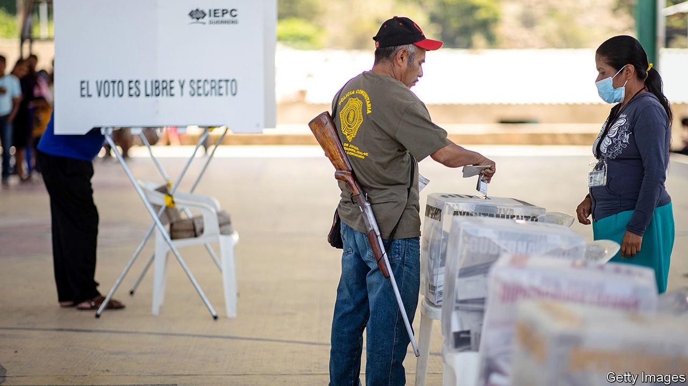

###### Clipped wings

# Mid-term elections have weakened Mexico’s president 

##### Andrés Manuel López Obrador will now have to negotiate with other politicians 

 

> Jun 10th 2021 

THE PRESIDENT, Andrés Manuel López Obrador, was not on the ballot, but , held on June 6th, were largely a referendum on his polarising performance. Voters selected representatives to the lower house of the national legislature and 30 of the 32 state congresses, as well as governors of 15 states and thousands of local posts. Although Mr López Obrador’s party, Morena, and the parties in its coalition won a majority in the national legislature’s lower house, it lost its two-thirds supermajority. The results are a blow to the president’s ambitions to transform Mexico.

Parties in power tend to lose seats in mid-terms, so the result is not entirely surprising. Morena dropped from 256 of 500 seats in the lower house to around 198. Even with the help of its allies, it falls well below the 334 seats needed for a supermajority. More gallingly for Mr López Obrador, the coalition of established parties did well: the National Action Party ( PAN), which held the presidency from 2000 to 2012, will be the second-biggest political force, followed by the Institutional Revolutionary Party ( PRI), which ruled the country for seven decades until 2000.


The president will now have to negotiate with other politicians to pass laws. That could put constitutional reforms beyond reach, since he would need around 40 opposition lawmakers to side with him. The party also suffered losses in Mexico City, long considered a bastion of leftism. Still, Morena remains the most popular party, bagging the most seats in the legislature. It also won 11 of the 15 governorships, and most of the state congresses. This suggests the party has a future after Mr López Obrador’s term ends in 2024.

It is likely that Mr López Obrador’s agenda will remain much the same, thinks Carlos Elizondo Mayer-Serra, the author of a book on the president. He can easily ignore the disapproval of urbanites. (He accepted the results overall but blamed Morena’s battering in the capital, where he was once mayor, on a “dirty war”.) And enough people still support Morena for him to feel he has a mandate. Outside a polling station in Mexico City’s posh Roma neighbourhood, María Teresa Crespo, a pensioner, says she is “very happy with the government”, as she feels it is tackling corruption.

Morena and its allies’ majority in the lower house will allow the president to continue to set the budget. Mr López Obrador can still dole out funds for pet projects, such as social programmes to support the young, who are given a stipend while they complete an apprenticeship, or to old folk in rural areas, who are paid to plant trees.

But the lack of a two-thirds majority will limit Mr López Obrador’s chances of enshrining in the constitution his energy policy, which seeks to boost state-owned firms. It also curbs his ability to damage Mexico’s institutions, such as the electoral body, which he has threatened to disband altogether. Indeed, despite a violent campaign—at least 36 candidates were murdered—Mexico’s largest-ever elections were a success. At least 53% of more than 93m eligible voters turned out, the highest for a mid-term election in this century.

Some fear that Mr López Obrador may try to advance his agenda by calling for small referendums, or by going after judges. He has called for investigations into a judge who ruled against one of his energy initiatives. On June 7th the government enshrined in law its controversial extension of the term of the Supreme Court’s chief justice, who is considered friendly to Mr López Obrador. The president is unlikely to tone down his divisive rhetoric, which distinguishes between the people and the elites. He will continue to scold his critics in his rambling daily press conferences.

The fact that Mr López Obrador will have to compromise and work with other politicians is undoubtedly a good thing. Indeed, many who voted for the opposition said they did so for this reason alone. However, the opposition’s lack of focus will complicate matters. The PAN and PRI formed a coalition to compete in the elections, but on a platform of curbing Mr López Obrador rather than to advance shared policies. In fact, the PRI may yet work with Morena. That would raise eyebrows, but Mr López Obrador’s desire for power could trump his political principles. ■

A version of this article was published online on June 7th 2021

