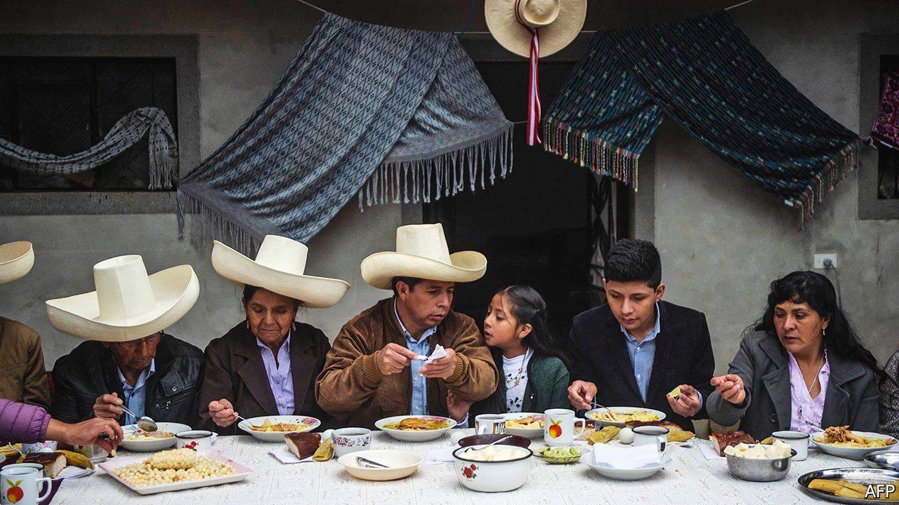

###### The man with the straw hat

# Pedro Castillo is on the verge of becoming Peru’s president 

##### The left-wing outsider will inherit a country split down the middle 

 

> Jun 10th 2021 

PEDRO CASTILLO often began his campaign rallies by saying, “I come from el Perú profundo [the heartland, in effect], from a modest family.” He went on to tell his life story. Born in a remote village in the Cajamarca region of the Andes to illiterate peasant farmers, he paid for his studies to become a teacher by selling ice creams on city streets. As a union leader, he travelled to forgotten towns and villages. That story resonates with the poorer half of the country. And it has taken him to the verge of his country’s presidency—but only by the narrowest of margins.

With the count in the presidential run-off election held on June 6th almost complete, Mr Castillo (pictured above, centre) had won 50.2%, a lead of just 70,000 out of 17.5m votes over his conservative opponent, Keiko Fujimori. She claims fraud, but has presented little evidence. International observers found none. The electoral authority has still to adjudicate some 300,000 disputed votes and will take days to arrive at an official result.


None of this seems likely to undo Mr Castillo’s surprising victory. He campaigned on a populist-leftist platform, promising a more statist economy and a constituent assembly to write a new constitution—the blueprint used by leftist leaders in Bolivia, Ecuador and Venezuela to entrench themselves in power. But Mr Castillo will inherit a country split down the middle, both geographically and socially, and he has a weak mandate.

Peru has a taste for electing outsiders. But none had as little political experience or knowledge of the world, or stood on such a radical leftist platform as Mr Castillo. In his only previous bid for elected office he stood in 2002 for mayor of a small town in Cajamarca and lost. In mid-March he was little known, although he led a three-month teachers’ strike in 2017. In a fragmented field of 18 candidates in the election’s first round, he topped the ballot, but with just 15% of the total vote. He campaigned the old-fashioned way, sometimes on horseback, always with his trademark farmer’s hat of cream palm-fibre. He drew on the networks of the teachers’ union, of the churches (his wife is evangelical; he is Roman Catholic) and of the rondas, the vigilante groups, originally against rustlers, that are a local power in the Andes.

Ms Fujimori and her allies warned against “communism”. But Mr Castillo embodies change in a country crying out for it. His slogan was “no more poor people in a rich country”, a reference to Peru’s mineral wealth, which he claims is not shared around enough. “Why did we have to wait for the pandemic to reveal the precariousness of the state?” he asked, saying that health care and education should be the right of all Peruvians. The country has suffered the world’s highest death rate from covid-19 relative to its population. All this was enough to bring Mr Castillo victory in much of the interior, as well as among Andean migrants in coastal cities.

Assuming his victory is confirmed, Mr Castillo faces an almost impossible balancing act of trying to govern pragmatically for the majority while keeping his radical base happy. This week he showed his first clear sign of moderation. “We will be a government respectful of democracy, the current constitution…[and of] financial and economic stability,” he told jubilant supporters. If so, that may bring an early clash with his own party, Perú Libre. An avowedly Marxist-Leninist outfit, its founder and leader, Vladimir Cerrón, is a doctor who is an admirer of Cuban communism and Venezuela’s dictatorship. Barred from running because of a sentence for corruption from when he was a regional governor, he recruited Mr Castillo only months ago. Mr Cerrón “is not totally intransigent but he will want to control things”, says a veteran activist who knows him.

During the campaign Mr Castillo gained the support of more moderate left-wingers. This week Pedro Francke, one of his new advisers, praised the central bank, promised to respect its autonomy, rejected price and import controls and said mines would face a tax renegotiation rather than nationalisation. Mr Castillo “knows the value of hard work and would never consider policies that would confiscate assets”, says Gonzalo Alegría, a former banker who is another new addition to his team.

To govern effectively, Mr Castillo is likely to have to look beyond his current advisers. The first imperatives for the new team will be handling the pandemic and ensuring economic recovery. Peru is fortunate that its caretaker president since November, Francisco Sagasti, has laid the basis for this after much mismanagement by his predecessor, Martín Vizcarra. Mr Sagasti has got vaccination going at an accelerating rate and organised oxygen supplies. Having contracted by 11% last year, the economy is rebounding. The World Bank forecasts growth of 10.3% this year. Some private forecasters think the figure could be as high as 13% provided politics is not too unstable.

Mr Castillo’s biggest political headache is likely to be the new Congress, which has a broadly conservative majority. On paper, he has the support of only 42 of its 130 members. And more than half of Perú Libre’s 37 representatives are beholden to Mr Cerrón. The outgoing Congress clashed with the executive and approved populist giveaways. Its replacement may not be much better. “We could be faced with a Congress wanting to make life hard for the president,” according to Luis Benavente, a political consultant.

Approving the setting up of a constituent assembly requires 66 votes in Congress and then a referendum. The demand for a new constitution is weaker in Peru than in Chile, which recently voted to write one. Candidates committed to an assembly won less than a quarter of the total vote in the first round. Many of the voters who backed Mr Castillo in the run-off did so only to stop Ms Fujimori. Peru’s Congress has developed a habit of impeaching presidents. If he is to last his five-year term, Mr Castillo would be wise to avoid a constitutional collision and settle for achieving some of the many reforms his country needs. ■

A version of this article was published online on June 7th 2021

