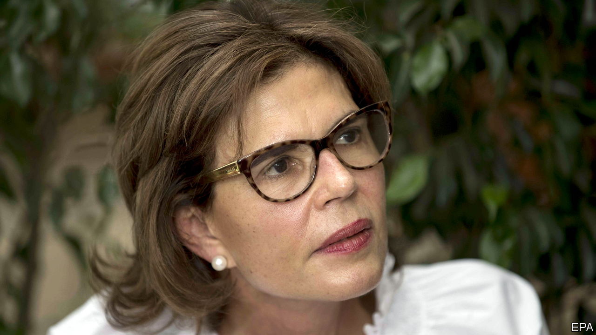

###### Democratic deficit

# President Daniel Ortega clamps down on Nicaragua’s opposition 

##### Months before an election, the strongman turns on his rivals 

 

> Jun 12th 2021 

ON JUNE 2ND Cristiana Chamorro, an opposition hopeful in Nicaragua’s forthcoming presidential election, was placed under house arrest. It came a day after she announced that she would run as a contender for a relatively new party, Citizens for Liberty (CxL), to unite a fractured opposition. On June 5th another opposition politician, Arturo Cruz, was detained for “conspiring against Nicaraguan society”. Three days later two more presidential hopefuls, Félix Maradiaga and Juan Sebastián Chamorro (a cousin of Cristiana), were detained, too.

Nicaragua is heading for the “worst possible elections” on November 7th, says Luis Almagro, secretary-general of the Organisation of American States in Washington. Voters will elect a president and members of the National Assembly. Daniel Ortega, the strongman president who governs with his wife as vice-president, plans to run for a fifth term.


Mr Ortega, a former Marxist guerrilla, first came to power in 1979 by force of arms. He stepped down after losing an election in 1990 but was elected president again in 2007. Now he appears determined not to let power slip once more. In 2018 he ordered a crackdown on anti-regime demonstrators that left perhaps 450 people dead and sent over 100,000 into exile. To ease international sanctions, he released some political prisoners in 2019. But more recently he has reverted to his old tricks.

Since late last year a flurry of new laws has tried to smother the opposition. One targets NGOs that receive foreign funding. Another bars “traitors” from running for office and redefines treason along absurdly broad lines (Messrs Cruz, Maradiaga and Chamorro are the first people to be ensnared by this law). A third doles out lengthy prison sentences to anyone found guilty of spreading fake news. But now the regime seems increasingly brazen. On May 4th the National Assembly, controlled by Mr Ortega’s Sandinista National Liberation Front, appointed five Ortega loyalists to the electoral council, banned independent election monitors and gave the police powers to shut down party meetings and campaign events. One of the two main opposition parties has been banned.

Mr Ortega is right to fear Ms Chamorro. She is the daughter of Violeta Chamorro, a former president who unseated Mr Ortega in 1990, and thus a scion of Nicaragua’s most famous political family. A poll released on May 28th ranked her as the most popular politician in the country.

The detention of these candidates “sends a direct message to the United States”, said Mr Chamorro, in a defiant interview with The Economist before his arrest. Ms Chamorro was detained while Antony Blinken, the US secretary of state, was visiting Costa Rica to discuss the erosion of democracy with Central American officials. The other candidates were arrested while Kamala Harris, the American vice-president, was in Guatemala and Mexico.

Such autocratic behaviour could backfire. The United States has already announced new sanctions, and is considering more. Members of the European Parliament are calling for the suspension of an agreement governing around $380m in exports each year. And by banning one of the two main parties, Mr Ortega has forced rival politicians to overcome differences and band together in CxL. ■

