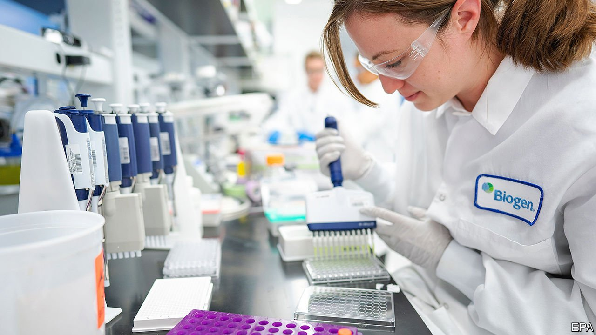

###### 

# Business this week 

#####  

 

> Jun 12th 2021 

The approval granted by America’s Food and Drug Administration to a new drug to combat Alzheimer’s disease was hailed as a breakthrough, even though the FDA conceded that the drug, aducanumab (to be marketed as Aduhelm), is . It has shown success in reducing the build-up in the brain of a protein known as beta-amyloid, one of the possible causes of Alzheimer’s. Biogen must now conduct a large-scale clinical trial to determine whether it does also slow memory loss and cognitive decline.

A consortium of private-equity funds, which includes Blackstone, reached an agreement to take a majority stake in Medline, a privately held supplier of medical equipment. At $34bn the deal is one of the  involving private equity.


The American Senate passed a mammoth bill that aims to counter China’s rising expertise in technology. The legislation would, among other things, fund research in artificial intelligence and quantum computing and support the American chip industry. The House of Representatives will soon debate its version of the bill. Separately, Joe Biden ordered a security review of all apps based in countries such as China.

Mr Biden earlier signed an order banning Americans from investing in 59 Chinese companies that do business in defence and surveillance. Many are connected to Huawei or Aviation Industry Corporation of China, a state-owned aerospace company. Legal experts say Mr Biden’s order is broader in terms than a similar one signed by Donald Trump, and that it may be harder to challenge in court.

China’s producer-price index, which measures the cost of goods leaving factories, , year on year. That was the fastest pace since September 2008, caused by rising prices for oil, iron ore and non-ferrous metals. Higher costs for producers could be passed on to consumers in China, and elsewhere, pumping up inflationary pressures.

How (not) to win friends

Britain’s Competition and Markets Authority said it was investigating British Airways and Ryanair to see if the airlines broke consumer law by offering vouchers or rebookings instead of refunds to passengers who were unable to fly during lockdowns. The practice is unpopular. In America complaints about airlines refusing to refund were up by 5,500% in 2020.

Facebook extended its suspension of Donald Trump for at least two years. As he is also permanently banned from Twitter, the former president will not have access to the social-media channels for America’s mid-term elections. From now on Facebook will hold material from any politician in the world to the same standards it applies to content from regular users, but will grant a “newsworthiness allowance” to some political posts that breach those standards. Its policy change did little to assuage its critics.

El Salvador became the first country to accept bitcoin as legal tender, meaning that businesses will be compelled to accept it as payment along with the American dollar, the official currency. The government hopes the cryptocurrency will appeal to the 70% of the population without access to a bank account.

Meanwhile, America’s Justice Department recovered most of the ransom paid in bitcoin to Russian hackers who had shut down a major pipeline. The FBI was able to seize the payment by tracking the bitcoin address used by the gang. It also emerged that JBS, the world’s biggest meat-processor, paid $11m in bitcoin to cyber-criminals after they disrupted its plants.

The Keystone XL pipeline was officially scrapped following Joe Biden’s decision not to grant it a permit to cross American territory. The project, opposed for years by greens and Native American groups, would have carried oil from Alberta’s tar sands.

Jeff Bezos, Amazon’s founder, is focusing on his long-standing passion for spaceflight. He and his brother will be  to fly with Blue Origin, a rocketry company he founded in 2000, when it makes its first flight with crew to 100km above Earth’s surface on July 20th. Mr Bezos is stepping down as Amazon’s chief executive on July 5th.

Progressive, except on tax

Mr Bezos may well want to escape the blue planet for a while, after revelations by ProPublica, a collection of investigative journalists, that he and the 24 other richest Americans pay little or no federal income tax. Between 2014 and 2018 this ultra-rich group, which also includes Elon Musk and Mark Zuckerberg, paid $13.6bn in federal tax, amounting to an average tax rate of just 3.4%, according to ProPublica. For Mr Bezos it was 0.98%. The Internal Revenue Service is investigating how ProPublica got hold of data on thousands of America’s wealthiest people.

