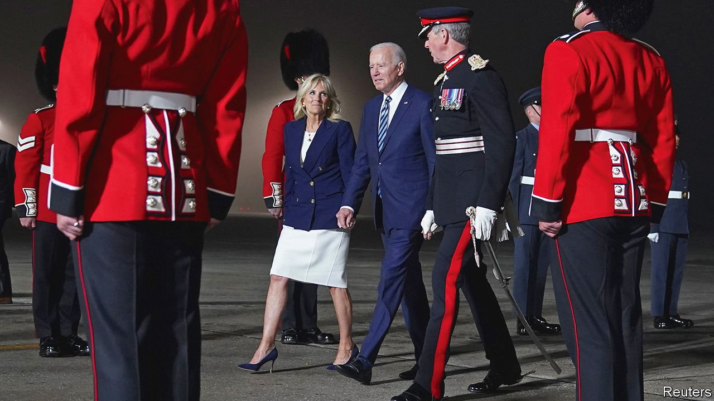
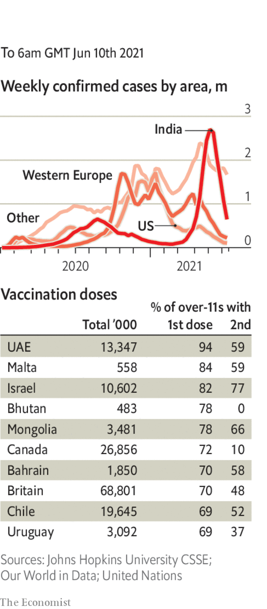

###### 

# Politics this week 

#####  

 

> Jun 12th 2021 

The leaders of the G7 countries headed to the Cornish resort of Carbis Bay for a summit, their first in two years and the first for Joe Biden as America’s president. Ahead of the summit G7 finance ministers met in London, where they proposed the  since the 1920s, backing a minimum global rate of at least 15% and a clampdown on companies that park profits in tax havens. But the proposals will need the support of other countries and will be a hard sell in China and India, among other places.


Democrats had to rethink their plan to pass comprehensive legislation on electoral reform, known as the For the People Act, when Joe Manchin, a Democratic senator from West Virginia, said he would not support it because it lacked Republican support. Mr Manchin also definitively ruled out backing any attempt to weaken the filibuster, another headache for the Democrats in a Senate that is split 50-50.

America’s border agency intercepted 180,034 illegal migrants in May, a new 21-year high. The number of unaccompanied children at the border is , as is the number of migrants from Central America. In her first trip abroad as vice-president, Kamala Harris went to Guatemala and warned potential migrants not to enter the United States, as they would be turned back.

Pedro Castillo, a left-wing former schoolteacher, narrowly won Peru’s presidential run-off. With just 50.2%, a lead of 70,000 out of 17.5m votes cast, he has a weak mandate and will preside over a . His conservative opponent, Keiko Fujimori, claimed there had been fraud, although there is little evidence of this.

In Nicaragua Daniel Ortega, the strongman president who hopes to win a fifth term in elections in November, appeared to be further , when four prominent opposition politicians were detained in the space of a few days.

There were  for Morena, the party of President Andrés Manuel López Obrador, in mid-term elections in Mexico. It and its allies lost their two-thirds majority in the national legislature’s lower house, but it remains the most popular party and has expanded its national footprint.

A court in Moscow ruled that two organisations connected to Alexei Navalny, a jailed opposition leader in Russia, were “extremist”, and thus should be shut down and their members barred from standing in elections. The move, which follows a change in the law that came into effect just five days earlier, is clearly aimed at preventing supporters of Mr Navalny from running in parliamentary elections expected in September. The hearing was held behind closed doors.

The European Commission launched legal proceedings against Germany’s Constitutional Court to assert the primacy of European Union law. The case relates to the German court’s ruling last year that the European Central Bank’s bond-buying programme contravenes the German constitution. That ruling contradicted a decision by the European Court of Justice, the EU’s highest court, which found that the programme complies with EU law.

Jihadists killed more than 138 people in an attack on a village in Burkina Faso, the deadliest incident since the start of an insurgency in 2015.

Assimi Goita, an army officer in Mali who has led two coups in less than a year, was sworn in as the president of a transitional government. His power-grab has prompted the African Union to suspend Mali. France has halted joint military operations against jihadists in protest.

Israel’s outgoing government approved a march by Israeli nationalists through Jerusalem’s Old City. Hamas, the militant Palestinian group that runs Gaza, warned that the march, due to take place on June 15th, could trigger a new round of violence.

Iran held a presidential debate in which Mohsen Mehralizadeh, a former provincial governor, pointed out the obvious: the regime has  in order to ensure that Ebrahim Raisi, the head of Iran’s judiciary and a staunch hardliner, wins the election on June 18th.

A few, small scattered protests took place in Hong Kong to mark the anniversary on June 4th of the bloody suppression of the pro-democracy movement in Tiananmen Square in 1989. The city’s government banned the usual commemorative gathering in a park which in previous years had attracted thousands of people. It cited reasons related to the pandemic.

Mongolia’s presidential election was won by Ukhnaa Khurelsukh, who resigned as prime minister in January amid street protests about the country’s health service. Mr Khurelsukh is from the ruling Mongolian People’s Party; he won 68% of the vote, the most for any presidential candidate since the start of democratic elections in 1990.

A new species of dinosaur, excavated in 2007 in Australia, has been identified by palaeontologists as among the largest ever. Australotitan cooperensis, a plant-eating beast, would have been 6.5 metres tall and 30 metres long.

Coronavirus briefs

 


The numbers of new cases and deaths are steadily falling, according to the World Health Organisation, with “marked declines” in Europe and South-East Asia. But infections in Africa are rising.

Unicef stepped up its campaign ahead of the G7 meeting to persuade rich countries to donate more vaccines to poor ones. Joe Biden was ready to donate 500m doses of the Pfizer jab.

Japan sent 1.2m doses of the AstraZeneca vaccine to  Taiwan to help fill a shortage. Chinese officials were quick to condemn the move for what they see as turning vaccine assistance into “a tool of political self-interest”. Taiwan accuses China of obstructing its attempts to buy the Pfizer jab.

In England 80% of adults were estimated to have antibodies against covid-19, either through vaccination or having had the disease.

