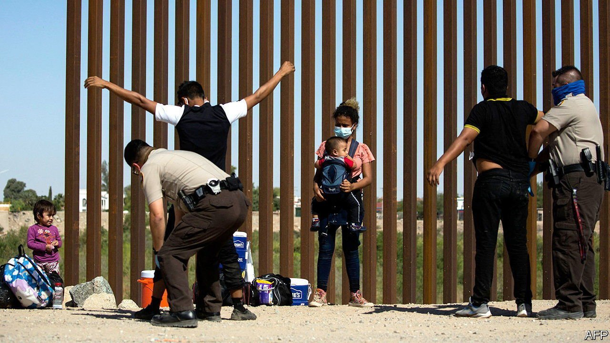
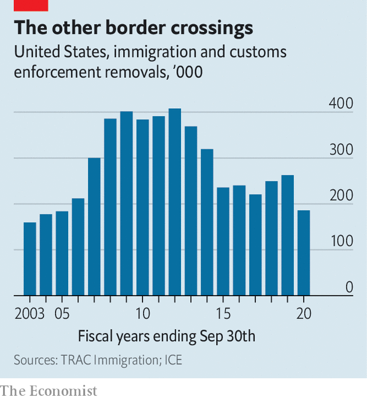

###### Lowering the bar

# Deportations of undocumented immigrants are at a record low 

##### Joe Biden does not want to be America’s next “deporter-in-chief” 

 

> Jun 12th 2021 

ALTHOUGH DONALD TRUMP talked the fiercest nativist game about illegal immigration, it was Barack Obama who oversaw the removal of more undocumented immigrants from America during his presidency, earning him the nickname “deporter-in-chief”. During his first term, Mr Obama deported over 60% more people than Mr Trump (see chart). Now Joe Biden is breaking records in the opposite direction.

In April the US Immigration, Customs and Enforcement agency (ICE), completed just 2,962 removals, the lowest number on record. Since February ICE agents have averaged around 2,300 arrests per month, a fifth of the monthly average in 2019, before the epidemic began. The figures show how Mr Biden is trying to craft policies that treat immigrants living illegally in America more humanely than his predecessors, without giving his critics on the left and the right too much ammunition.


There are two reasons for the recent decline in deportations. One is practical. In February the interim director of ICE, Tae Johnson, issued a memo telling staff to prioritise certain people for deportation, mainly those who had arrived in the country recently or posed a threat to national security and public safety (such as engaging in terrorism or gang activity). This marks a shift in strategy from the Trump administration, when all illegal immigrants were deemed priorities, regardless of how long they had been in America or whether they had committed crimes. “It was about instilling fear in immigrant communities as a means of enforcement,” is how Theresa Cardinal Brown of the Bipartisan Policy Centre (BPC), a think-tank, summarises Mr Trump’s strategy of deterrence.

 


The other reason for the recent decline in deportations is philosophical. Mr Biden campaigned promising a pathway to citizenship for many of the 11m unauthorised immigrants already in America, who are seen as enmeshed in communities and productive members of society. To deport them before any solution is brokered in Congress “feels heartless to the Biden administration”, says Ms Cardinal Brown.

However, brokering some sort of compromise that offers a legal pathway for citizenship is far from guaranteed in Washington, DC. It is not an immediate priority: the infrastructure bill is occupying the White House and Congress. Nor is history on Mr Biden’s side. It has been 35 years since comprehensive immigration reform was passed by Congress. One of the reasons why Mr Obama pursued enforcement so aggressively was the hope of inducing Republicans to compromise on an immigration bill, which they never did. When Mr Biden entered office, he even went so far as to issue a 100-day halt to deportations. (His plan was scuttled after a lawsuit by the state of Texas, when a court blocked the deportation moratorium.)

What comes next? The problem of immigrants attempting to cross the southern border illegally, which is distinct from immigration reform and from providing permanent status to those already in America, complicates Mr Biden’s ambitions. The numbers of people arriving are higher than at any time since before 9/11, after which border security was tightened. Kamala Harris, the vice-president, travelled to Guatemala this week to discuss the root causes of migration and try to discourage more arrivals. Republicans have used the opportunity to paint Mr Biden’s immigration policies as toothless. Meanwhile, headlines about the border being out of control hurt perceptions of immigrants already in America. According to a poll by BPC and Morning Consult, a data outfit, those who have heard about the situation at the border recently are more likely to say that immigrants will hurt America’s long-term economic recovery from covid-19.

Immigration has become such a supercharged issue that Mr Biden is managing to please no one, despite being the president with the most progressive immigration platform in recent history. Immigration advocates and progressives question whether ICE should still be funded at Trump-era levels, as the agency’s 2022 budget proposes, and say the White House has not done enough to reverse Mr Trump’s policies. Naureen Shah of the American Civil Liberties Union points to the continuation of “287(g)” agreements, which enable local police officers to enforce federal immigration law under ICE supervision. These were expanded under Mr Trump, from 34 such agreements to 151, most of which are still in effect. According to Austin Kocher of Syracuse University, which collects immigration data, there is a “sceptical hopefulness” among many immigration lawyers that Mr Biden will reverse more of Mr Trump’s policies.

Meanwhile, enforcement hawks say that Mr Biden’s decision to adopt a gentler approach to deporting people who are residing illegally in the country will only further the impression that America is now welcoming immigrants and encourage them to try their luck at the southern border. Mr Biden will not earn the title “deporter-in-chief”, but that does not mean the insults will stop. ■

For more coverage of Joe Biden’s presidency, visit our dedicated 

