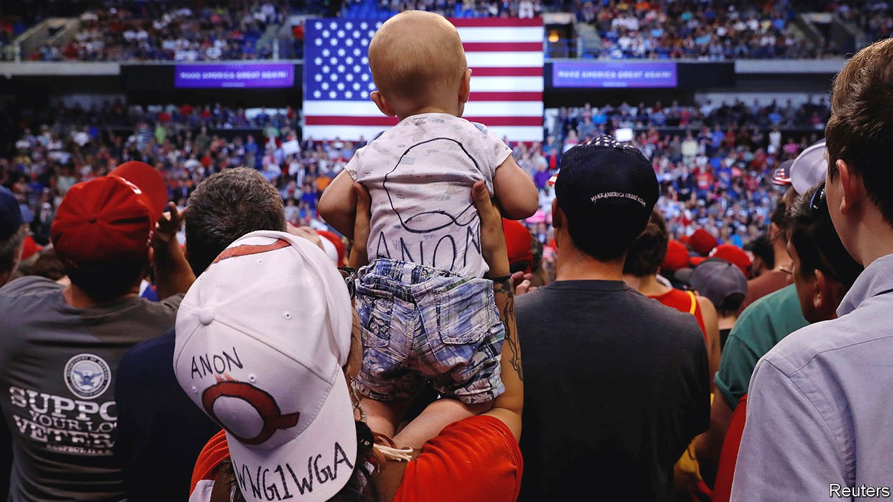

###### Conspiracy as a second language

# Hispanic Americans are curious about QAnon too 

##### And tech companies have not yet worked out how to counter misinformation in Spanish 

 

> Jun 12th 2021 

IF YOU VISIT Segadores de Vida, a Hispanic megachurch in the outskirts of Miami, you will probably get more than your average church service. Its Dominican-born pastor, Ruddy Gracia, has been teaching conspiracy theories alongside the Bible. Pastors who have not resisted lockdown orders are “in line to get the mark of the beast”, he told his parishioners. He called Anthony Fauci, a public-health official, a “wild beast” and reckons Mr Fauci is importing face-masks from China to profit from the pandemic (that sermon’s title was “The Big Lie”). The canards are amplified by Mr Gracia’s social-media following, which numbers several million domestically and across Latin America.

Multiple surveys have found conspiracy theories, such as QAnon, are most popular among white Americans, particularly evangelicals. But Hispanics seem to gravitate towards them as well. In a Pew Research poll from July 2020 they were the ethnic group most likely to believe a group of powerful people were behind the covid-19 pandemic. A recently published survey from Public Religion Research Institute (PRRI), a pollster, confirmed white evangelicals as the strongest supporters of QAnon, but it also found Hispanic Protestants drawn to the movement. They are just as likely as white evangelicals to agree with QAnon’s core theory—that “the government, media, and financial worlds in the US are controlled by a group of Satan-worshipping paedophiles who run a global child sex-trafficking operation”.


One reason why QAnon is making headway among Hispanic Protestants is that many are conservative evangelicals and hold similar views to their white counterparts. Natalie Jackson, head of research at PRRI, says QAnon fits into Manichean beliefs about good and evil. Mr Gracia, for example, has conjectured that covid-19 is a plot concocted by a group of elites, chief among them Bill Gates, to undermine individual rights and people’s patriotism and lay the foundation for a global government that will be run by the Antichrist.

Over the past few election cycles misinformation analysts have noticed more attempts by political groups to spread propaganda and conspiracies among Spanish-speakers, especially in Florida. These efforts have been successful, in part, because limited news coverage in Spanish of certain issues leaves “data voids”, says Saiph Savage, a computer scientist who researches the spread of conspiracy thinking.

Although the misinformation is primarily about news in America, researchers point out that some of the biggest influencers are in Latin America, particularly Colombia and Venezuela. Informativo G24, a Colombian talk show, has more than 500,000 subscribers on YouTube and covers subjects such as the deep state and the end times. A few months before the presidential election, the show hosted a panel on the global battle between good and evil. “I am convinced Donald Trump…is the only one who can do something for humanity,” said one of the panellists.

Jaime Longoria, a researcher from First Draft, a non-profit that fights misinformation, says other influencers provide daily commentary on transliterated articles from far-right websites such as Breitbart and Gateway Pundit (whose founder was banned by Twitter in February). And some seem to have noted the crackdown by tech giants on content related to QAnon. A popular YouTube influencer based in Colombia does not mention the movement in his videos but claims to have the largest Telegram group of Latino QAnon followers, with more than 30,000 members.

Fact-checkers face several obstacles when countering Spanish-language misinformation. Much of it circulates in encrypted texting apps, such as WhatsApp, making it harder to moderate. Another problem, says Claudia Flores-Saviaga, a fellow at Facebook’s research division, is that tech companies use English as the primary language to train machine-learning models that automate the detection of disinformation. Bizarre conspiracies in Spanish can evade them.

Groups such as First Draft are training fact-checkers, and the National Latino Evangelical Coalition, which represents about 3,000 Hispanic churches in America, has joined the Department of Health and Human Services to host webinars in Spanish about covid-19. Changing the minds of Mr Gracia and others who are convinced that this is a spiritual battle will not be easy, though. “We have to obey God and not man,” he says. ■

