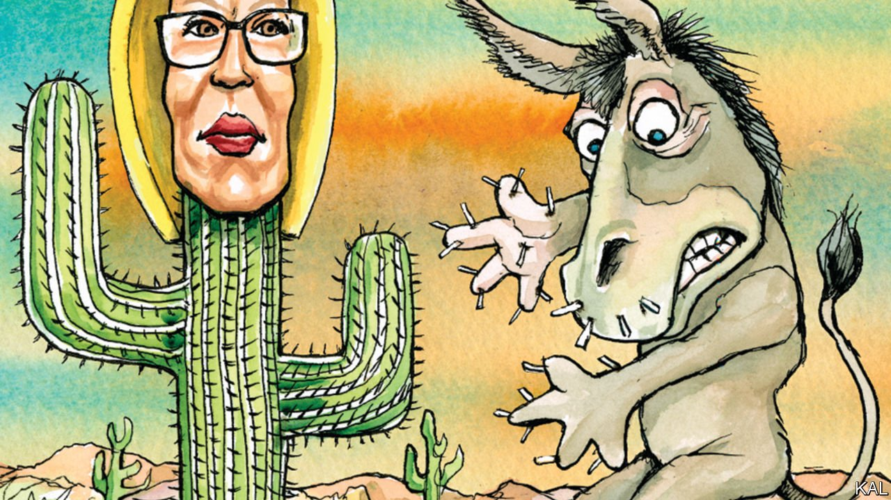

###### Lexington

# Kyrsten Sinema’s technicolour moderation 

##### The senator from Arizona is better at upsetting Democrats than working with Republicans 

 

> Jun 12th 2021 

WHEN KYRSTEN SINEMA first sashayed into the Senate, liberal hearts fluttered. The 42-year-old was one of the youngest women elected to the chamber, the first Democratic senator from Arizona for three decades, and exuded cosmopolitan élan. By repute a “Prada socialist” with a charismatic personality, she was also the first openly bisexual member of Congress. Did Mike Pence look uncomfortable as he swore her in—on the constitution, given her admitted irreligiosity (another novelty in Congress)? Or did the pious former vice-president hang onto her hand a trifle too long? Liberal tweeters were in raptures over such questions.

Their hearts are now broken, since Ms Sinema has shown herself to be anything but a left-wing crowd-pleaser. Though Joe Manchin of West Virginia has drawn most of his party’s flak for refusing to vote down the legislative filibuster, she holds the same position as immovably. She says the 60-vote threshold was designed to foster bipartisanship, though it was more a procedural accident. She claims it remains a force for “comity”, which is a word rarely used outside the Senate these days, though the quality is seldom witnessed inside it. Many Democrats have decried this, their fear of Republican lawmaking—a much bigger reason for the filibuster’s endurance—having recently been trumped by fear of the gridlock it causes. The singer Cher called Ms Sinema a “traitor”, notwithstanding their shared fondness for colourful wigs.


The senator’s transgressions against her party line, of which her support for the filibuster is only the latest example, can be equally flamboyant. Eight Democratic senators opposed a provision in the covid-19 stimulus bill to raise the minimum wage to $15 an hour; only one signalled her opposition—to a cherished progressive initiative—with a Caesarean thumbs-down and derisive curtsy. Having called on her Republican colleagues to back a bipartisan commission into the mob attack on the Capitol in January, Ms Sinema outraged her party by failing to show up for the relevant vote (she claimed this was for family reasons). Despite her professed commitment to bipartisanship, she has meanwhile initiated no ambitious legislation nor formed notable partnerships in either party. She almost never speaks to journalists. Senior Democrats say they do not know what issues she is most interested in. She is described as “isolated”; also “very strange”.

Some of this tension can be attributed to the always-underestimated fact that Ms Sinema owes her position to a lot of voters who dislike her party. Arizona is a conservative state. To win there Democrats need a plurality of unaligned voters, who tend to be somewhat conservative. That Arizona has two Democratic senators and narrowly elected Joe Biden is the result of Donald Trump’s toxicity. And this is an advantage that Ms Sinema and her fellow Arizonan Mark Kelly will hope to increase. Mr Trump’s continuing influence on Arizonan Republicans—as shown by their lunatic obsession with non-existent electoral fraud—is likely to swell the ranks of disaffected conservatives further.

Yet a comparison with Mr Kelly also shows how gratuitous Ms Sinema’s performance can be. The former astronaut also defines himself against his party (especially on the southern border, a preoccupation for Arizonans) and preaches bipartisanship. But his carping is more selective and fact-based. He has meanwhile won plaudits for pushing gun control, with which his family is deeply concerned, and building relationships on both sides. He is more popular with Democrats on and off the Hill. Though both senators have solid ratings in Arizona, Mr Kelly scores better with Democrats and Ms Sinema with Republicans. Her provocativeness, in other words, is as much a political choice as an imperative.

It probably owes something to her most glaring potential vulnerability: a Damascene conversion from far-left protest politics. A former Naderite, who railed against capitalism and addressed anti-war demos in a pink tutu, she once prided herself on being the most left-wing member of the Arizona legislature. Yet she quickly tired of being the star of a Democratic minority so small it was known in Phoenix as the “pizza caucus” (because one large pizza could feed it). She proceeded to write a vapid but semi-amusing book on coalition-building (“Let go of the bear and pick up the Buddha…to be your most fabulous political self”) and campaigned for Congress as a pragmatic problem-solver. In the House she made a small mark on veterans’ affairs, low-hanging fruit for the aspiring conservative, and backed more of Mr Trump’s bills than almost any other Democrat.

Americans tend to be relaxed about political makeovers; yet Ms Sinema’s is unusual not only for its suddenness but also for the combination of attributes it has left her with. Blue-dog Democrats like Mr Manchin, whom she claims as a model, tend to be socially conservative but progressive on economic policy. She is the opposite, even as the right has largely abandoned its interest in economics for the culture wars. If she protests her newfound moderation too much, it is in part because that is her wont; but it is also an effort to shut this potential weakness down.

Don’t mess with her tutu

It helps that Arizona has a tradition of mavericks—including John McCain, whom she often praises. “We have that 48th-state attitude out here,” chuckles a veteran Arizonan Republican strategist. “We act like the juveniles that we are.” Perhaps that makes her as good a match for the state as the Democrats can hope for.

Certainly, a standard progressive could not win there. And, when not picking fights with her party, Ms Sinema quietly votes with it most of the time. Democrats should remember that. Even so, the hollowness of her grandstanding is depressing. It does not represent, as she claims, the perpetuation of a great bipartisan tradition. It represents its diminution, notwithstanding her larger-than-life performance, to such an extent that significant bipartisan co-operation now hardly exists. ■

For more coverage of Joe Biden’s presidency, visit our dedicated 

