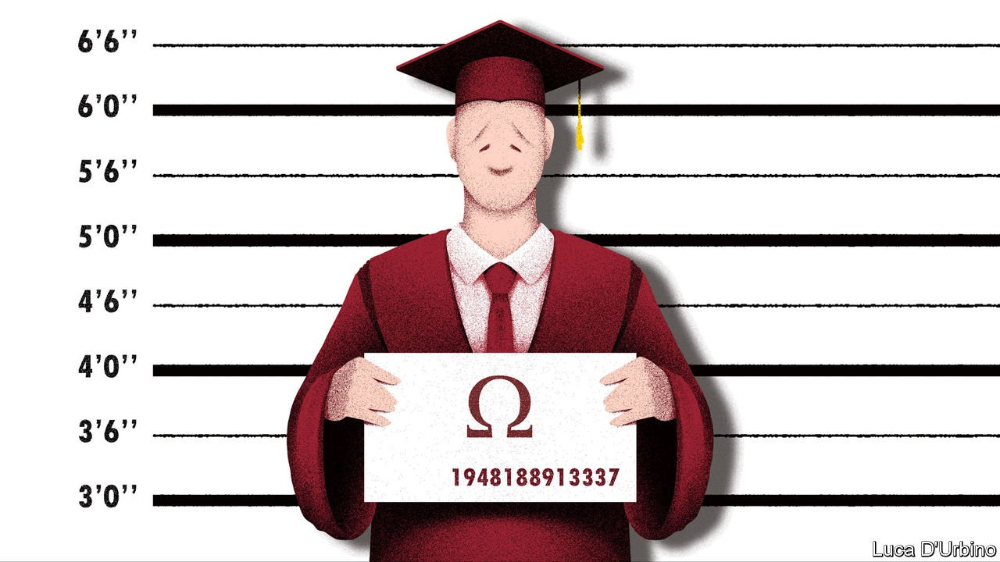

###### Dorm norms

# The Biden administration wants to change guidelines on campus sexual assault 

##### It should think twice before doing so 

 

> Jun 12th 2021 

A FEW WEEKS after he had a one-night stand with a fellow student, Daniel (not his real name) received a text message from a mutual acquaintance. It said the woman had been drunk and had not wanted to have sex with him. It wished him luck finding a new university. “Unfortunately that was about right,” says Daniel, who claims his protests that the encounter had been consensual were ignored—including by university authorities after his accuser made a formal complaint. A university panel refused to hear the witnesses Daniel and his lawyer requested, including people who had seen him and his accuser together after they had had sex. Neither he nor his lawyer was allowed to cross-examine his accuser; they could pass questions to the panel but had no control over whether they were asked. “The process felt completely one-sided,” he says.

After Daniel was found guilty of sexual assault his university, which cannot be named for legal reasons, suspended him and he finished his degree elsewhere. He worries that the episode will mar his attempts to launch a career. “I’m no longer as desperate and depressed as I was about the worst thing that has ever happened to me,” he says. “But I feel like the damage is done.”


Had Daniel been accused of sexual assault a few years later, things might have turned out differently. The process of investigating and adjudicating claims of sexual assault that he and his accuser went through in 2015 had been substantially shaped by guidance introduced by the Obama administration in 2011 and 2014. Many believe that guidance gave short shrift to the rights of the accused. In 2020 Betsy DeVos, Donald Trump’s secretary of education, introduced a rule to restore those rights. The Biden administration may now usher in yet more changes. This week, following an executive order signed by the president in March that directed the Department of Education to consider rescinding the Trump-era rule, a hearing gathered views on that.

It is one of the great failings of the justice system in America, as elsewhere, that perpetrators of sexual assault are too rarely charged or convicted. Only a few years ago victims of sexual abuse on campus were routinely ignored or encouraged to drop their claims. It was with the aim of correcting this that the Obama administration introduced guidance on Title IX, a law passed in 1972 that prohibits discrimination on the basis of sex.

Though the guidance did not have the weight of law, the Office for Civil Rights threatened to cut off federal funding to institutions that did not comply with the guidance, which was sweeping. It said educational institutions must adopt the lowest possible burden of proof, what is known as a “preponderance of evidence” (often conceived as a 51% likelihood of guilt), rather than the standard of “clear and convincing evidence” (thought of as around a 75% likelihood).

Judge and jury duty

The guidance also undermined the right to be considered innocent until found guilty. It made it difficult for the accused to question their accuser or see the evidence against them. It recommended a “single investigator” model in which a university employee plays judge, jury and prosecutor. And it introduced some vague definitions, including sexual harassment as any “unwelcome conduct of a sexual nature”.

Jenna Parker, a lawyer in California who has represented students in civil lawsuits after they have been found guilty by their university panels, says that this guidance sowed confusion. Some universities have been accused of eliding “non-consensual” with “unwanted” (a feeling that may follow consensual sex but can also be separate from it). Some hold that drunken students cannot give consent, which would seem to invite miscarriages of justice.

The fact that many universities were ill equipped to administer this parallel form of justice became evident in the flood of litigation claiming due-process violations that followed. Title IX For All, which keeps a database of such lawsuits, says nearly 700 have been filed since 2011. Cynthia Garrett, co-president of Families Advocating for Campus Equality, says a system that required civil litigation put poor students at a particular disadvantage.

The regulation introduced by Mrs DeVos in 2020 undid much of that guidance. It allowed universities to use the “clear and convincing” evidentiary standard. It restored balance to the processes that followed, including by not allowing only one side to cross-examine. These changes are fairer than the regulation that preceded them, though some critics of the Obama directives worry that the new definition of sexual harassment—as unwelcome conduct that is “severe, pervasive, and objectively offensive”—may deter victims from seeking redress. The covid-19 epidemic has meant the regulation has not been tested as it would otherwise have been.

Wider criticisms have been levelled at the Trump-era rule by groups that believe the new process gives too much weight to the rights of the accused. “We’ve heard a lot of schools saying to victims, ‘This process is so scary, do you really want to go through with it?’” says Sage Carson, manager of Know Your IX, an advocacy group.

Yet a complete reversal of the Trump-era rule is unlikely. It has survived several legal challenges. A series of court decisions have accepted sex-based discrimination claims by male students penalised under the Obama-era guidance. This suggests future changes would lead to legal clashes. It also suggests that the previous guidance led to too many unjust punishments, the effects of which may be lasting. ■

For more coverage of Joe Biden’s presidency, visit our dedicated 

