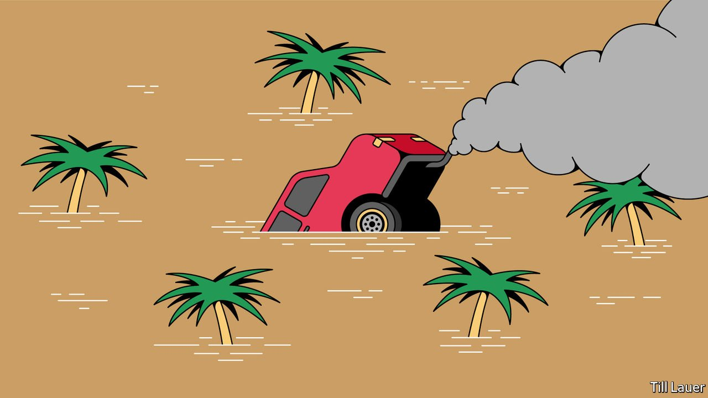

###### Banyan

# Climate change is remaking South Asia’s monsoon 

##### A bad season can cut economic growth by a third 

 

> Jun 19th 2021 

SINCE ARRIVING two days late at its usual landing point at Thiruvananthapuram in Kerala near India’s southern tip, South Asia’s annual summer monsoon has made up for lost time. Tearing north, the south-westerly, rain-bearing winds covered four-fifths of the country in the first two weeks of June, reaching even India’s north-easternmost states. The monsoon’s western arm has yet to reach the states of Gujarat, Haryana and Rajasthan. But Yogesh Patil, head of Skymet, a private weather-forecasting service, predicts that the monsoon will cover the whole country by July 8th, pretty much bang on its average date.

Bangladesh, Bhutan, Nepal and Pakistan are also recipients of the South Asian monsoon. It touches over 1.8bn people, or nearly a quarter of the world’s population. Though its circulation is complex, at its heart the summer monsoon is a sea breeze that operates on a season-long, continental scale. A rapidly heating Indian subcontinent causes hot air over it to rise. That draws in wetter maritime air from the Indian Ocean. As this air in turn rises, it cools and falls as rain. The northern wall of the Himalayas amplifies the effect.


The monsoon’s arrival is cause for rejoicing. Over 70% of the year’s rain falls in just four months. It cools the fierce summer heat and slakes a thirsty earth. The Ganges and other rivers fill and spread rich silt over flood plains. Sown crops put on growth at last. Agriculture supplies nearly half of all India’s jobs and accounts for nearly 20% of GDP (most farmers rely on rain-fed crops rather than irrigation). A bad monsoon can cut economic growth by a third, drive farmers into penury and create knock-on effects for government revenues when they are needed most. The remark by a British imperial administrator that the Indian budget is “a gamble in rain” remains true today.

Yet the monsoon is no uniform wave. It is overwritten by “vagaries”: bursts of intense rainfall in some parts and dryness in others. Scientists have yet to get to the bottom of these vagaries. But they can have profound effects. A farmer can see his crop washed away in a thunderstorm, or seedlings wither in a drought. In his part of Andhra Pradesh in south-eastern India, S. Ananth, a writer on the monsoon, says that this year the monsoon has delivered just one proper downpour and a few mild showers. A cyclone churned through the Bay of Bengal in May, which was unusually early. Mr Ananth’s great-grandfather used to say that after a cyclone in May, the monsoon would fail. Folk myth, perhaps, but local farmers are worried.

Since vagaries can make or break farmers, Mr Patil says, Skymet is using satellite imagery and data from over 7,000 weather stations to make 72-hour forecasts with village-level detail, including storm and drought alerts, which farmers can access on their phones. Millions of rural people use the service which, Mr Patil says, has done much to improve the accuracy of short-term forecasts.

Yet a long-term threat also looms: the effects on the monsoon of climate change. Recent analysis in the journal Earth System Dynamics led by Anja Katzenberger of the Potsdam Institute for Climate Impact Research suggests that the monsoon is both getting wetter—by 5% for every one degree Celsius of global warming—and more erratic. In other words, the frequency of extreme downpours is growing. It might be thought that the aerosol soup of dust, exhaust emissions and particulates from stubble-burning that hangs over the vast north Indian plain might absorb solar energy and so counteract somewhat the effects on the monsoon of a warming planet. Yet a paper in Earth-Science Reviews led by Qinjian Jin of the University of Kansas argues that Asian dust more generally reinforces an aerial heat pump that also helps render the monsoon hotter and wetter. While the monsoon has long made mankind in South Asia, man is now remaking the monsoon.

Nor is it clear how much can be done about it, short of a global will to reduce carbon emissions. Building resilience helps. Work is being done in India to improve crop selection and management. Improving water storage and lessening the risks from flooding would help, too. Here, however, aquifers are being mined faster than rain can replenish them, while urban development swallows up age-old reservoirs, water tanks and flood plains. Meanwhile, India remains dependent on coal for electricity and on belching lorries and trains for transport. The monsoon will continue to bring relief but also, increasingly, grief.

For more coverage of climate change, register for The Climate Issue, our fortnightly , or visit our 

