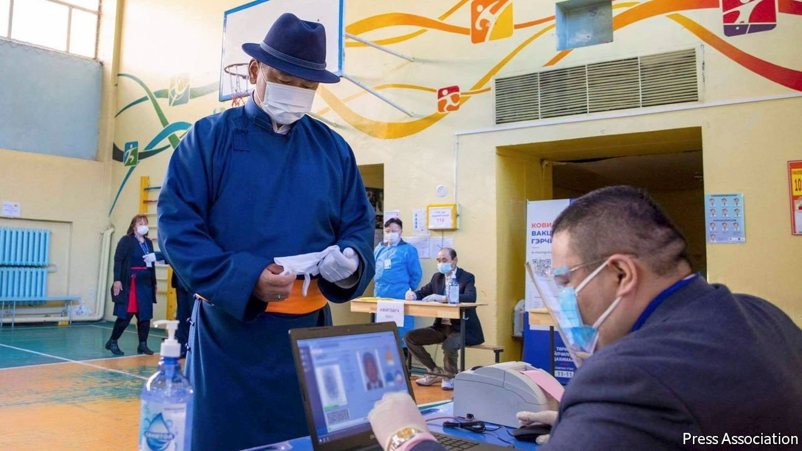

###### One-horse race

# Mongolia’s ruling party secures a thumping victory 

##### It snatches the presidency from a bickering opposition 

 

> Jun 19th 2021 

UNLIKE THE shenanigans that came before it, the result was remarkably clear. Ukhnaagiin Khurelsukh romped to victory in Mongolia’s presidential elections, held on June 9th. He became the first candidate in recent history to snaffle more than two-thirds of the vote. His Mongolian People’s Party (MPP) already holds a supermajority in parliament. After Mr Khurelsukh takes office on June 25th it will have an even stronger hold on power.

Mr Khurelsukh was Mongolia’s prime minister until January, when he resigned suddenly and ostentatiously over something that did not seem to require it: Mongolians had objected to footage of a new mother shivering in the cold while being transferred to a facility for patients with covid-19. Handing the reins to a protégé was not an act of principle, it turned out, but a ploy to tee up a presidential run.


His campaign had to swerve traps laid by the incumbent, Khaltmaagiin Battulga of the opposition Democratic Party (DP). In April the courts ruled that Mr Battulga could not seek re-election (a constitutional amendment passed by the MPP in 2019 limits presidents to one six-year term, though whether that applied to Mr Battulga had previously been unclear). Within days the president declared that he was outlawing the MPP. That pronouncement shocked Mongolians, but had little other effect. The party ignored his decree. The Supreme Court also declined to enforce it.

The election was a disaster for the DP. Its leaders had bickered over whom to nominate as the party’s candidate. The man they selected, Sodnomzundui Erdene, secured only 6% of the vote. Even some long-standing supporters of the party chose to cast blank votes rather than endorse him. That is a fresh nadir for an outfit that was already in trouble. It held almost half the seats in parliament before its coalition lost elections in 2016. These days it has less than one-sixth of them.

The opposition’s implosion leaves the ruling party unchallenged. Although constitutional changes have lessened the power of the presidency, the job still confers control of the army, among other trophies. Mr Erdene had argued that handing the MPP the presidency in addition to its supermajority would be dangerous. He campaigned under the slogan “Mongolia without dictatorship”. But many Mongolians and foreign observers sound relaxed about single-party rule. The MPP is “quite fragmented internally”, says Sumati Luvsandendev of the Sant Maral Foundation, a pollster. He is confident that lively factionalism within the party will help moderate its decision-making.

Whatever comes next, the poll has underlined the depressing superficiality of much political debate. Loud personalities and squabbles over electoral rules drowned out useful stuff. Campaigns gave little time to bigger questions such as how to manage relations with Russia and China, reduce unemployment, invest mineral wealth and diversify the economy.

The electorate looks disengaged. The turnout of 59% was the lowest ever. Christian Sorace, who follows Mongolia at Colorado College in America, warns that the country’s political class is only storing up problems. “There is no political movement, party, or politician who speaks directly to the massive socioeconomic disparities of Mongolian society.” ■

