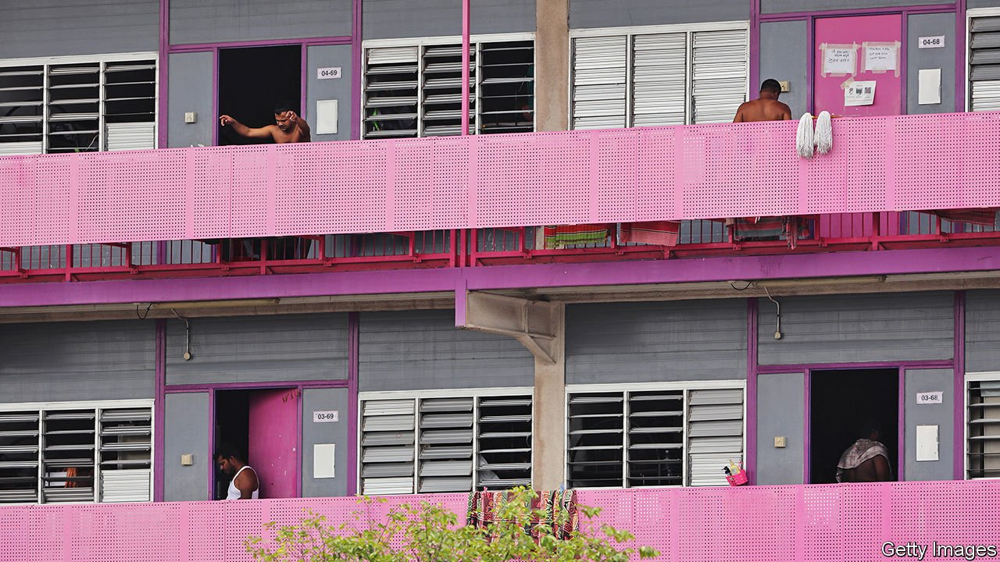

###### Fever cabins

# Singapore’s migrant workers have endured interminable lockdowns 

##### It is taking a toll on their mental health 

 

> Jun 19th 2021 

IT IS MORE than a year since Mohammad Sharif Uddin leafed through a book at the National Library or wandered beneath Singapore’s skyscrapers, two of his favourite pastimes. Since early 2020 migrant workers such as Mr Sharif, a Bangladeshi who oversees safety on construction sites, have endured lockdowns far stricter and longer than those imposed on the rest of Singapore’s population. His employer ferries him to and from work. But otherwise he must remain in his dormitory, where he shares a room with eight others. He passes the time on a top bunk reading, writing, praying and trying to stay cool amid the heat. “I feel like I am trapped in a cage.”

More than 300,000 of Singapore’s migrant workers live in dormitories (one is pictured). Most are men from India, Bangladesh or China, sharing rooms that accommodate as many as 20 people. These cramped conditions made it easy for covid-19 to spread. Four out of five dorm-dwellers surveyed in April 2020 by HOME, a charity, said it was difficult to keep a distance from others. That month new cases of covid-19 in the dorms peaked at nearly 1,400 a day. Foreign workers living in dormitories account for nearly 90% of all the people who have tested positive for covid-19 in Singapore. Antibody tests suggest that by December nearly half of the workers in dormitories had been infected.


At the beginning of the crisis strict lockdowns prevented many migrants from leaving their dormitory rooms, even to cook meals. By November most were back at work and had been given limited freedom to visit “recreation centres” set aside for them, where they can shop for groceries and send money home. At first the government allowed them to visit these places once a week for three hours; this was increased to three times a week for four hours. But the visits were stopped in May, after a slight rise in infections. Workers must get approval to run essential errands.

HealthServe, a charity that helps provide medical care to migrant workers, says that the restrictions have exacerbated “feelings of isolation, anxiety and despair”. Last year journalists reported several cases of migrant workers killing themselves (the government said it had not observed a spike in such deaths). In December HOME said stories reported in the media were the “tip of the iceberg”. It says a hotline that it runs has received many more calls related to suicide than in previous years.

The crisis could improve conditions in the long term. Last year the government set up a task force that is seeking ways to improve migrant workers’ mental health. Officials thinned crowds in dormitories by moving some residents into former schools and vacant factories. The government says it is building new permanent accommodation blocks that will offer slightly better conditions. It says polls of migrant workers find that most are “coping well”. But it says restrictions on their movements will remain tight until more of the people living in dormitories are vaccinated and “the covid-19 situation in Singapore further improves”. By early June only a fifth of dorm-dwellers had received all their jabs, compared with a third of the overall population.

Many migrants have gone home. Last year the number of foreigners employed in industries such as construction and shipbuilding shrank by about 16%. Mr Sharif would be on a flight back to Bangladesh if he could afford it. Instead he has made use of his idle hours to write and publish a diary of his days under lockdown. As he puts it: “The government has locked us in invisible shackles.” ■

Dig deeper

All our stories relating to the pandemic and the vaccines can be found on our . You can also listen to , our podcast on the race between injections and infections, and find trackers showing ,  and the virus’s spread across  and .

