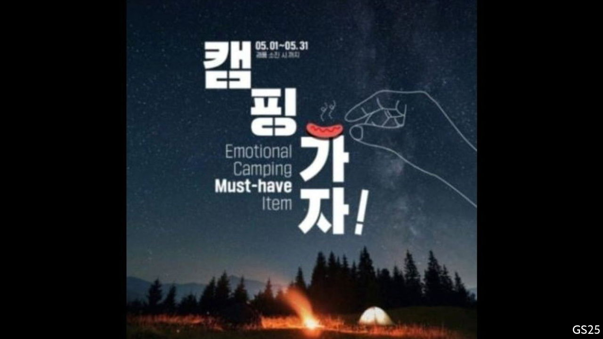

###### Sausage party

# Young men in South Korea feel victimised by feminism 

##### A conservative upstart appeals to them 

 

> Jun 19th 2021 

WAS IT MERELY an innocent sausage? Last month a poster promoting camping kit sold by GS25, a chain of shops in South Korea, included an illustration of two fingers reaching out to grasp a steaming banger. Angry young men complained. They said the detail, which resembled an emoji that depicts a hand making a pinching gesture, was a hidden insult planted by feminists. As everyone knows, the symbol is commonly used when mocking the size of a man’s penis. One critic was especially outspoken. “Why on earth would the sausage have to be there and who would eat a hot sausage with their fingers?,” said Lee Jun-seok. “We deserve an explanation.”

On June 11th Mr Lee was elected leader of South Korea’s main opposition party, the People Power Party (PPP). At 36 he is the youngest person ever to lead a South Korean political party. His election marks an effort to rejuvenate the conservative outfit ahead of the presidential poll next year, though Mr Lee is not himself old enough to be eligible for that job. Among his biggest fans are men in their twenties who feel victimised by South Korea’s increasingly vocal feminist movement.


South Korea scores poorly on measures of equality between the sexes. The “glass-ceiling index” compiled by the Economist Intelligence Unit, a sister company of The Economist, rates it the worst rich country in which to be a working woman. Many women suffer discrimination and harassment. Creeps use hidden cameras to snap pictures of them in bedrooms and public toilets. That culture ruins lives, according to a report issued on June 16th by Human Rights Watch, an international monitor.

Many young men take a different view. In a survey conducted in 2019 some 60% of men in their twenties said that discrimination against women was not a serious issue. More than two-thirds said that unfairness towards men was the big problem. They said they felt disadvantaged by South Korea’s marriage culture, job market, and the application of its laws. Compulsory military service, which applies only to men, is a particular grievance. “We have to compete against women after sacrificing 22 months for the country,” says a 25-year-old surnamed Jung. “We just want compensation for our sacrifice.”

Mr Lee has railed against radical feminism. He said the ruling party performed poorly in mayoral elections in April because it focused too much on pleasing female voters and had “underestimated” young males. He has promised to abolish quotas for women in the PPP and wants to restore “fairness” to the political process by using tests to choose his party’s candidates. This appeals to many young men, more than three-quarters of whom voted for the conservatives in the recent mayoral election in Seoul. “Most of my friends feel discriminated against in some way and that’s why we support Lee Jun-seok,” says Mr Jung. “It’s not about anti-feminism, it’s about fair competition.”

Mr Lee graduated from Harvard and worked for an education startup but has never held public office. He may struggle to find more policies that can unite his young fans with his party’s older and crustier supporters. These include evangelical Christians with a penchant for conspiracy theories whom many in the PPP find embarrassing. His idea to make party members compete for nominations by taking exams in skills such as drafting power-point presentations is unlikely to fly, reckons Choi Jin-bong of Sungkonghoe University. His ambition to abolish quotas for women and young people will irk other party leaders, some of whom are young women.

Yet Mr Lee’s youth and novelty may prove powerful assets. The PPP has changed its name twice since losing power four years ago after a corruption scandal toppled Park Geun-hye, the previous president. Until recently it had shown no appetite to renew itself any more than that. A conservative landslide in the mayoral elections suggests voters are souring on the leftish government of President Moon Jae-in, which has been damaged by scandals of its own and delays to vaccinations against covid-19. Mr Lee’s popularity will aid whomever the PPP nominates to run for the presidency next year—among some male voters, at least. Women may find him less impressive. ■

