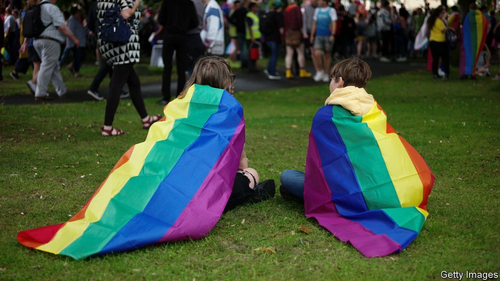

###### Stonewall stonewalls

# A campaigning LGBT charity turns a deaf ear to its critics 

##### Despite a high-court judgment affirming employees’ right to freedom of belief and speech 

 

> Jun 19th 2021 

PEOPLE BELIEVE many things, some sensible, some less so. English law regards it as a right to hold and express those beliefs—within reason. In recent years courts have ruled that beliefs in catastrophic climate change, ethical veganism and “the ability to communicate with spirits via mediums” are all “worthy of respect in a democratic society”. In 2019 a tribunal considered yet another, namely “that there are only two sexes…male and female”.

The plaintiff was Maya Forstater, a tax expert, who lost her job with an American think-tank for tweeting about her beliefs. She summarised them as that: “Women are adult human females. Men are adult human males,” and “sex cannot change”. Those beliefs were found “not worthy of respect in a democratic society” by an employment tribunal. On June 10th that ruling was overturned.


The decision matters, both for Ms Forstater and for Stonewall, a large campaigning charity. It says being trans—identifying as other than your natal sex—“isn’t about having (or not having) particular body parts”, but “something that’s absolutely core to a trans person’s identity and doesn’t alter—whatever outward appearances might be”. It describes any other view as “transphobia”.

Stonewall spreads this doctrine, widely known as “gender self-identification”, through its Diversity Champions scheme, which hundreds of big organisations, including NHS trusts, MI6, the army and the Home Office, are signed up to. The scheme’s business model is simple. Companies give Stonewall money; Stonewall checks that their policies align with its ideas and then badges them as diverse and inclusive. Simon Fanshawe, one of the charity’s founders and now a critic, thinks employers like it at least in part because “everybody’s so terrified that everybody got it so badly wrong with the gays that they’ve panicked about getting it wrong with the trans people”.

But the result has been inimical to freedoms of belief and speech at work. It is as though all major institutions decided that everyone had to be a practising Catholic, says Naomi Cunningham, an employment barrister and co-founder with Ms Forstater of Sex Matters, a campaign group. “And suddenly the rest of us have woken up and realised that we are in the grip of a theocracy [that] requires everybody to pay lip service.” Stonewall’s insistence that transness is not a physical matter, she suggests, echoes the Catholic belief in transubstantiation: a man may “retain the accidents of a man, but the essence is that of a woman”.

There are a few signs that faith in Stonewall may be starting to wane. In May the Equality and Human Rights Commission, an official body, said it was pulling out of the Diversity Champions scheme. Other big organisations are also leaving, and Liz Truss, the minister for women and equalities, says all government bodies should. In an article in the Times in May, Matthew Parris, another co-founder of Stonewall, said that “Stonewall has lost its way”. What was it doing, he asked, getting entangled in attempts to suppress free speech?

Mr Fanshawe thinks Stonewall’s travails are part of a wider malaise in political debate, namely a failure to engage civilly with opponents. The recent judgment, he points out, upheld not only Ms Forstater’s right to her beliefs, but also the right of others to believe in the primacy of gender identity over biological sex. True inclusion means, he says, “creating a very broad alliance”—not doing as Stonewall does, which he characterises as “sitting in a corner of a room with a bag over its head shouting ‘bigot’ at people”. ■

Editor’s note: An earlier version of this article incorrectly described Maya Forstater as a “defendant”. We regret the error.

