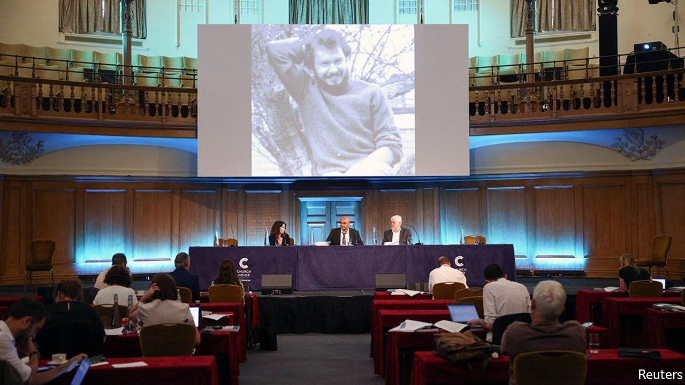

###### The murder of Daniel Morgan

# A panel finds that London’s police are “institutionally corrupt” 

##### The coppers are having none of it 

 

> Jun 19th 2021 

IN MARCH 1987 Daniel Morgan, a private investigator, was found dead in the car park of the Golden Lion pub in south London. The axe used to kill him was embedded in his head. Its handle had been wrapped with sticking plasters, perhaps for a better grip, perhaps to avoid fingerprints. A wad of banknotes in his pocket was untouched.

The Metropolitan Police’s investigation of the crime was appalling. Its forensic work was lamentable even by the sloppy standards of the time. The investigation was marred by unseemly links between the police and Morgan’s associates, and between the police and tabloid newspapers. A detective sent to interview Morgan’s business partner, Jonathan Rees (who was later acquitted of the murder) omitted to mention that he knew him well, and that the three men had been drinking together the evening before Morgan was killed.


The most alarming possibility, which the panel can neither prove nor disprove, is that police officers were involved in the murder. Investigating officers heard that story, but discounted it partly because the man who related it had been charged with a crime. Morgan may have been about to reveal corruption in the Metropolitan Police to an officer from another force when he was killed.

All this is described in a long and detailed report released on June 15th by a panel chaired by Lady Nuala O’Loan, a veteran of police investigations in Northern Ireland. But the panel was concerned not only with Morgan’s murder (for which nobody has ever been convicted) and the investigation into it, but also corruption in the Metropolitan Police, both past and present.

That corruption was once serious and widespread in London’s main police force is indisputable. Officers with memories of the 1980s recalled envelopes filled with money and criminals paying for the right to operate. Ten officers connected to Morgan’s associates were later convicted of offences including bribery and supplying drugs. In 1997 the Metropolitan Police commissioner estimated that between one in 200 and one in 100 officers were corrupt.

It is much harder to argue that corruption still flourishes in the Met, given strenuous efforts to root it out since the 1990s. But the panel adopts a broad definition, arguing that failing “to be open and transparent” or “to admit past mistakes” is corruption if the intention is to protect an organisation’s reputation. It dubs these “institutional corruption” and says the force still suffers from this. Witness, for example, the Met’s tardiness in handing documents to the panel.

The conclusion deliberately echoes the Macpherson Report, which in 1999 dubbed the police institutionally racist. The police eventually accepted that charge. So far they are having no truck with the idea that they are institutionally corrupt as well.

