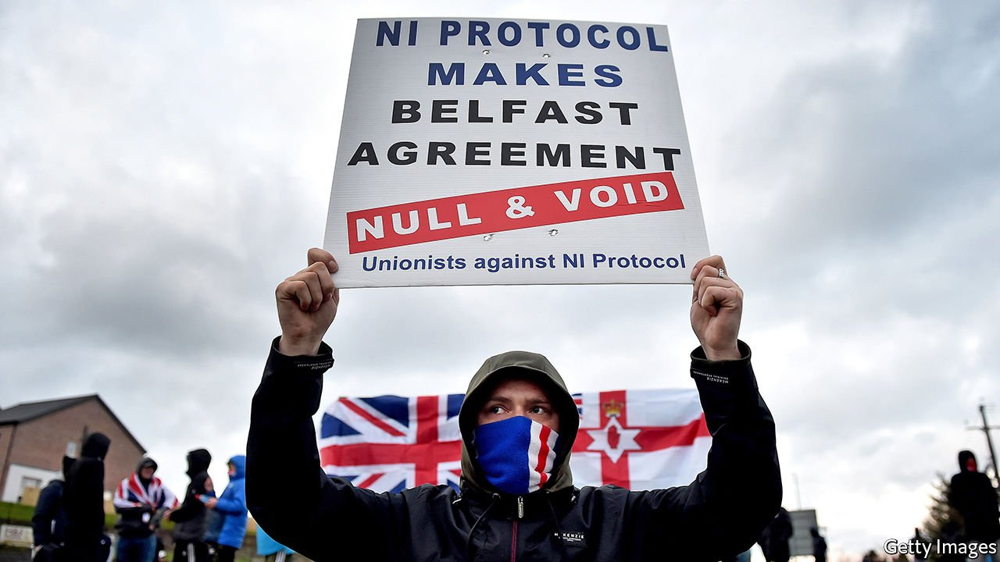

###### Border trouble

# Brexit faces problems at the Northern Irish border 

##### Britain’s uneasy relationship with the EU will get worse before it gets better 

 

> Jun 17th 2021 

JUNE 23RD marks the fifth anniversary of the Brexit referendum. Even the keenest Brexiteer must feel that the process has been tortuously long. That has been, in large part, because successive British governments have refused to accept the trade-off between untrammelled sovereignty and friction-free access to the EU’s single market, a refusal that shapes today’s increasingly testy relationship.

Almost six months after Britain finally left the single market, the impact on the economy is hard to unpick from that of covid-19. Yet the effects of new barriers to trade are clear. The Trade Policy Observatory at Sussex University reckons that in the first quarter of 2021 British goods exports to the EU fell by 15%, while EU exports to Britain fell by 32%. The Office for National Statistics finds similarly that total EU-UK trade has shrunk by 20%. And a model constructed by John Springford of the Centre for European Reform, a think-tank with offices in both London and Brussels, concludes that goods trade is 11% lower than it would otherwise have been, on top of an earlier 10% fall since the referendum.


Such numbers suggest that what was once dismissed as Project Fear is now Project Fact. A survey by consultants at EY found that 75% of firms had experienced business disruption from Brexit. Small firms found adjusting particularly hard because the EU-UK trade deal was struck just a week before exit, meaning there was no transition period. Services have been particularly hard hit. A study by researchers at Aston University concluded that, in the first four years after the referendum, British exports of services were more than £110bn ($155bn) lower than they would have been without the Brexit vote. And a report by New Financial, a London-based think-tank, found 440 financial-service firms that were moving part of their business and some staff, along with a shift of over £900bn of bank assets (10% of the total) to the EU.

The economy’s bounceback and Britain’s successful vaccine roll-out have disguised much of the impact. João Vale de Almeida, the EU’s ambassador to Britain, says the most immediate negative effects of Brexit are loss of mobility and damage to the union. Musicians and others in creative industries are complaining loudly about the first, and employers in hospitality also bemoan shortages of EU workers. As for the second, Brexit has clearly boosted the long-term chances of independence for Scotland, which voted strongly to remain in the EU. But the bigger worry is Northern Ireland.

Accommodating its needs was always going to be devilishly difficult, because its border with Ireland is Britain’s only land border with the EU. All sides agree that a “hard” north-south border—one with physical infrastructure—could threaten the fragile peace. Theresa May’s failed answer was to avoid any border or customs checks with a “backstop” in the protocol that would have kept the entire UK in a customs union and the single market for goods until alternative arrangements were possible. But Mr Johnson came to power having pledged to get rid of the backstop by taking Great Britain out of the single market and the customs union, leaving Northern Ireland alone in both. And although he has often pretended otherwise, that made an east-west customs and regulatory border in the Irish Sea unavoidable.

Just as inevitable were unionist objections. When supermarket supplies were disrupted straight after Brexit, . Unionist hardliners even claimed that, just as the decision to avoid a hard north-south border was motivated by fears of nationalist violence, so the threat of loyalist violence might now get rid of border controls in the Irish Sea. The new Democratic Unionist Party (DUP) leader, Edwin Poots, calls for  to be scrapped. Even if it stays, in 2024 the Northern Irish assembly could vote to end its application. A simple majority would suffice.

Arguments over implementation have been stirred by unilateral actions on both sides. The British government first proposed to breach international law in its internal-market bill last autumn, but dropped this plan when it struck a trade deal with the EU. In January the EU threatened to suspend the protocol unilaterally in a bid to stop vaccine exports from the bloc, though it backed down within hours. Mr Johnson has since broken the treaty by extending a grace period for the import of supermarket goods. Now he promises to do the same for the grace period for chilled-meat imports that expires at the end of June. The EU threatens to respond with not just legal action but tariffs, too, as permitted by the terms of the trade deal.

The prospect of a trade war over sausages may delight the pro-Brexit press, which is itching for a fight with the bully on the other side of the channel. It is unpopular, however, with Northern Irish businesses. And getting rid of the protocol would not be straightforward. The assembly election due within 12 months may see Sinn Fein, the main Irish-nationalist party, take the most seats, making it harder to win a majority in favour of removing the protocol. Katy Hayward of Queen’s University and UK in a Changing Europe, a think-tank, points out that voting to remove its trade clauses would merely trigger a negotiation to find some other option. And as Claire Hanna, a Social Democratic and Labour Party MP, observes, the DUP has not suggested any alternative.

Aodhan Connolly of the Northern Ireland Retail Consortium offers one possible solution. Instead of what he calls diplomacy by rival op-eds, he suggests a temporary commitment by the British government to stick with EU food-safety and veterinary standards. That would cut the number of border and customs checks required under the protocol by 80%, he says. The EU would be happy to agree to such a temporary measure, as would Mr Poots and the DUP.

Mr Johnson, however, is not keen on any alignment with EU regulations. This may seem odd, since he also insists he has no intention of weakening food-safety standards. Other neighbours of the EU, such as Norway and Switzerland, are happy to abide by its food rules in order to avert trade barriers. A more substantial objection is that such a policy would make it harder to negotiate a free-trade deal with America, which always demands better access for its farmers. But at the G7 summit in Cornwall between June 11th and 13th, President Joe Biden, anxious to avert renewed trouble in Northern Ireland or any risk of an intra-European trade war, promised that a trade deal would not be blocked by British alignment to EU food standards. And such a deal would, in any case, take years to negotiate.

The biggest obstacle to a pragmatic solution is lack of trust. The EU believes Mr Johnson signed the protocol intending not to stick to it. Mr Johnson thinks that some within the bloc want to drag Britain back into its regulatory orbit. Most worrying is that both sides have something to gain from playing tough: the EU by demonstrating that those who sign deals with it must stick to what they agreed; Mr Johnson by standing up to an overweening neighbour. Diplomats on both sides expect the relationship to worsen. Sadly, Northern Ireland may be the fall guy. ■

A version of this article was published online on June 15th 2021

