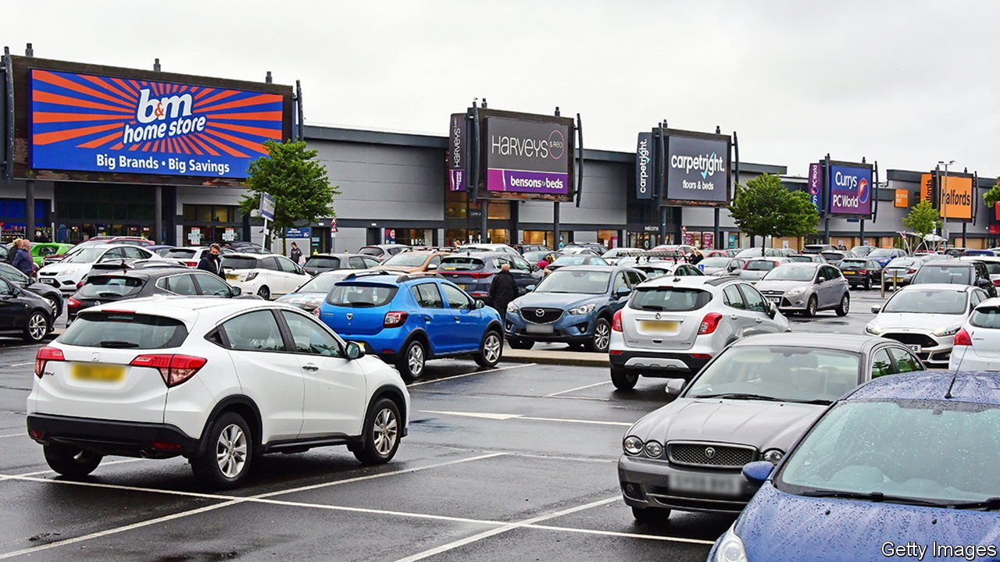
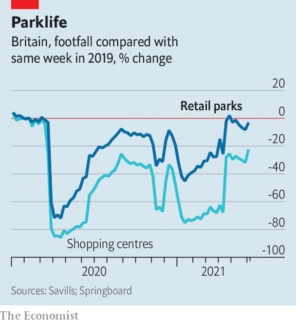

###### Clicks and mortar

# Retail parks are well-placed to weather lockdowns 

##### In a post-pandemic world, out of town and out of doors is a winning combination 

 

> Jun 19th 2021 

TIMES WERE tough for offline retail before covid-19. Rising costs and tepid sales growth had squeezed margins; online shopping was filching market share. According to the Centre for Retail Research, an analytics firm, by early 2020 high streets had around 50,000 fewer shops than a decade before, a drop of 13%.

Then the pandemic struck. During the first lockdown, customer numbers for all retail locations plummeted. In-town shopping centres were the worst hit and slowest to bounce back: data from another analytics firm, Springboard, show that footfall in the first week of June was 22% below that in the same week in 2019. But amid the gloom, there is a bright spot. Visitor numbers for out-of-town retail parks were hit far less hard, and have recovered to 3% below their pre-pandemic level.

 


Property investors have noticed. According to Savills, an estate agent, rental yields on shopping centres and high-street stores were rising before the pandemic, but the pace accelerated during it, meaning that the market is demanding a higher return on assets it perceives as riskier. Yields for retail warehouses have been falling since September 2020. Acquisitions tell a similar story: buyers have spent £900m ($1.3bn) snapping up retail parks so far in 2021, but only £280m on shopping centres.


In part, they reason that retail parks will do better in a world reshaped by the pandemic. Shoppers feel safer in outlets visited by car rather than public transport, and where moving between shops happens out of doors. Outlets in retail parks are larger, which helps with social distancing and ventilation. Moreover, they are stuffed with the sorts of shops that have boomed during the pandemic: supermarkets, pet-supply stores and those selling everything needed for the home, from plants and paint to futons and fridges.

But the pandemic is not the only reason retail parks are outperforming. They are much better placed than their high-street counterparts to survive the rise of internet shopping. People buying white goods, furniture and furnishings want to see and touch them before shelling out cash. Vast shop floors and good road access mean they can double as distribution centres. And they are ideal for “click and collect”, the fastest-growing form of online shopping. Expect investors’ enthusiasm to outlast lockdowns. ■

