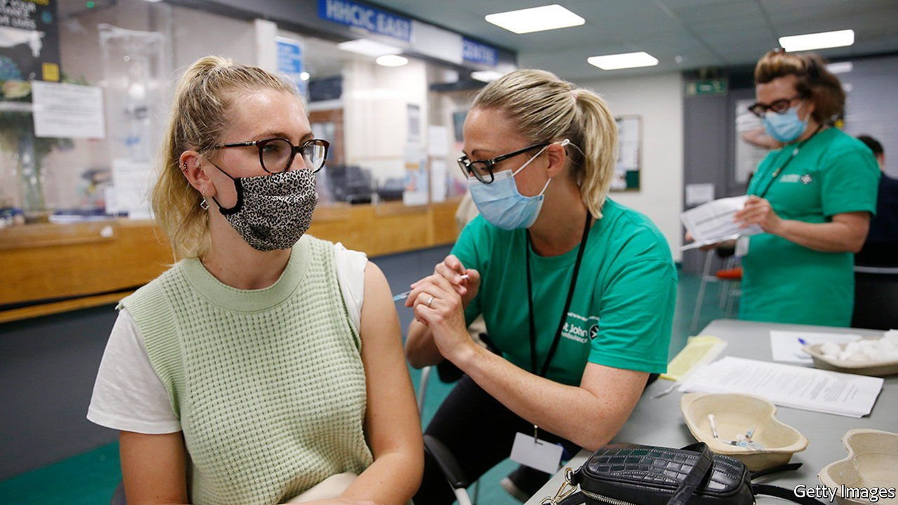
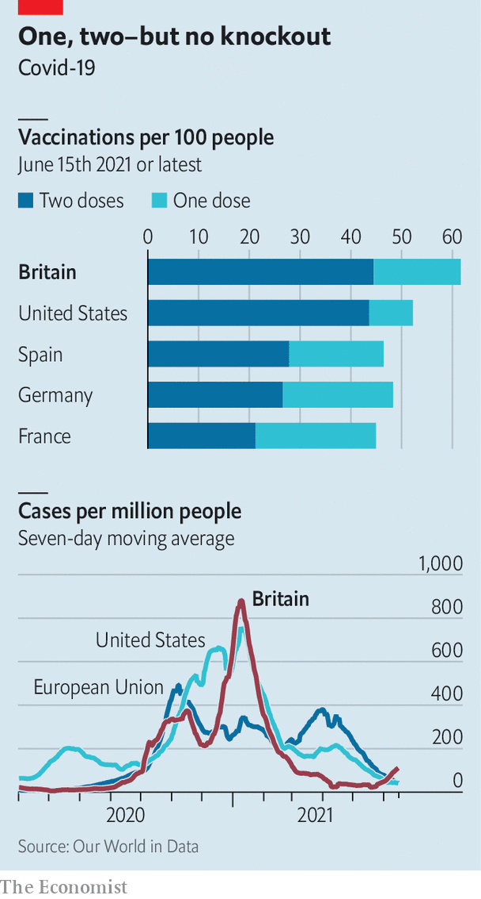

###### Jabs v virus

# The British covid-19 warning 

##### Despite rapid vaccination, rising case numbers force Boris Johnson to delay reopening 

 

> Jun 19th 2021 

AT FIRST THE government focused support—surge vaccination, wastewater testing and the like—where the covid-19 Delta variant (then known as B.1.617.2) had taken hold. Now, it is everywhere, accounting for 90% of cases, and so the support has spread, too; from Bolton and south London to Birmingham, Blackpool, Cheshire, Chester, Liverpool and Warrington. The battle to defeat the variant has been lost. The aim now is to stop cases spiralling.

Ministers and modellers hold little hope that these measures, and a vaccination campaign that has jabbed more than six in ten Britons, will protect hospitals. So on June 14th Boris Johnson announced that “stage 4” of the reopening, allowing big events and indoor gatherings of more than six people, would be delayed from June 21st to July 19th. The government is also thinking about the long haul, including how to improve public ventilation and whether to encourage people back into offices.


The postponement reflects both bad luck and bad policy. According to Public Health England (PHE), the Delta variant is around 60% more transmissible than the Alpha (formerly Kent) variant, which is in turn more transmissible than earlier ones. The new wave is spreading among younger Britons, who are more likely to be unvaccinated or to have received only a single dose, which another PHE study finds is a third less effective at preventing infection by the Delta variant than by the Alpha one. The extra delay before easing restrictions will mean more second jabs, which are just as good at preventing hospitalisation.

 


Nadhim Zahawi, the vaccines minister, has said the roll-out would have been faster had the Joint Committee on Vaccination and Immunisation (JCVI) not recommended, in response to rare blood clots, that under-40s be offered jabs other than AstraZeneca. This raises two questions. Was the advice followed correctly? The JCVI recommended other jabs only if it would not “substantially delay” vaccination. And will that advice change? No case-count threshold has been set for reversing it, but the committee is keeping an eye on the risk-benefit calculation as cases rise.

Britain is still better placed than most of the rich world to weather the new variant (see chart). “Countries that have taken a more lackadaisical approach will find themselves with a big problem,” predicts Sir John Bell of the University of Oxford. That there are so many Delta cases probably reflects the fact that lots of people infected with it reached Britain early, he says. Mr Johnson’s delay in adding India to the “red list” of countries, with tighter travel restrictions, looks foolish. That vaccines mean the mistake is likely to prove less deadly than previous ones will be little comfort to businesses desperate to reopen, or to hedonists desperate to party. ■

Dig deeper

All our stories relating to the pandemic and the vaccines can be found on our . You can also listen to , our podcast on the race between injections and infections, and find trackers showing ,  and the virus’s spread across  and .

