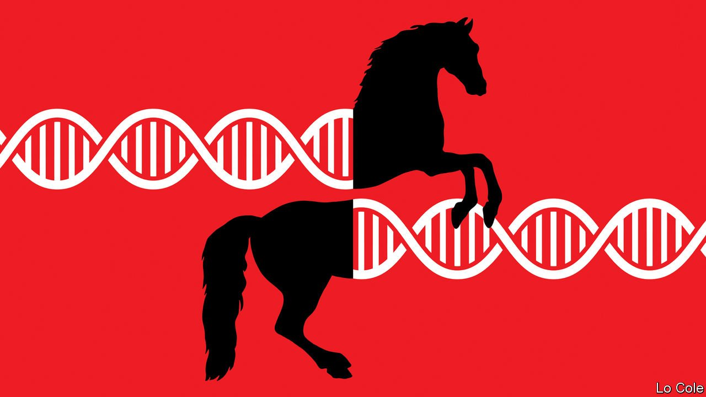

###### Neigh laughing matter

# Thoroughbred horses are increasingly inbred 

##### Since its origins in 18th-century England, the industry has prized purity over diversity 

 

> Jun 19th 2021 

THE COURSE OF true love never did run smooth. That is particularly true when your lover weighs half a tonne and is wearing steel shoes. At the National Stud in Newmarket, a town in Suffolk widely regarded as the home of thoroughbred racing, it is breeding season. A mare stands in the shade of a stable. Her hooves have been covered with leather boots, to dampen kicks; her head is held by grooms. Tim Lane, director of the stud, calms her. The horses, brushed till they are as shiny as conkers—“they’ve got to look good,” explains Mr Lane—eye each other warily.

Thoroughbreds are the aristocrats of the horsing world: glamorous, subjected to odd mating rituals and more than a touch inbred. All are descended from three Arabian stallions brought to England in around 1700; animals which, Charles Darwin said, had “the commingled blood of Arabs, Turks and Barbs” in their veins. They make the Habsburgs look genetically diverse.


Always closely related, thoroughbreds are getting even more so. A recent study published in Scientific Reports found “a highly significant increase in inbreeding in the global thoroughbred population during the last five decades”. All but 3% of the 10,000 horses in the study counted Northern Dancer, born in 1961, among their ancestors. Superstar sires “cover”, as horsey types call mating, over 200 mares per year, up from 40 in Northern Dancer’s day.

At first, horse breeders did not consider inbreeding a problem. On the contrary: horses, like maidens, were better when purer. Within a century of the arrival of those three stallions, it was decided that the job of perfecting the horse had been done so well that the stud book was closed to new entrants. Aristocrats policed the parentage of their horses, listing their dams and sires in Weatherbys stud book. In 1826 Burke’s Peerage appeared, allowing aristocrats to do much the same for themselves. Francis Galton, the father of eugenics, recommended that “no time ought to be lost” in instituting a human equivalent to the stud book, to record not class, but fitness and form.

Eugenics has fallen out of fashion. The horsey equivalent has not. Thoroughbreds can earn far more from propagating their race than from running races. At the National Stud, one commands a fee of £25,000 ($35,000) for a cover. Galileo, among the world’s finest stallions, is rumoured to command £600,000 a pop.

Such fees make the very best thoroughbred semen one of the world’s most expensive substances, at around £6m a litre. Precise sums are difficult as it is not sold by the bottle (horses conceived by artificial insemination cannot be registered as thoroughbreds) and quantities naturally vary, but there is no doubt this is a profitable business. The finest stallions can earn a million pounds in a day.

Fashionable sires are therefore good for breeders. But they may be bad for the breed. As genetic mutations accumulate, health and fertility decline. Such problems have been found in species as diverse as dogs, humans and cows, and it is hard to see why horses would be immune to them. “We don’t know yet how much inbreeding is tolerable or whether we’ve reached a tipping point, or when that point might be reached,” says Emmeline Hill of University College Dublin, one of the authors of the recent report. Genetic problems may be accumulating, unseen.

Back at the National Stud the gleaming horses, cover completed, trot back into the sunlight. Mr Lane, like Ms Hill, considers that what matters is not just appearance, but function. A horse that looks wonderful might not race well, or breed well. Teasingly, he reaches for an analogy with another species. “Not all good-looking women can cook, can they?” ■

