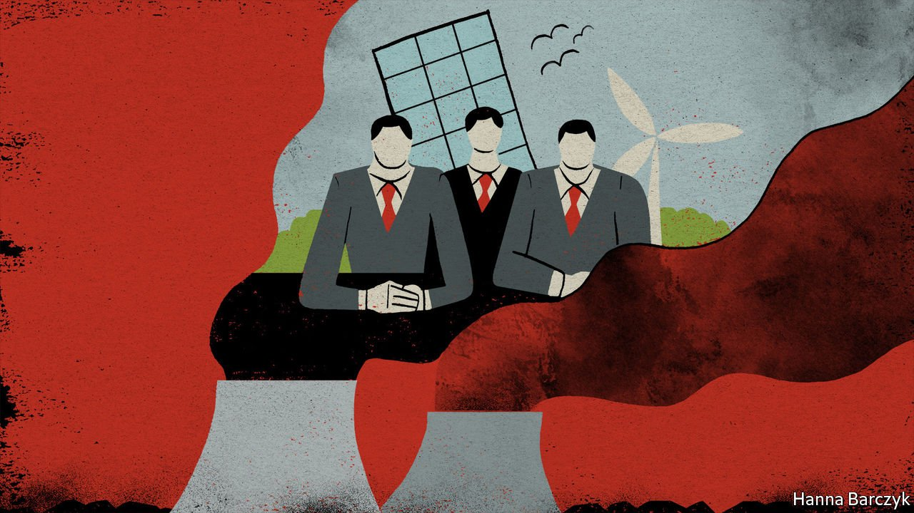

###### Chaguan

# China’s climate sincerity is being put to the test 

##### Until it stops burning coal for power, foreign firms will be reluctant to invest more there 

 

> Jun 17th 2021 

TO HEAR CHINA’S Communist Party tell it, the nifty thing about autocracy is that it lets rulers plan for the long term. Apologists for one-party rule hail China’s leaders as enlightened technocrats who think in centuries, while decadent Western democracies struggle to see beyond the next election cycle.

By the autocrats’ logic, China should excel at tackling climate change. For it faces stark long-term risks. As an arid country that lacks clean water and productive farmland, and where the richest regions lie on the coast, China is exceedingly vulnerable to global warming and rising sea levels. Sure enough, the supreme leader, President Xi Jinping, seems to be taking charge. Last September he decreed that China’s emissions of CO will peak by 2030 and that by 2060 the country will become carbon neutral.  goes live this summer. Vast wind farms and arrays of solar panels have been built, and more are coming.


In fact,  is a mess of contradictions. Perhaps time will show that Mr Xi is serious about making the unpopular, expensive changes that are needed to wean his country off fossil fuels, notably the coal that supplies nearly 60% of the country’s energy. But it is difficult to be sure. China’s coal consumption has risen significantly since it joined the Paris climate agreement in 2015. At home, a ban on new coal-fired power stations was lifted in 2018. The total capacity of such plants approved for construction or being built is larger than America’s entire active coal-fired power sector. Overseas, despite pleas from America, the European Union and others, Chinese development banks lend billions of dollars each year to build coal-burning plants, though a state-owned giant, the Industrial and Commercial Bank of China, says it will phase out coal financing.

Provinces and cities, especially in the coal-reliant north-east, are hesitant about publishing carbon “peaking plans”. They want more time to pursue growth before curbing greenhouse gases. The rules governing the emissions-trading scheme have been loosened so that only a handful of plants will face real constraints, at least initially. This reflects the leading role apparently granted to the main economic planning agency, at the expense of the environment ministry, in bodies charged with deciding how, and how fast, to tackle climate change. Some big steelmakers have been allowed to expand production again, months after they were caught breaking environmental rules and ordered to cut emissions.

Climate-related efforts in China are not always as mysterious or prone to sudden reversals. Take the China operations of foreign multinationals. Responding to consumers and politicians back home, many such firms have promised to make their global businesses carbon neutral, and to seek big cuts in emissions from their supply chains. As a result, the China bosses of some well-known European companies have told officials, including in the north-eastern cities of Tianjin and Shenyang, that they will find it hard to expand or open new production sites if the electricity or heating on offer locally continues to come from coal. “In an energy-intensive industry, if the electricity is coal-based, you can’t build a new plant,” says Harald Kumpfert of the European Union Chamber of Commerce’s branch in Shenyang, the capital of Liaoning province.

The largest taxpayer in Shenyang is a BMW joint venture that makes 600,000 cars a year at two plants. In 2016 the city had no green electricity to sell. Now a new wind farm in Liaoning—a blustery coastal province with huge potential for green energy—provides about two-thirds of BMW’s power. More energy comes from solar panels built over car parks where vehicles await delivery. On a recent visit, Chaguan was shown technologies that have cut carbon emissions per vehicle by 84% since 2016, such as cleverly controlled ovens in the paint shop. In a nicely dramatic touch, freshly baked car bodies emerge on a raised conveyor that carries them on a bridge through an office building, on their way to assembly lines.

Alas, hundreds of BMW suppliers in China have “huge trouble” obtaining renewable electricity, say engineers at the car firm, suggesting that the foreigners have snapped up most green energy on offer. To avoid simply shuffling dirty energy around and to increase demand for renewables, energy-intensive Chinese suppliers, such as steelmakers or aluminium foundries, need to start installing efficient technologies and using low-carbon energy. Progress also requires changing the incentives that guide officials. BMW makes the case to governments that “jobs using renewable energy are sustainable jobs,” says Johann Wieland, head of the carmaker’s main China business.

Long-term plans, short-term incentives

China’s political system, for all its multi-decade plans, is run by officials who may stay in a given job for five years, and whose next promotion depends on economic growth now. Zhang Lei, the chief executive of Envision, a big wind-energy and battery company, is confident that top-down orders can overcome local inertia. “The most important thing is that President Xi has made a huge commitment and continues to push that agenda,” says Mr Zhang.

Ma Jun, an environmentalist, sees a role for pressure from above and below. He runs the Institute of Public and Environmental Affairs, an influential Beijing-based organisation that tracks and publishes pollution and emissions data. “It is too much to expect a foreign company to change the energy mix of a city,” says Mr Ma. But nudges from foreign and local businesses might push officials to a tipping point. “To change minds we need both market-based and policy-based interventions,” he says.

Multinational corporations are not saints. Many were happy to run profitable but dirty plants in faraway places. Too many are still reluctant to demand transparency from suppliers. But Western voters are growing serious about the climate, and about holding governments and businesses to account. That pressure might just be helpful in China. Pluralism is messy but potent stuff. ■

For more coverage of climate change, register for The Climate Issue, our fortnightly , or visit our 

A version of this article was published online on June 14th 2021

