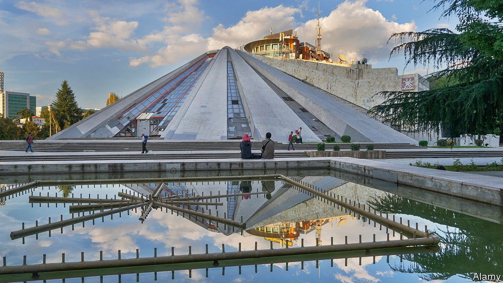

###### Pyramid scheme

# A memorial to Albania’s late dictator gets a new lease of life 

##### Enver Hoxha’s pyramid is becoming a shrine to coding 

 

> Jun 19th 2021 

FOR YEARS it has been an eyesore. Stripped of its marble facing and defaced with graffiti, Tirana’s pyramid was falling down. Now workmen are busily clambering about on top of it, as work has begun on restoring the Albanian capital’s most unusual building. Completed in 1988, the same year as I.M. Pei’s Paris pyramid, Tirana’s shabbier version is getting a new lease of life.

The building was put up as a museum and memorial to Enver Hoxha, Albania’s Stalinist dictator, who died in 1985. It was designed by his daughter and her husband, who said their inspiration was the mountain that rises above the city. Its real significance was obvious to everyone. Mr Hoxha had been Albania’s pharaoh and he would be remembered for thousands of years. In private, Albanians grumbled. They were poor, a pyramid seemed rather extravagant and besides, Hoxha was a mass-murdering monster. When communism collapsed in Albania in 1991, the memorial-cum-museum was promptly closed.


Ever since, no one has quite known what to do with the thing. NATO opened a regional headquarters in it during the war in neighbouring Kosovo in 1999. Sali Berisha, a post-communist leader, started an abortive project to convert it into a new national theatre. The structure became “a Frankenstein”, says Erion Veliaj, Tirana’s mayor.

Last year Mr Veliaj came under fire for demolishing the existing, miniature national theatre, which was built during the second world war by the occupying Italians out of (oddly enough) compacted paper matches. Mr Veliaj shrugs. Leaders sometimes have to go against the flow, he reckons: “Only dead fish go with it.” By contrast, his decision to restore the pyramid is rather popular.

When the restoration is finished the pyramid will be faced with staircases, so people can climb to the top. And an organisation that Mr Veliaj came across in Armenia, which teaches teens how to code, will work inside what was once a shrine to a communist tyrant. There are worse uses.

