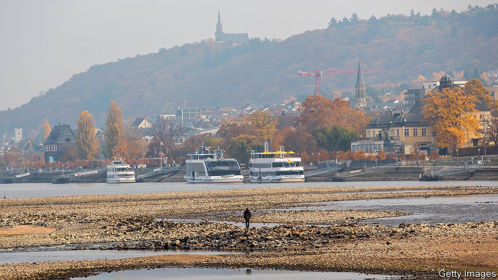
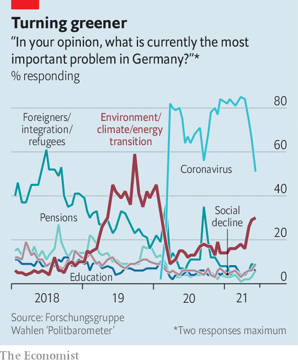

###### Grant me greenery, but not yet

# Climate change will feature heavily in Germany’s election 

##### But the difficult discussions will have to wait 

 

> Jun 19th 2021 

THE FIRST sign of trouble on the Rhine, Europe’s busiest inland waterway, was when the river cruises and hotel ships disappeared. Then the cargo vessels got smaller, or simply stopped sailing; goods like coal were shifted to trains. Water levels fell low enough to expose unexploded wartime bombs. These grim scenes, described by Florian Krekel of the Bingen office of Germany’s Waterways and Shipping Administration, date from autumn 2018, when a long drought so depleted the waters along this scenic part of the Rhine that navigation became near-impossible. Manufacturers on the river had to slash production, exporters were cut off from world markets and petrol stations in Cologne had to raise prices. The disruption shaved 0.2 percentage points off German GDP, according to the Kiel Institute for the World Economy.

Over two-thirds of Germany’s land area was afflicted by the great drought of 2018. Soon afterwards climate change shot up the list of voters’ priorities (see chart). And as its effects, potential or actual, on Germany’s waterways, forests and farms have become harder to ignore, it has remained at or near the top ever since. Germany’s parties, gearing up for an election in late September, are reacting accordingly.


The Green Party, which approved its manifesto at a party pow-wow last weekend, has naturally placed climate policy at the centre of its offer. But the centre-right Christian Democrats (CDU), their Christian Social Union (CSU) allies in Bavaria, and the Social Democrats (SPD), who currently rule in coalition, have also had to put their imprints on it. Parliament is debating a revision to Germany’s climate law, spurred by a constitutional-court ruling that made the government tighten its climate goals. In 1990, in the newly reunified country’s first election, the Greens boasted, “Everyone is talking about Germany. We’re talking about the weather.” Three decades on, their rivals have fallen into line.

 


Yet that may not work to the Greens’ advantage. Although climate’s prominence in Germany’s debate is new, the old tactic of tarring the Greens as a bossy Verbotspartei (“prohibition party”) still looks potent. When Annalena Baerbock, the party’s chancellor-candidate, recently said petrol prices would have to rise, the CDU/CSU and SPD hammered her for building climate policy on the backs of poor motorists. Armin Laschet, her CDU rival, says the Greens threaten Germans’ sacred right to an annual jolly in Majorca. “People in the cities telling people in the countryside how to live—it’s crazy,” grumbles Jochen Ratzenberger, a Green-sceptic Rhineland winemaker. The Greens have slumped in polls.

Their response is twofold. First, to tamp down excesses in their own ranks. At the Green congress the leadership saw off activists who wanted bolder promises to increase Germany’s new carbon price. Second, to provide a cheerful narrative for the climate struggle. Robert Habeck, who leads the party with Ms Baerbock, delivered a barnstorming speech linking climate action to heroic themes like freedom and justice. More prosaically, the Greens have a plan to redistribute dividends from carbon tariffs to Germany’s less well-off.

But voters distrust such schemes. Nor are they wild about making specific sacrifices, such as paying more for petrol or ditching meat. Germany must now reduce greenhouse-gas emissions by 65% (from 1990 levels) by 2030, in order to reach net-zero emissions by 2045. This will have a dramatic impact on everything from retrofitting housing stock to the speed with which German petrolheads are weaned off the combustion engine. “Most people have no clue what it will take for Germany to achieve its goals,” says Anita Engels, a climate sociologist at Hamburg University. Few politicians seem inclined to tell them.

In theory, the CDU/CSU’s emphasis on market methods for climate action versus the Greens’ penchant for regulation could make for “healthy debate” in the campaign, reckons Ottmar Edenhofer, head of the Potsdam Institute for Climate Impact Research. Some younger CDU MPs, sniffing the political wind, would indeed like to take the fight to the Greens. But others doubt the wisdom of battling on Green turf, and they seem to have Mr Laschet’s ear. A leaked draft of the CDU’s imminent manifesto offered little detail on climate.

A new report by More in Common, an international group that works on social polarisation, finds a broad consensus across Germany for climate action, alongside concerns about fairness and a sense of personal helplessness. Two-thirds of Germans it polled want binding climate rules. “Politicians are threatening social cohesion by not acting,” says Laura-Kristine Krause, the outfit’s Germany director.

Should Mr Laschet and Ms Baerbock find themselves yoked in coalition after the election, as many expect, climate will be among the toughest elements of the negotiations. The new targets must be met, and the court satisfied. Postponing tricky conversations carries its own costs. ■

For more coverage of climate change, register for The Climate Issue, our fortnightly , or visit our 

