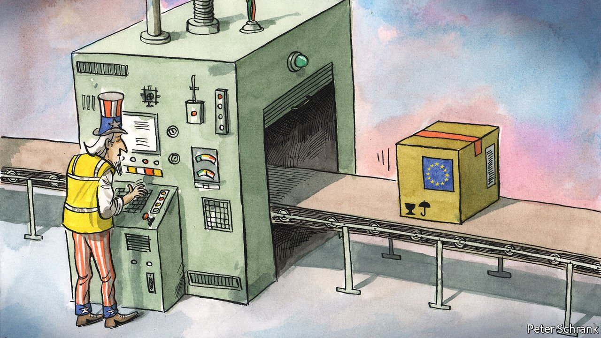

###### Charlemagne

# The EU: Made in America 

##### America is an engine of European integration, intentionally or not 

 

> Jun 19th 2021 

FROM THE Big Mac to the nuclear bomb, the list of 20th-century America’s achievements is long. In a remarkable period of invention, America bestowed human flight, superglue, rock and roll, the Saturn V rocket, Pop Tarts and the internet upon humanity. One American innovation from this era receives much less attention: the European Union.

The EU is an American creation, as much as a European one. In the middle of the 20th century, there were more European federalists in Washington than in Brussels. Senators bashed out resolutions declaring: “Congress favours the creation of a United States of Europe.” The Marshall Plan, a torrent of post-war funding for the crippled continent, came on the condition that European countries meld themselves together. George Kennan, an American diplomat, summed up American policy: “We hoped to force the Europeans to think like Europeans, and not like nationalists.” Forget Jean Monnet. When it comes to naming founding fathers for the EU, the list should start with President Harry Truman.


When Joe Biden swung by Brussels on June 15th, he reiterated a long-standing American goal. In a festival of back-slapping, the president heaped compliments on the EU and stressed that an integrated club was in everyone’s interests. Donald Trump did his best to bury the thing, attacking it at every opportunity and loudly supporting Brexit. With Mr Trump gone, America has returned to its normal role of trying to make Europeans get along.

America has always been the secret ingredient of European integration. In the aftermath of the second world war, unifying Europe made sense for America. A divided continent could hardly resist Soviet domination. Nor would it be able to fix the “German problem” that had resulted in two wars in three decades. Instead, in a novel experiment by a victorious power, America opted to try to unite a traumatised continent, even though it could be a potential rival.

Skip forward 70 years and America is now a more subtle force for European unity. State-building can be a messy business, but American history provides one of the few guides for creating a continent-sized democracy. When discussing whether to issue collective debt, European politicians reach for Alexander Hamilton, one of America’s Founding Fathers. When wrestling over who has the final legal say, scholars look to the same debates that played out in 19th-century America. The EU is a unique beast, but American history still provides the best instruction manual for how to handle it.

Sometimes European integration is a byproduct of American policy. Stubbornly national elements of policymaking, such as corporation tax, are slowly being mangled into EU matters thanks to American action. A recent American-led push to set a global minimum tax rate for big business has done more to shunt the EU towards a common tax policy than years of nagging and legal tricks by Brussels. Within the EU, low-tax countries such as Ireland and Hungary wield a veto on its tax affairs. Diplomatic force majeure by America overcame that.

If American governments have been an engine of integration, then American companies have greased the gears. The rise of Netflix and other streaming services means that Europeans increasingly watch the same programmes, breaking national siloes. Facebook and Twitter allow for a raucous public sphere, where anyone can share thoughts on Emmanuel Macron. Google Translate makes users feel as if they had weirdly woken up with the ability to read 24 languages, allowing Italians to flick through newspapers in Swedish and Bulgarian, if they have the urge.

At times, America drove Europe closer together by mistake. When the American government tried to tear the club apart under Mr Trump, it ended up accidentally fortifying it. Mr Trump taught EU leaders that America would not always be a helpful ally and that the bloc had to stick up for itself. French diplomats were giddy, blowing the dust off old policy ideas for beefing up European power. In a post-Trump era, their fellow officials actually listened.

The EU still falls far short of the federal mini-me imagined by the likes of Marshall, Kennan and Truman. During the euro-zone crisis, American officials were left perplexed that Greece, an economy just over half the size of New Jersey, might blow up the project. When viewed from 4,000 miles away, the vicious disagreements in European politics that stood in the way of further integration seemed rather small. In this way, says Jeremy Shapiro at the European Council on Foreign Relations, America’s take on European integration resembles Gandhi’s view of Western civilisation: it would be a good idea.

Nowhere to run ain’t got nowhere to go

From an American perspective, a stronger EU is one that can be left alone. Europe was the front line of the cold war, but it is the periphery in America’s struggle with China. Europeans may not enjoy isolation. In the shade of America’s defence umbrella, difficult decisions could be avoided. It does not matter if, say, Poland or France has different security concerns, as long as America is happy to sit behind all of them. Exit America and these debates become awkward.

On paper, America wants a more capable EU. In practice, it may find such a development unsettling. At the turn of the century, the euro was talked of as a rival to the dollar. The euro’s near-collapse a decade later put paid to that idea. A stable euro zone with the ability to issue collective debt at will would be a much stronger potential challenger to the dollar’s supremacy. Where the EU does have power, such as over competition policy or privacy rules, it has delighted in whacking American firms. Such areas are rare but becoming less so. A more unified EU is a more powerful one and, almost inherently, a more independent one. America may, with time, come to regret what it has wrought. ■

