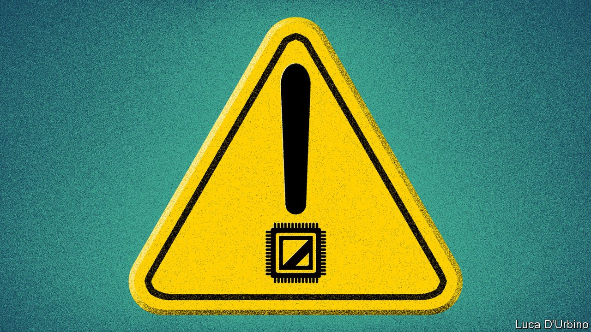
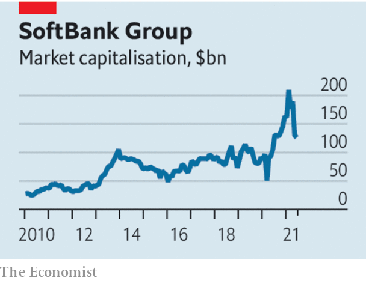

###### Corporate governance

# Investors in technology need to pay attention to corporate governance 

##### Investors in technology firms too often put up with ropy corporate governance. They may come to regret it 

 

> Jun 19th 2021 

EVERY BUSINESS cycle, as it runs out of puff, reveals problems that seem obvious in hindsight. Twenty years ago, when stockmarkets slumped, accounting frauds came to light at Enron, an energy-trading firm, and WorldCom, a telecoms outfit. Less spectacular were the revelations that many companies had cut corners or behaved recklessly. The actions of titanic bosses ruling over General Electric and Vivendi, a French media group, ended up hobbling them for decades. After 2008, the emperors of Wall Street were revealed to be wearing no clothes, with Lehman Brothers, Merrill Lynch and others collapsing under the weight of huge losses—and their bosses’ giant egos.

Guessing where tomorrow’s cautionary tale may lie is not easy. But investors seeking to avoid blow-ups should pay special attention to securities, companies and bosses that encapsulate the boom today. One area of financial risk is the thriving  where underwriting standards have slipped. In the corporate world the prime candidate for a governance conflagration is the technology industry.


One reason is the enduring exuberance for anything with the whiff of tech. The recession caused by covid-19 was a hammer-blow to many parts of the global economy. But a side-effect of the pandemic was to turbocharge Silicon Valley and its various offshoots, amplifying an already unprecedented bull run. All manner of sins, from questionable accounting to imperious executive behaviour, tend to be overlooked in good times. As Warren Buffett famously noted, only when the tide goes out can you see who has been swimming naked.

 


Another reason to watch tech is the plentiful funding for risky ventures. Investors desperate for returns have been shovelling money at businesses with high valuations, but whose prospects are far from proven. Didi Chuxing, a Chinese ride-hailing outfit, may well receive a valuation of over $100bn in an upcoming share sale, despite amassing $13bn of cumulative losses. Further rum has been added to the punch with the proliferation of special-purpose acquisition companies, or SPACs, which are listed pots of money designed to merge with private firms.

The last reason to watch out for tech firms is their bosses. Dotcoms and their corporate cousins are often still run by their founders. Many of them have controlling stakes, thanks to souped-up voting rights. These entrepreneurs tend to have a messianic confidence in their own abilities and a fortune to match. The heady potion of control, wealth and self-belief can lead bosses to brush aside all criticism and to look upon rules as things for other people.

One firm that highlights all of these worries is SoftBank. The world’s biggest tech investor, with a market value of over $120bn, it has been instrumental in fuelling today’s ebullience. Some of its bets, including Didi and Coupang, a South Korean e-commerce champion, have been great successes. But as well as backing some hits, and its inevitable share of duds, the Japanese firm has also become mired in firms like Greensill, a British lender that collapsed earlier this year; WeWork, a troubled office company; and Wirecard, a fraudulent German fintech firm.

That raises questions about how  itself is run. Although a tentacular outfit, the firm is best thought of as the Masa show, where all the big decisions are made by its founder and boss, Son Masayoshi. This includes how to allocate oodles of capital—the firm is currently spending over $200m a week backing companies.

Risk control at the firm is patchy. Its internal hedge fund, once dubbed the “Nasdaq Whale”, roiled markets last year, sending shares of various companies berserk. The firm has morphed so many times analysts admit struggling to understand what goes on there. Dealings between the firm, its funds, its executives and its affiliates can create the risk of conflicts of interest.

SoftBank is not alone. There is surely questionable corporate governance in other tech firms, too. Disclosure is patchy at best. At the big tech firms, it is far less demanding than at big banks: Facebook’s annual report has 129 pages, compared with 398 at JPMorgan Chase. This week executives at Lordstown Motors, an electric-vehicle startup, resigned after the firm made inaccurate disclosures. Those dual-class shareholding structures often let exalted founders keep control.

In tech, activist investors hold relatively little sway. Their arrival would go some way to improve corporate-governance standards by subjecting management to more rigorous scrutiny (as Elliott has at SoftBank). In their absence, conventional shareholders and creditors should be vigilant. When the tide goes out—as one day it will—the investors who paid closest attention during the dizzying days of the boom will be rewarded. ■

