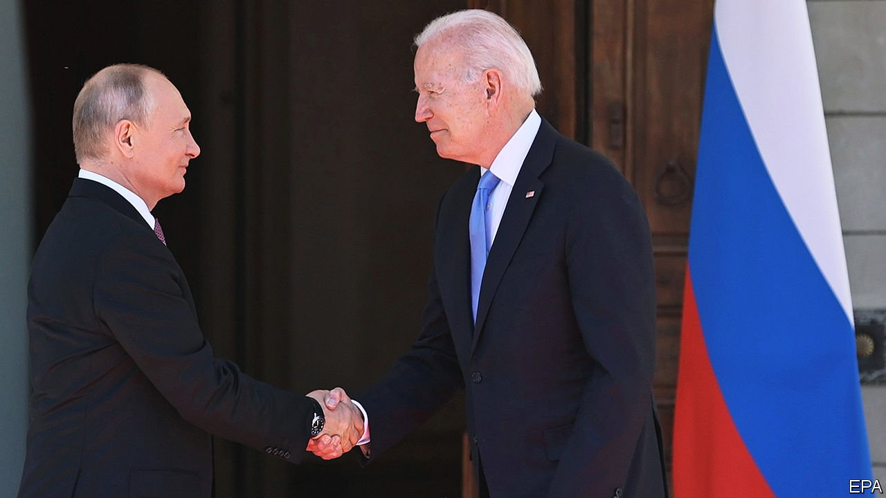

###### Worth the air miles

# Joe Biden’s summit with Vladimir Putin yielded only modest gains 

##### But it beats the turbulence of the recent past 

 

> Jun 19th 2021 

THE AIM, President Joe Biden said, before setting off on a European tour that ended in a summit with his Russian counterpart on June 16th, was to “make it clear to Putin and China that Europe and the United States are tight”. He achieved that, more or less. After meetings of the G7 and NATO and an EU-American pow-wow, it is clear that the rich countries of Europe and North America (and Japan) share common concerns about the two great autocracies that confront them. Whereas Donald Trump showed a strange fondness for dictators, Mr Biden is doing a fair job of uniting democracies to call the autocrats out.

Mr Putin and Mr Biden arrived in Geneva without much room for manoeuvre. Mr Biden wants to look tough on Russia, but finds himself constrained. He needs Russian help on a range of issues, including climate change, keeping nukes out of Iran, ending the war in Syria, forging new arms-control treaties and, perhaps most of all, avoiding an escalation of the conflict in Ukraine that might suck America in.


Mr Putin is constrained, too. He faces dissent at home, and would gain from a relaxation of economic sanctions. Russia has turned itself into a “fortress economy” to withstand these, but that makes life harder for ordinary Russians. Mr Biden cannot give him such relief, so long as the repression that is necessary to Mr Putin’s political survival goes on, and in the absence of a humiliating withdrawal from Ukraine.

Still, they talked for four hours, and both men agreed that it had been constructive. After the summit, Mr Biden put the issues into three buckets. The first is those areas where America and Russia share common interests and can work together. These include climate change, Iran, the Arctic and arms control, where there was an outline agreement to restart stalled talks. Both sides agreed to return their ambassadors, who were recalled earlier in the year, after Mr Biden called Mr Putin a “killer”. On these issues grown-up, plodding diplomacy will resume.

The second bucket is trickier. Mr Biden warned Mr Putin that America will protect its own interests and those of allies, over cyber-attacks or the territorial integrity of Ukraine. The trouble is that no one knows how far Mr Biden would be willing to go, and Mr Putin simply denies everything. He insists, for example, that Russia, not America, is the main victim of hacking.

The third area is human rights, where Mr Biden says America will always defend universal values and warned of “devastating consequences” if Alexei Navalny, an opposition leader, should die in prison. However, by putting them in their own bucket, he hinted that human rights are not the reddest of red lines. Critics will call this détente at best, a sell-out at worst. Others will see it as sensible. Relations with Russia are too important to be seen only through one lens.

Mr Putin may welcome a breathing space, especially if he is, more or less, left alone within his borders. If he continues troublemaking, it is unclear how much stomach Mr Biden has for a fight. Like Mr Trump and Barack Obama, he rightly sees China, not Russia, as the urgent challenge. He would love to leave Russia to the Europeans, letting America devote its full attention to Asia. But the Europeans are not up to the task. They are divided among themselves and parsimonious.

What is left if finger-wagging achieves little and it is too hard to restrain autocracies? Mr Biden talks of outcompeting them. Yet the G7 summit missed a chance to show leadership, pledging to donate fewer than 1bn doses of covid-19 vaccine to the less fortunate, a tenth of what is needed. It also failed to add flesh to its grand ideas about a Build Back Better World (an infrastructure plan to compete with China’s Belt and Road Initiative). Outdoing Russia economically is not hard, but China is a different matter.  is hobbled by congressional gridlock and deep political polarisation. America will find that contest a more severe one. ■

For more coverage of Joe Biden’s presidency, visit our dedicated 

