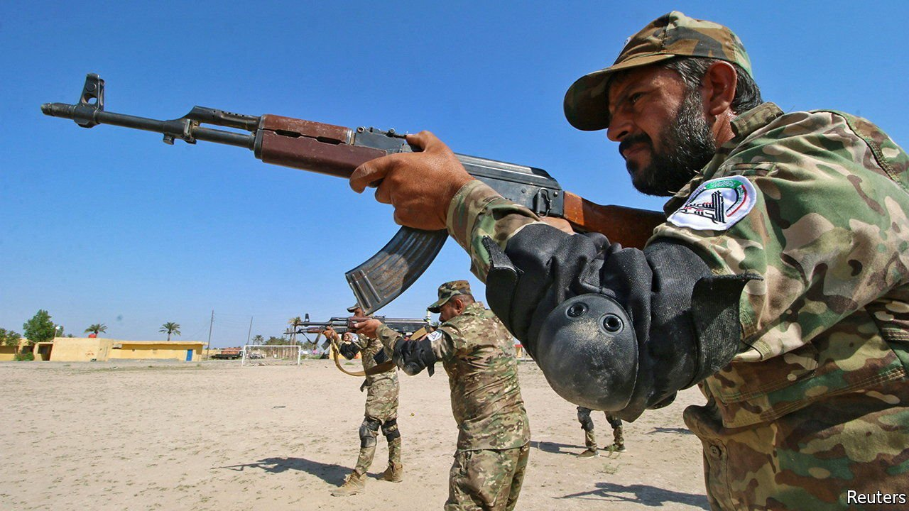

###### After the caliphate

# Relative peace gives Iraq a chance to build a functioning state 

##### If it fails, mayhem beckons 

 

> Jun 19th 2021 

SINCE THE overthrow of Saddam Hussein, a blood-soaked despot, Iraq has lurched from crisis to civil war and back again. Today, as the country prepares for an , many Iraqis say they are too disgusted to vote. What is the point, they ask, when the government they will elect can barely govern, when politicians are useless and corrupt, and when the country is really run by militias, factions, tribal chiefs and foreign powers?

Yet there is cause for hope. The main one is that Iraq is less violent than it was. As recently as 2014, a third of its territory was controlled by Islamic State (IS), a group that enslaved women and burned people in cages. Since the “caliphate” was crushed in 2017, a measure of calm has returned, letting businesses operate and children walk to school without fear of being blown apart by a car bomb. The economy is set to recover from the shock of covid-19. And peace creates an opportunity for Iraqis to build a state that actually works.


An essential step in that direction is to defang the militias. Several of these mostly Shia armed groups were created to defeat IS. Ayatollah Ali al-Sistani, the most revered Shia cleric in Iraq, urged young men to join the fight. However, when the campaign ended, they did not lay down their arms. Quite the opposite: they wangled permanent spots on the public payroll.

The militias’ budget for salaries has increased annually, from 1.3trn Iraqi dinars ($1.1bn) in 2018 to 3.5trn Iraqi dinars in 2021. Iraq’s government now spends 2% of GDP on its informal armed forces, more than most countries spend on their formal ones. This does not include the money that militias make from smuggling and extortion. And many are anything but loyal to the state. Some take orders from Iran; others from venal warlords.

It would help if Ayatollah Sistani, who has gone silent of late, told the militias that their mission is over. Regardless, the government should seek to take charge of the vast fiefs the militias control. It should also integrate some of their gunmen into the Iraqi army, under the regular chain of command, and demobilise and pension off the rest.

This will be both horribly expensive and dangerous—a vocal advocate of demobilisation was recently murdered. But the alternative is worse. Some militia bosses aim to emulate the Iranian Revolutionary Guard Corps, a force that corruptly dominates the Iranian economy and takes orders only from Iran’s top theocrat. A plan to demobilise Iraqi militias was drafted years ago. It should be dusted off and implemented.

Another vital step is for the government to provide services for citizens and not just jobs for civil servants. Pay and pensions for public-sector workers sometimes gobble up more than all the state’s oil revenues. Hiring is nepotistic. No private employer pays so much for so little work, so most Iraqis want a government job. This makes it harder for private firms to recruit. It also devours cash that could be used for schools, hospitals and welfare for the truly needy. The finance minister has a plan to slim the civil service, remove ghost workers and invest in things that benefit the majority of Iraqis. It should be enacted.

Third, the government should scrap energy subsidies, which cost a staggering 10% of GDP. Electricity is cheap—or, since bills are seldom collected, entirely free—so users waste it on a huge scale. To generate more, the government imports gas from Iran, but often fails to pay for it.

None of this is necessary. Iraq produces lots of gas, but wastefully flares most of it. The country should capture more and impose a market rate on consumers. This would give them an incentive to conserve energy, public money and the environment.

To help bring all this about, voters need to vote. Although this can be scary in militia-dominated areas, when Iraqis boycott the ballot it only cements the grip of the armed groups and the hated corrupt factions. It would help if the anti-graft protesters who made so much noise in 2019 got themselves organised and offered an alternative. Failing that, voters should pick the cleanest candidate in their district.

The long road back

The next Iraqi government will face plenty of opposition to such reforms if it attempts them. All the more reason to agitate harder for them. Building a state is tough, and will take a long time. But it is in Iraqis’ interest. Their country’s recent experience of chaos should make them aware of the price of failure. ■

