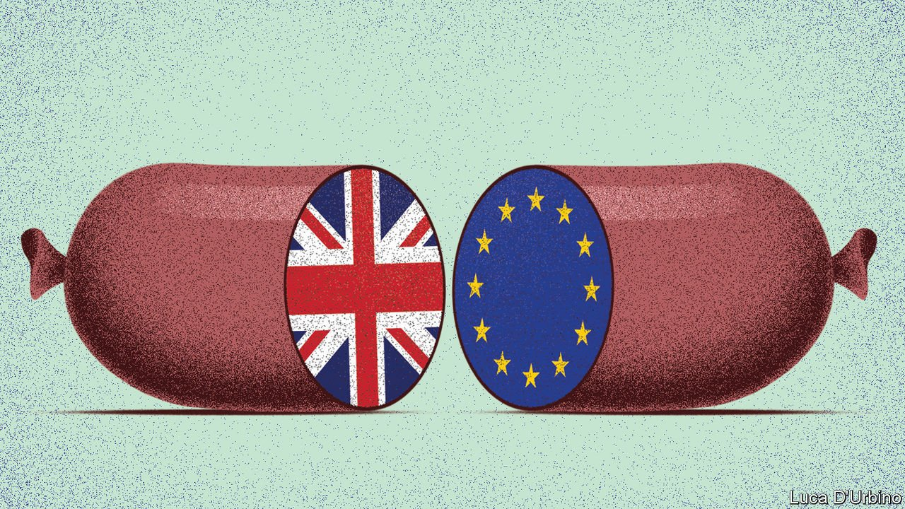

###### Northern Ireland

# The quest for a more pragmatic Northern Ireland protocol 

##### Britain and the European Union should seek compromise over Northern Irish trade 

 

> Jun 19th 2021 

SELDOM CAN a mere  have caused so much fuss so soon after it was signed. Under Boris Johnson’s Brexit deal, Great Britain has left the European Union’s single market and customs union. But to avoid a hard north-south border in Ireland, Northern Ireland has, in effect, remained in both. That necessitates border and customs checks between the province and Great Britain instead.

The prime minister is now attacking Brussels for its legal purism in enforcing their agreement. His supporters denounce the EU’s colonialism and lack of feel for delicate Northern Irish politics. They have even accused EU leaders of treating the province as if it were no longer a full member of the United Kingdom.


Yet it was Mr Johnson who chose to negotiate the protocol as the alternative to the loathed “backstop” engineered by Theresa May, his predecessor. This would have kept the entire United Kingdom in a customs union with the EU. The protocol lays down precisely how this alternative arrangement should work, including rules to block movement of chilled meats such as fresh sausages, after a grace period that expires on June 30th.

Mr Johnson knew all this when he triumphantly ratified the protocol, calling it the best of both worlds. It is disingenuous for him to feign outrage today, when Brussels calls for the rules to be implemented, not broken. However much he relishes the political gains from a fight with the EU, for the sake of peace in Ireland and the health of Britain’s most vital commercial relationship, he should compromise—and the EU should go out of its way to help him.

An early sign of the potential costs came at the G7 summit in Cornwall, Britain’s post-Brexit coming-out party, which was partly overshadowed by squabbles over the protocol. Mr Johnson signalled that he plans to break the treaty (and, once again, international law) by unilaterally extending the chilled-meats grace period. Brussels meanwhile is insisting that it will invoke its right to retaliate with tariffs.

A tariff war over sausages would be an absurdity. The EU runs by law and it fears that Mr Johnson will gradually undermine the entire protocol. But by pressing its case it is playing into his hands, because his poll ratings rise in line with battles with the EU. Even if the law is on its side, the politics are not.

A compromise is available. The EU could be more creative in assessing whether goods going to Northern Ireland are really about to cross into its single market. It is already easing the movement of guide dogs and medicines, and the single market has just survived six months of free-flowing British sausages.

Although the EU does not trust the British government, Mr Johnson could help by offering a concession of his own by promising to observe, for a limited period, EU food-safety standards, as Switzerland does. That would eliminate 80% of checks in the Irish Sea and, moreover, allow beef, lamb and fisheries exports from Britain to the EU to resume.

Some argue against this, pointing to a British ideological allergy to any alignment with EU rules. Yet the British government is sticking to the EU’s veterinary standards—indeed, it is promising to exceed them. Others say that regulatory divergence with the EU may be needed to secure a free-trade deal with America, a big food exporter. Yet at the G7 summit Mr Biden promised that this would not be the case. In any event, there is no prospect of a transatlantic free-trade deal for several years.

Other free-trade deals with, say, Australia would still be possible while sticking to EU rules. Switzerland has a deal with China and, unlike EU countries, can import hormone-treated beef if it is labelled. Tellingly, temporary British observance (avoiding the term “alignment”) of the EU’s veterinary standards has been called for by all parties in Northern Ireland, including the new Democratic Unionist leader, Edwin Poots.

This scheme would give time for relations with the EU to cool and let negotiators find a more pragmatic approach to Northern Irish trade. That would be wiser than further breaches of international law or the imposition of tariffs. Does Mr Johnson want a fight, or what’s best for the United Kingdom? ■

For more coverage of matters relating to Brexit, visit our 

