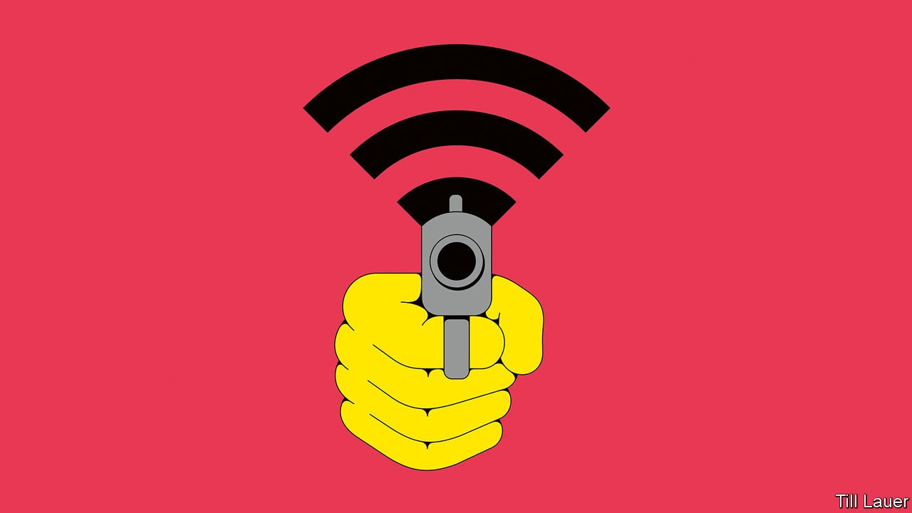

###### Computer security

# To stop the ransomware pandemic, start with the basics 

##### That will help stop other sorts of cyber-mischief, too 

 

> Jun 19th 2021 

TWENTY YEARS ago, it might have been the plot of a trashy airport thriller. These days, it is routine. On May 7th cyber-criminals shut down the pipeline supplying almost half the oil to America’s east coast for five days. To get it flowing again, they demanded a $4.3m ransom from Colonial Pipeline Company, the owner. Days later, a similar “ransomware” assault crippled most hospitals in Ireland.

Such attacks are evidence of an epoch of intensifying  that will impinge on everyone, from tech firms to schools and armies. One threat is catastrophe: think of an air-traffic-control system or a nuclear-power plant failing. But another is harder to spot, as cybercrime impedes the digitisation of many industries, hampering a revolution that promises to raise living standards around the world.

The first attempt at ransomware was made in 1989, with a virus spread via floppy disks. Cybercrime is getting worse as more devices are connected to networks and as geopolitics becomes less stable. The West is at odds with Russia and China and several autocracies give sanctuary to cyber-bandits.

Trillions of dollars are at stake. Most people have a vague sense of narrowly avoided fiascos: from the Sony Pictures attack that roiled Hollywood in 2014, to Equifax in 2017, when the details of 147m people were stolen. The big hacks are a familiar but confusing blur: remember SoBig, or SolarWinds, or WannaCry?

A forthcoming study from London Business School (LBS) captures the trends by examining comments made to investors by 12,000 listed firms in 85 countries over two decades. Cyber-risk has more than quadrupled since 2002 and tripled since 2013. The pattern of activity has become more global and has affected a broader range of industries. Workers logging in from home during the pandemic have almost certainly added to the risks. The number of affected firms is at a record high.

Faced with this picture, it is natural to worry most about spectacular crises caused by cyber-attacks. All countries have vulnerable physical nodes such as oil pipelines, power plants and ports whose failure could bring much economic activity to a standstill. The financial industry is a growing focus of : these days bank robbers prefer laptops to balaclavas. Regulators have begun to worry about the possibility of an attack causing a bank to collapse.

But just as costly is the threat to new tech as confidence in it ebbs. Computers are being built into cars, houses and factories, creating an industrial “internet of things” (IOT). Insights gleaned from oceans of data promise to revolutionise health care. In theory, all that will boost productivity and save lives for years to come. But the more the digital world is plagued by insecurity, the more people will shy away from it and the more potential gains will be lost. Imagine hearing about ransomware in someone’s connected car: “pay us $5,000, or the doors stay locked.”

Dealing with cyber-insecurity is hard because it blurs the boundaries between state and private actors and between geopolitics and crime. The victims of cyber-attacks include firms and public bodies. The perpetrators include states conducting espionage and testing their ability to inflict damage in war, but also criminal gangs in Russia, Iran and China whose presence is tolerated because they are an irritant to the West.

A cloud of secrecy and shame surrounding cyber-attacks amplifies the difficulties. Firms cover them up. The normal incentives for them and their counterparties to mitigate risks do not work well. Many firms neglect the basics, such as two-step authentication. Colonial had not taken even simple precautions. The cyber-security industry has plenty of sharks who bamboozle clients. Much of what is sold is little better than “medieval magic amulets”, in the words of one cyber-official.

All this means that financial markets struggle to price cyber-risk and the penalty paid by badly protected firms is too small. The LBS study, for example, concludes that cyber-risk is contagious and is starting to be factored into share prices. But the data are so opaque that the effect is unlikely to reflect the real risk.

Fixing the private sector’s incentives is the first step. Officials in America, Britain and France want to ban insurance coverage of ransom payments, on the ground that it encourages further attacks. Better to require companies to publicly disclose attacks and their potential cost. In America, for example, the requirements are vague and involve large time lags.

With sharper and more uniform disclosure, investors, insurers and suppliers could better identify firms that are underinvesting in security. Faced with higher insurance premiums, a flagging stock price and the risk of litigation, managers might raise their game. Manufacturers would have more reason to set and abide by product standards for connected gizmos that help stem the tide of insecure IoT devices.

Governments should police the boundary between the orthodox financial system and the shadowy world of digital finance. Ransoms are often paid in cryptocurrencies. It must be made harder to recycle money from these into ordinary bank accounts without proof that the money has a legitimate source. Likewise with cryptocurrency exchanges, which should face the same obligations as established financial institutions.

Cyber-insecurity is a matter of geopolitics, too. In conventional warfare and cross-border crime, norms of behaviour exist that help contain risks. In the cyber-domain novelty and confusion reign. Does a cyber-attack from criminals tolerated by a foreign adversary warrant retaliation? When does a virtual intrusion require a real-world response?

A starting-point is for liberal societies to work together to contain attacks. At the recent summits of the G7 and NATO, Western countries promised to do so. But confronting states such as China and Russia is crucial, too. Obviously, they will not stop spying on the Western countries that do their own snooping. But a , between Presidents Joe Biden and Vladimir Putin, began a difficult dialogue on cybercrime. Ideally the world would work on an accord that makes it harder for the broadbandits to threaten the health of an increasingly digital global economy. ■

就就