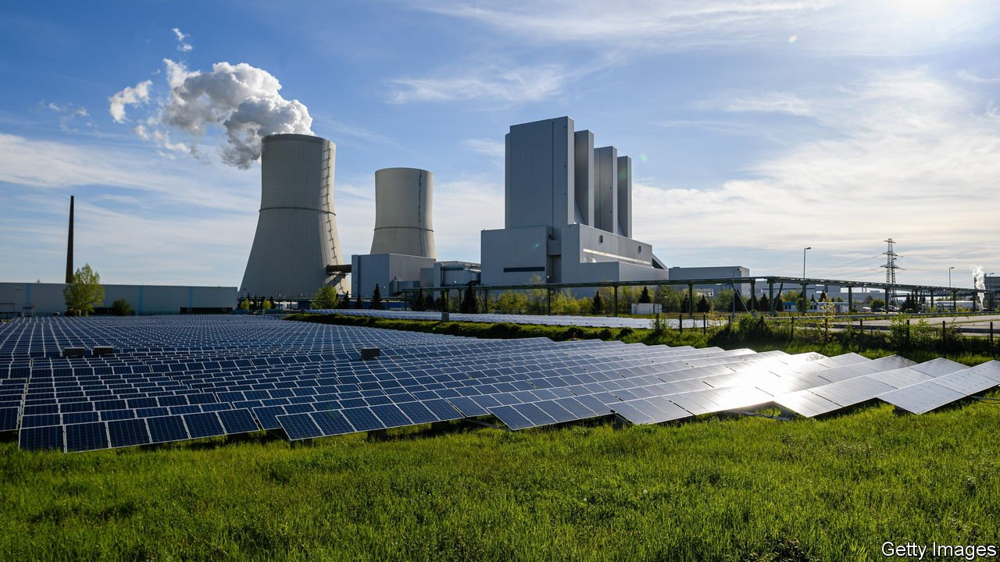

###### On gold and bitcoin, buses, air conditioning, greenwashing, China

# Letters to the editor 

##### A selection of correspondence 

 

> Jun 19th 2021 


The nature of gold

column on bitcoin and the battle between “crypto kids and fiat dinosaurs” (May 29th) made many excellent points, although a couple of them could be qualified. The column stated that “crypto, like gold, is built on a collective belief about its value. But so to an extent are all asset prices.” Although we agree with much of this, the argument assumes that gold is solely a financial instrument. It is not. It has a dual nature as a consumer good and an investment. This sets it apart as an asset and is one of the ways gold differs from crypto.


The price of gold is not just driven by how investors view it. It also responds to its uses in jewellery, technology and in myriad other real-world applications. Together, jewellery and technology account for more than 40% of net annual gold demand.

Although there are perhaps a few similarities between crypto and gold, there are more clear differences, and there are many reasons why the value of gold is not solely determined by investors’ beliefs.

DAVID TAIT

Chief executive

World Gold Council

London

The suggestion that the price of bitcoin is the latest measure of investor risk appetite reminded me of your article years ago describing my work (“”, February 24th 1996). The more an asset lacks intrinsic value, the more it is a barometer of shifting risk appetite. We shifted from private to fiat money because the price of money cannot swing wildly. Any seller of products in bitcoin, made with products purchased in bitcoin, would go from bust to boom daily. Modern money is a social construct. Unregulated private money can never be more than a curiosity.

AVINASH PERSAUD

Emeritus professor

Gresham College

London

 


Get on the bus

Your special report on race in America () didn’t say much about inequities in transport. I have been a bus driver for 13 years in south-east Michigan. We have many good jobs in my suburb of Livonia, but it has chosen not to participate in the regional bus system, cutting off people of all races in Detroit from the opportunities here.

An extremely low-cost way to support people economically is to reorganise transit systems that serve lower-income areas. This enables easier access to jobs and education in the suburbs. One of my regular passengers works in a suburban nursing home but lives in Detroit. Her home and place of work are seven miles apart. She has to take a Detroit bus to Eight Mile Road (the city’s limit) then wait to transfer to a suburban bus, both ways. This should be a 25-minute bus ride. But because she has to transfer her trip takes an hour, if the buses are on time. She cannot work overtime because the last suburban bus leaves at 6:30pm. She doesn’t bother with Sunday work because the buses are unreliable at weekends. Going to community college is out of the question because there are no late evening buses. I know of many people who routinely make three-hour commutes, each way, because they have to catch two transfers, and still walk a mile or more.

Safe and efficient public transport will boost the economic lives of everybody, but especially African-Americans who have been locked out of the larger economy for all these generations.

FRANK KALINSKI

Livonia, Michigan

 


Is the AC working?

“” (May 29th) struck a chord with me. As a ventilation engineer I am constantly appalled at the low priority put on air quality in buildings by regulators. The current code minimum in British Columbia is an American standard published in 2001. It describes how to ventilate “smoking rooms” (smoking in workplaces was outlawed over a decade ago). Building officials are keen to ensure the water pipe serving a toilet is the correct size, but are completely uninterested in the design for adequate ventilation. The air quality inside buildings is largely determined by the whims of individual engineers.

The pandemic has not helped. Rather than implementing science-based solutions, such as increasing ventilation rates or adjusting room air distribution patterns, the snake-oil salesmen are out in force successfully hawking inadequate “air purifier” systems. With a focus on energy efficiency and air tightness in buildings, what could once have been forgivable omissions of proper ventilation may now be creating unproductive or unsafe indoor spaces.

MIKE DIXON

Abbotsford, Canada

 


Full disclosure

At CDP, the charity running the world’s largest corporate environmental disclosure system, we read your leader on “greenwashing” with interest (“”, May 22nd). It is true that the current system of largely market-led environmental reporting comes with a risk that some companies might not disclose full information. However, the CDP system, used by 10,000 organisations a year, mitigates against this by inducing transparent responses through our scoring methodology. Additionally, science-based targets require companies to report their entire value-chain emissions rigorously, the gold standard for climate targets.

Your leader claims that “a better system would force companies to reveal their full carbon footprint.” Thousands of companies already do that through CDP. And although the carbon footprint is an important measure, by definition it looks at past emissions and tends to encourage a binary framework of clean versus dirty at any given point in time. It is better to use the carbon footprint along with forward-looking data, such as temperature trajectories, which seek to capture the overall journey and potential for long-term improvement. BlackRock says it will map trajectories this year.

We welcome mandatory climate disclosure, as signalled by the G7, but would emphasise that market-led incentives offer a valuable system. Most companies are not required by law to disclose environmental information, and even in jurisdictions that have mandatory disclosure, the legal requirements are generally more light touch.

PAUL SIMPSON

Chief executive

CDP

London

 


The encroaching state

China shouldn’t tell its people how many babies to have, says The Economist, in a year when governments, with a straight face, have told people whom they are allowed to hug and when they may leave their homes (“”, June 3rd, digital editions). I fear the golden age of self-determination and freedom is now long behind us.

If we ever emerge from biosecurity tyranny (unlikely) we will have ecosecurity tyranny to look forward to. Restrictions on fertility are a perfectly logical response to the environmental crisis. Not a democratic response, not a response compatible with basic freedoms and probably not a very effective response, but none of that made any difference to the imposition of coronavirus restrictions, did it?

BEN RAPP

Marisule, St Lucia

