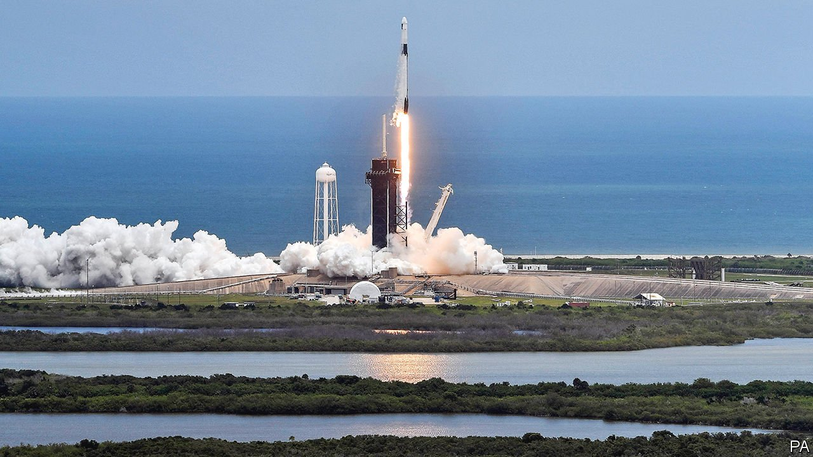

###### Taking off

# Africa is blasting its way into the space race 

##### Disruptions to the space industry offer a rare opportunity to new entrants 

 

> Jun 19th 2021 

IN THE HOURS after Hurricane Katrina slammed into America in 2005, destroying large parts of New Orleans, the people co-ordinating the disaster response urgently needed satellite pictures to show them what they were facing. The first images to come in were not from the constellations launched by NASA or the space agencies of other rich countries. They were beamed to Earth by a small Nigerian spacecraft that had been launched from Russia just two years earlier.

The small cube—Nigeria’s first satellite and only the second launched by a sub-Saharan African country—did not just watch a storm, it provoked one, too. British politicians and a taxpayers’ pressure group called for a halt in development aid, saying Nigeria did not need help if it could afford a space programme. Still, the sums being spent on space by African countries back then were tiny. South Africa’s SUNSAT, the region’s first satellite, was built by students at Stellenbosch University and hitched a free ride on a NASA rocket. Nigeria’s spacecraft cost just $13m.


In the past few years, however, the continent has dashed into space. The most recent orbital enthusiast is Mauritius, which put up a satellite on June 3rd. At least 20 African countries now have space programmes. These include heavyweights such as Egypt, Algeria and Nigeria, as well as smaller countries such as Ghana. In 2019 another five African countries launched satellites, bringing Africa’s total in orbit that year to 41.

Space in Africa, a consultancy based in Nigeria, reckons that African governments budgeted about $500m for their space agencies in 2020. That is a sliver of the $23bn spent last year by NASA, but it still marked a big jump from the $325m they spent in 2019. This does not include spending by private investors such as Eutelsat, a European operator, which park communications satellites in orbits so they can beam signals down to Africa.

African governments argue that their investments in space programmes help to build local skills that can attract investment and spill over into other areas of the economy. The Square Kilometre Array, an internationally funded radio telescope being built in South Africa, will pull in almost €2bn ($2.3bn) of investment and is creating thousands of jobs. It is also inspiring youngsters to study engineering.

The satellite programme started on the Stellenbosch University campus has already borne fruit. Several of its graduates went on to work at Dragonfly Aerospace, a firm based in Stellenbosch that hopes to build as many as 48 small satellites a year. In April Max Polyakov, a Ukrainian-born investor, bought a controlling stake in the company for an undisclosed sum.

African countries missed out on the big shift in the world’s economy in the 1990s, when manufacturing moved from rich countries to poorer ones in Asia, because they were not nimble enough to open their economies and attract investment. Now they are entering the space industry just as it is being disrupted by new entrants, who are making small satellites that cost a fraction of the price of big ones made by incumbents. That offers a rare opportunity to countries and companies quick-witted enough to grasp it. ■

