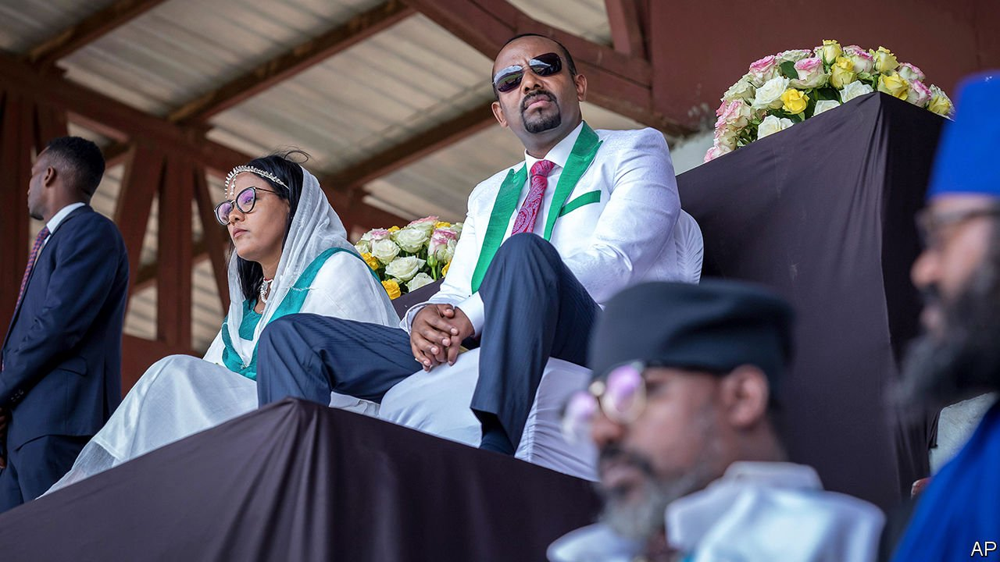
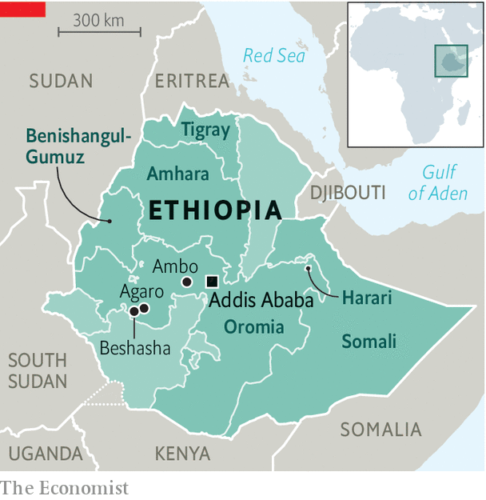

###### A coronation

# Ethiopia’s flawed elections risk dividing the country further 

##### Opposition leaders are in jail and in many areas people cannot vote 

 

> Jun 16th 2021 

KHALID JEMAL, a merchant from the western Ethiopian town of Agaro, is no stranger to elections. The poll on June 21st will be his fourth as an opposition candidate—and, barring divine intervention, his fourth successive defeat. Since 2010, when the ruling party and its allies won all but two parliamentary seats, Khalid has had the misfortune of standing against Abiy Ahmed, then an up-and-coming party man and now the prime minister. “I’m proud he’s from here and I respect him,” he told The Economist in an interview held not in his office, but in one belonging to the ruling Prosperity Party—and with an attentive official of that party taking notes.

Abiy took office three years ago, after massive protests forced his predecessor to resign. Ever since, government officials have talked up elections (originally scheduled for 2020) as a salve for the country’s divisive politics and bitter ethnic cracks. According to the prime minister, this will be the most credible vote in Ethiopian history. Given that the country has never had an election in which the incumbent did not claim victory, that is a low bar. Unfortunately the coming poll may not clear it. In some places the vote will be competitive: notably Addis Ababa, the capital, and parts of Amhara, the second-most populous region. But the overall result is not in doubt. For Abiy, who has said his mother prophesied that he would one day be king, it is less an election than a coronation.


About a fifth of constituencies will not take part at all on June 21st. This includes all of Tigray, a northern region in the midst of a . Fighting between the central government’s forces and those allied with the region’s former ruling party, the Tigrayan People’s Liberation Front (TPLF), is far from over. Indeed, it may well be intensifying. Moreover, millions of people are at risk of starving to death in Tigray because forces allied to the government are not allowing enough lorries carrying aid to pass their checkpoints. In a closed meeting of the UN Security Council on June 15th Mark Lowcock, the UN’s humanitarian chief, said that parts of the region are now . He added that Eritrean soldiers, who have been fighting alongside Ethiopia’s federal forces, “are using starvation as a weapon of war”. He also spoke of widespread rape, attacks on civilians, and the intimidation, harassment, beating and killing of aid workers.

 


In short, there is no chance of a free vote in Tigray. But the delay to voting also applies to the Somali and Harari regions, which have been beset by legal disputes as well as mishaps such as misprinted ballot papers. A second round of voting is therefore scheduled for September.

Abiy’s vast home region of Oromia, which contains 41% of registered voters, is a one-horse race. The two main Oromo opposition parties have boycotted the vote, citing the persecution of their members and arrest of their most popular leaders (for supposedly inciting ethnic violence). Khalid’s party, Ezema, espouses a pan-Ethiopian ideology that stresses individual rather than group rights. This sets it apart from most other parties, which typically champion one of Ethiopia’s many ethnic groups. It stands almost no chance of winning seats in Oromia. In the nearby village of Beshasha, where Abiy was born, a hall set up for residents to wait in before they cast their vote is decked exclusively with bunting celebrating the ruling party. “The people believe in the election,” says a local official. “They want to show their love for the government.”

Many opposition supporters, especially young people, may simply stay at home on polling day. “Why waste my time and energy?” asks a student at Jimma University, in Oromia. Some people complain that officials forced them to register, for instance by withholding state-subsidised rations of sugar or cooking oil from anyone without a voter card. But apathy does at least mean worries about post-election violence have waned. “There’s a kind of disengagement,” says Geresu Tufa, a peace activist in Oromia. “So in that sense it’s safe.”

Where it is not so safe is in parts of western and southern Oromia, which are racked by armed insurgency. Fierce fighting in these places, as well as in the neighbouring region of Benishangul-Gumuz, has scotched any hope of voting there proceeding on schedule. “This time [violence] will not be about ‘My party didn’t win’,” predicts a Western diplomat. “It’s about discrediting the whole thing.” Rebels have attacked electoral posts and assassinated officials from the ruling party. In response local security forces have unleashed terror on civilians. Many have been arrested or killed. In May police tied up and beat a teenage boy in broad daylight—and then publicly murdered him. “There’s no mercy at all now,” says Ashenafi Dhabate, an opposition supporter in the western Oromo town of Ambo.

Foreign governments are belatedly sounding the alarm. On June 11th America’s State Department said it was “gravely concerned” about the election and called on the government to promise talks with the opposition afterwards. America has already imposed travel restrictions on officials connected to the war in Tigray and has asked the IMF and World Bank to withhold economic assistance. Last month the European Union cancelled its election observation mission, saying that bureaucratic obstacles had made its work impossible.

Abiy has responded by making standing up to the West part of his election schtick. At a large rally organised by the government last month protesters denounced American sanctions. On state television broadcasters warn of foreign plots to weaken Ethiopia. In a speech on June 6th the prime minister called on the public to “eliminate” what he said were foreign enemies and domestic traitors.

Whatever the election’s shortcomings, Abiy is sure to claim a big popular mandate. In theory that might make it easier for him to take bold steps, such as calling a ceasefire in Tigray or releasing opponents from prison. But it will do nothing to fix the problems that brought down his predecessor, such as the federal government’s centralisation of power and the deep mistrust among the country’s 80 or so ethnic groups. “Real dialogue should be the next step to solve the underlying disagreements about what kind of country we want,” argues Geresu. “An election alone cannot bring enough legitimacy to govern.” ■

