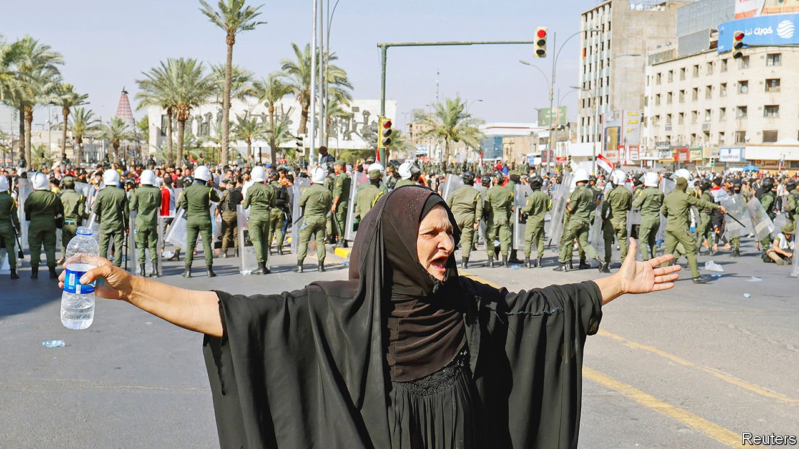
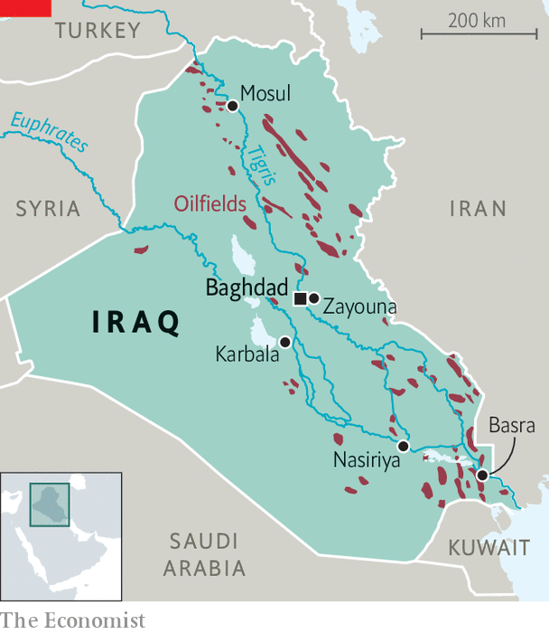
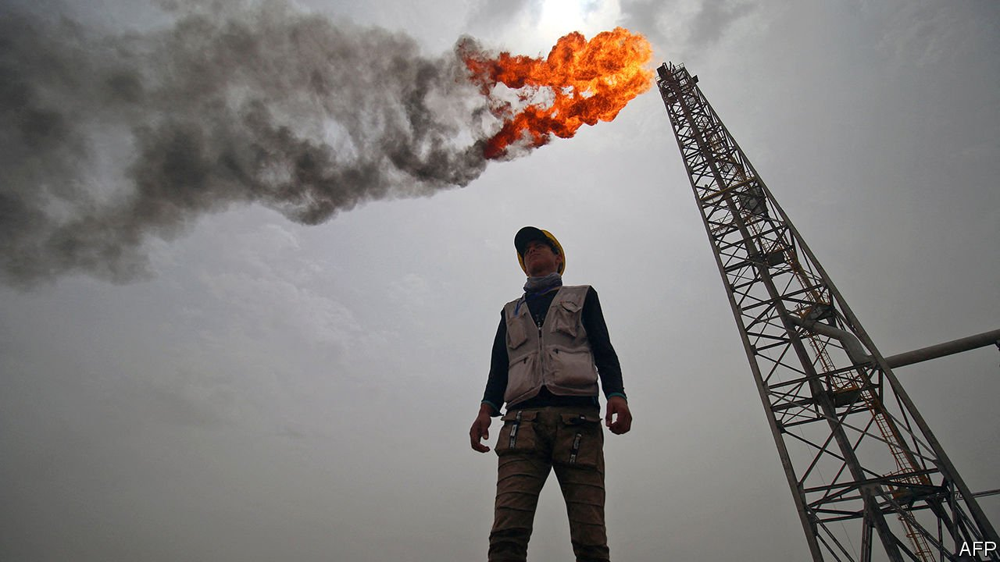

###### Thirsting for change

# Few things are harder than building a state in Iraq 

##### But hints of progress can been detected 

 

> Jun 19th 2021 

AROUND NOON on June 9th, a sudden hubbub echoed through the Imam Hussein shrine in Karbala. Qassem Musleh, a militia boss who had been arrested two weeks earlier on suspicion of murder, was free and visiting one of Shia Islam’s holiest sites. A happy crowd surged around him as he walked out into the blazing sun. Some did not even stop to retrieve their shoes, and scorched their feet on the street. Your correspondent squeezed into the throng for a brief interview. “They had no proof,” crowed Mr Musleh.

For many Iraqis, his release was a sad reminder of how weak their state is. Prosecutors had accused him of ordering the assassination of a campaigner against corruption and Iranian influence. When Mr Musleh was arrested, his gun-waving supporters promptly occupied parts of the Green Zone, where Iraq’s central government is based. Rather than risk a bloody confrontation, the state released him.


Iraq is preparing for elections in October. It will be “a huge task to ensure they are free”, says President Barham Salih. The UN has been invited to supervise. Thirteen main factions are jostling for power. Seven are Shia, four Sunni Arab and two Kurdish. Two broad coalitions of Shias, Kurds and Sunnis will probably emerge from the mix: one leaning towards Iran; the other towards America and the Sunni Gulf states. Mustafa al-Kadhimi, the prime minister (a position more powerful than president), may get a second term if the factions are convinced that he is pliable.

However, Iraqis wonder how much authority the government they elect will actually have. Many fret that, no matter who wins, the shots will really be called by militias, tribes, corrupt factions and foreign powers. Many plan to boycott the ballot. Five young men in a restaurant in Basra, a southern city, sum up the mood. All supported the huge anti-establishment protests that rocked the country in 2019. Two show off scars from having been beaten by militiamen. None plans to vote. “I want a country,” says Nabil, a civil servant with a nasty truncheon injury.

Like many Iraqis, he frets that his motherland is tugged and battered by forces beyond the government’s control. Qassem Suleimani, one of Iran’s top generals, used to visit regularly to help organise Iraq’s Shia militias. America, which still has 2,500 troops in Iraq, killed him with a drone strike last year as he left Baghdad airport. The charred wreckage of his car is now mounted on a pedestal near where he died. It is one of the first things visitors see, along with countless billboards of Suleimani’s face, and that of Abu Mahdi al-Muhandis, an Iraqi militia commander who died with him.

Scores of militias, most of them Shia, are collectively known as the Hashd al-Shaabi (Popular Mobilisation Forces). They played a crucial role in vanquishing the torture-broadcasting Sunni jihadists of Islamic State (IS), who once controlled a third of Iraqi territory. But after IS was defeated in 2017, the militias did not disband. On the contrary, they have won public funding: 2% of GDP last year. Thus, the government bankrolls private military forces of dubious loyalty with a lavishness many formal armies would envy. (Iraq’s gets 4%.)

“We always follow the prime minister’s orders,” says Sheikh Abdul Zahra al-Ghanim, the spiritual leader of the Hashd’s 10th brigade. But the pictures on his wall are of Suleimani and Ali Khamenei (Iran’s supreme leader). Abu Fatima al-Basri, who runs the martyrs’ centre where Mr Ghanim is sitting, lets the mask slip: “On religious matters, we follow Ayatollah Khamenei; on earthly matters, we follow the prime minister.” And if their instructions were to conflict? “Our faith is above the prime minister,” he says.

 


Mr Basri adds that he would like the Hashd to become like the Iranian Revolutionary Guard Corps. For many Iraqis, this is a horrifying prospect. Iran’s elite force answers to the top cleric, not the president, and runs a vast, corrupt business empire.

The Hashd already control some ministries, and make tidy sums from extortion and smuggling. Resentment against Iran and its proxies is widespread. Protesters set fire to the country’s consulate in Karbala last month. Others burned a Hashd office in Nasiriya last year. Soot still daubs the walls. The attacks were “paid for by outside forces”, claims one of the staff there. Such conspiracy-mongering is rife.

The prime minister’s men say they are gradually curbing militia power. Last month Mr Kadhimi issued a report claiming that the government had impounded 1,700 missiles in the past year, but it did not say from whom. A plan was proposed to merge the Hashd with the army and pension off many of its members. It has gone nowhere. One of its more vocal advocates, Hisham al-Hashimi, was murdered last year. Many Iraqis have lost faith in the prime minister. When he visited Nasiriya on June 12th, protesters pelted his motorcade with sandals.

No work and all pay

A state is supposed to serve its citizens. The Iraqi state, however, serves its employees. In a normal year, pay and pensions for public-sector workers gobble up two-thirds of the budget. Last year, when oil prices were low thanks to covid-19, they swallowed an estimated 122% of Iraq’s oil revenues, which are the state’s only big source of income. Civil-service bonuses and perks are not taxed, so civil servants are mostly paid in bonuses and perks. Police get extra for standing guard in risky areas; professors, for lecturing. The government pays more money, more reliably, for less work, than any private firm. So “everyone wants to work for the government,” observes Ali Allawi, the finance minister.

Parties take over ministries and dish out jobs to their supporters and their cousins. Merit barely merits a mention. “When I say I don’t belong to a party, they won’t even let me apply for a job,” says a young oil engineer in Basra. (He plans to emigrate.) When a huge portion of public workers stayed at home during the pandemic, there was “no effect on output”, sighs Mr Allawi. And this is not because they were furiously working remotely. Some 10% of them, he says, are ghost workers.

Efforts to trim the public payroll, so that there might be cash left over for schools, roads, hospitals and so on, meet fierce resistance. Iraq’s 4.5m public employees and 2.5m pensioners in an adult population of roughly 20m are a gigantic interest group that politicians fear to defy.

The other big drain on the public purse is subsidies, on such things as food and electricity. Energy subsidies (largely in the form of free oil to generate power) run to $17bn a year, or 10% of GDP. This makes electricity cheap; even so, few Iraqis pay their bills. Officials take bribes to overlook this. Politicians are reluctant to upset either group. Because electricity is in effect free, demand is “uncontrolled”, says Mr Allawi. “Go to any squatter settlement, everyone has air-conditioning.” Except during power cuts, which are common.

If Iraqis had to pay their bills, they would waste less. Iraq would find it easier to keep the lights on. In a pilot scheme in Zayouna, a Baghdad suburb, a private firm collected payments for electricity. Residents and local businesses found they actually saved money, because there were fewer power cuts and they spent less on costly diesel generators. But such reforms may take time to catch on.

 


To generate more power, Iraq imports Iranian natural gas. Because of American sanctions on Iran, paying for this is complicated: Iraqi dinars must be placed in an escrow account, which can then be used to buy food and medicine. Iran would rather have cash, but this will not be allowed unless international talks about its nuclear programme yield an agreement. Iraq has often failed to pay what it owes, prompting Iran to curb supplies.

Ironically, Iraq produces plenty of gas, which bubbles out of its oil wells. But most is flared (ie, burned on the spot) or released into the atmosphere. This is environmentally irresponsible and economically daft. Were the gas to be captured, it could replace Iranian imports entirely.

Some firms are trying. Basrah Gas Co, a joint venture between the state, Shell and Mitsubishi, has since 2013 gone from capturing gas equivalent to 50,000 barrels of oil a day to 210,000. Work has begun to capture 100,000 barrels more. “Technically none of this is complicated,” says Malcolm Mayes, the managing director. The difficulty has been making sure the government pays what it owes—essential for a project that requires hefty upfront investment. After some hiccups, the firm has worked out a deal whereby payment is secured with oil, and is pressing ahead.

The fossil-fuel industry can never be a big employer. And that irks many Iraqis. The tribes from whose land the fuel is pumped insist that as many jobs as possible are given to their members. The tribes next door tend to miss out. On a tiny island in the marshes near Basra, surrounded by water buffaloes, Noaman al-Salmi grumbles about the blazing flare on the horizon, and the pollution that falls like mist. “We get no jobs,” he says, “only cancer.”

Beset by pious gunmen, some Iraqis have grown disillusioned with religion itself. Imams bemoan their dwindling congregations. The country’s top Shia cleric, Ayatollah Ali al-Sistani, has stopped giving weekly sermons. Iraqis speak of a rising nationalism that eschews foreign interference, especially Iran’s.

Respect for human rights is still lacking. Sunni Arab dissenters are treated as terrorists and have largely been silenced. Shia ones fear assassination. The prime minister promised to arrest the thugs who killed more than 560 protesters last year. But a year of investigations has yet to result in a single prosecution, says the UN.

Some perspective is in order. “This country has seen devastation no other country has seen,” says Mr Salih: dictatorship, genocide, invasion and a blood-drenched “caliphate”. Building a state that can govern Iraq “needs a lot of work”, he says. Still, there are signs of progress.

The main reason for optimism is that the country, though still violent, is less so than at any point since the American-led invasion in 2003. The last big car bomb was in 2017. Tribal feuds are still common, but the sound of gunfire in cities is fading.

Iraq is also opening up. Visas that once took months are now available on arrival. Traffic flows through checkpoints more easily than before. The economy is rebounding from covid-19. Having plummeted by 10% last year, it will grow by 2% this year and 8.4% in 2022, predicts the World Bank. The budget assumes an oil price of $45 a barrel; it is around $70, so the fiscal deficit should shrink from 5.5% of GDP in 2021 to a more manageable 0.6% in 2023.

The state is as corrupt as ever. But optimists note that much of the money that is stolen is now invested locally, rather than spirited abroad. Cranes long dormant are rotating again. Well-tended shrubbery has appeared by roads in Basra. The old city of Mosul, which was bombed to cinders during the war against IS, is being rebuilt with help from the UN. Of the 6m Iraqis displaced by that war, almost 80% have returned to their areas of origin.

Chin up

Covid-19 has spurred innovation. Credit cards are rare, making it hard for homebound Iraqis to order things online. So firms such as Zaincash have built apps to allow digital payments. “Small businesses are working incredibly fast because of covid-19,” says Rashwan Shareef, who runs a Basra-based online marketing company.

Meanwhile, ordinary Iraqis are getting on with their lives. Ghayth al-Hillo recalls taking a high-school exam in Baghdad in the turbulent days of 2007. Desks were spaced far apart to prevent cheating. When a gunfight broke out on the floor below, the teacher did not stop the exam. “We were told to sit closer together, away from the windows,” recalls Mr Hillo.

Now, aged 30, he seldom hears shooting. He is developing an online startup, Join the Club, to help Iraqis improve their English. He is guardedly hopeful about the future. But still, he scorns the choices at the upcoming election. “I’m going to spoil my ballot,” he says. ■

