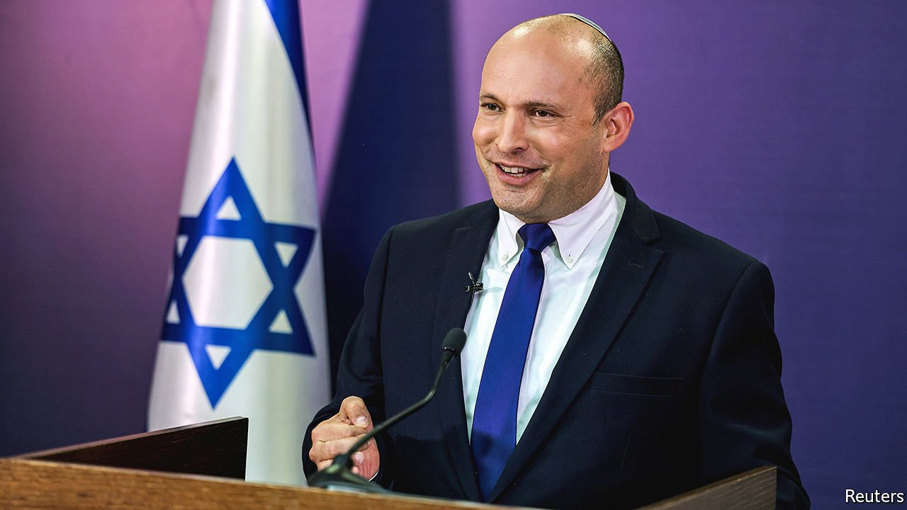
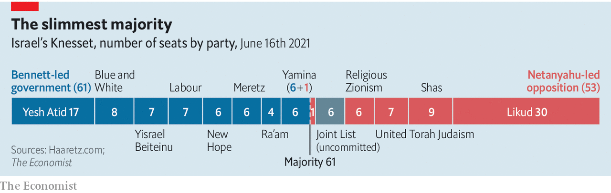

###### New man in charge

# Naftali Bennett’s new Israeli government has its work cut out 

##### But it may also tackle issues that have long been neglected 

 

> Jun 19th 2021 

WHEN ISRAEL’S new government, led by Naftali Bennett, holds its first cabinet meeting on June 20th, it is expected to appoint an independent commission of inquiry into the disaster at Mount Meron, where 45 people were crushed to death at a religious pilgrimage in April. Mr Bennett’s predecessor, Binyamin Netanyahu, shunned such commissions during his 15 years as prime minister. Mr Netanyahu, who is on trial for corruption, was not fond of pesky investigators looking into his government’s actions.

Mr Bennett’s government will be different in other ways, too. Whereas Mr Netanyahu led a cohesive coalition of right-wing nationalist and religious parties, Mr Bennett leads an unwieldy one that includes some nationalist parties (such as his own, Yamina), as well as left-wing and secular parties—and, for the first time ever, an Arab Islamist party (Ra’am). The new government was approved in the Knesset, Israel’s parliament, by just a single vote.


That has led to low expectations. Just passing a budget would be seen as a success: Israel has not had one in two years. But because of its make-up, Mr Bennett’s government is also in a position to tackle issues that Mr Netanyahu long ignored.

 


The commission on the Meron disaster is indicative. The pilgrimage site is the fiefdom of ultra-Orthodox Jewish groups that bristle when the state tries to interfere in their affairs. Mr Netanyahu, who depended on the ultra-Orthodox for votes, let them be. But they are not part of the new coalition, which gives it more freedom to act. It may expand the network of state schools serving the ultra-Orthodox, who are about 12% of the population. That would see more of them studying standard subjects alongside religious ones, and so prepare them for work as well as piety. The government might also curtail funding for schools that refuse to teach the national “core curriculum”.

Another area of focus will be Arab Israelis, who are 20% of the population. Their long-held grievances fuelled clashes between Arab and Jewish citizens in Israeli cities last month. The groups are meant to have equal status, but Arab citizens complain of discrimination and neglect. Ra’am’s presence in the new government will help. The coalition agreement includes a promise to spend over $15bn on infrastructure and social programmes in Arab towns. It also vows to tackle a lack of urban planning in these areas, which has led to illegal building and, in turn, demolitions by the state.

The government will probably not do much to address the conflict with the Palestinians. In the past Mr Bennett opposed a Palestinian state and wanted formally to annex much of the West Bank. His government, though, also includes supporters of the two-state solution. So its members have agreed not to make any big moves. Yet the conflict cannot be ignored. After Jewish nationalists marched through the Old City of Jerusalem on June 15th, Hamas, the Palestinian militant group that runs Gaza, launched dozens of balloons bearing incendiary devices at Israel, causing brush fires. Israel responded with air strikes on Hamas positions.

Neither Hamas nor Israel seemed interested in provoking a repeat of the 11-day conflict that killed 269 people (mostly Palestinians) last month. Hamas did not launch any rockets this time. The targets struck by Israel were empty. No casualties were reported on either side.

As big a challenge may come from Mr Netanyahu, who took a moment to adjust to his new post as leader of the opposition. On June 13th, after the government won its initial confidence vote in the Knesset, he had to be told by a colleague that he needed to vacate the seat at the centre of the government’s bench. But Mr Netanyahu has since taken to his new role with a vengeance, reminding colleagues that he was opposition leader twice before—and each time toppled the government. Now he promises “to bring down this dangerous left-wing government, this scam government that will fall quickly.”

Mr Netanyahu is 71 and, besides his corruption trial, he must contend with fissures in his party, Likud. Still, he is determined to win the top job for a third time. His continued presence, though, will remind members of the new government what brought them together. More than anything, it was their opposition to the former prime minister. That may also keep them together. ■

