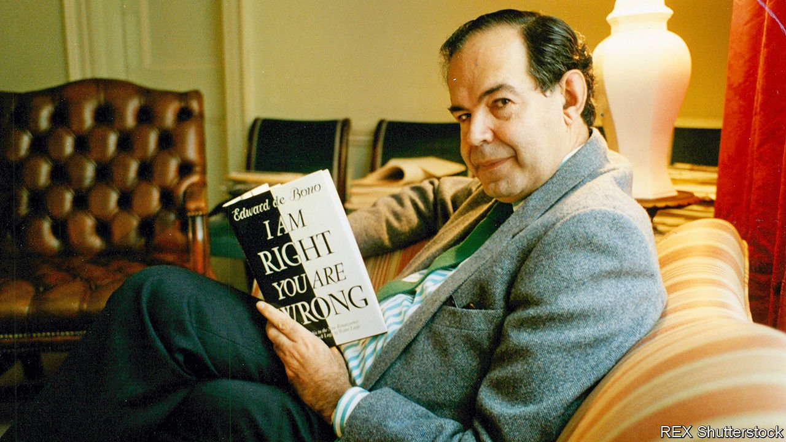

###### Seeing problems sideways on

# Edward de Bono died on June 9th 

##### The father of lateral thinking and “Six Thinking Hats” was 88 

 

> Jun 19th 2021 

THE LETTER was unexpected, but not undeserved. It contained an invitation to a Symposium in Athens. Over the years Edward de Bono had been to hundreds of these affairs. Some were seminars, some consultations or lecturing, all based on his much-acclaimed books. He had produced 70 of them, including “How To Be More Interesting”, “How To Have a Beautiful Mind”, “Edward de Bono’s Textbook of Wisdom” and “Think! Before It’s Too Late”. That last was the message he carried loud and clear as he jetted from city to city and boardroom to boardroom. He was teaching the world a new way of thought, the most important for 2,300 years.

A gathering in Greece was alluring. He was a man of the Mediterranean himself, born in Malta to a family boasting seven generations of doctors. On his mother’s side, he was possibly descended from Napoleon. It was at school that he was first called “Genius” and allowed to skip years. From there he sailed into both Oxford and Cambridge, to do two doctorates and several years of research into physiology and psychology. His study of self-organising systems such as the kidneys and the glands convinced him that the brain, too, could be organised differently. It could be taught to operate creatively, surprisingly and “outside the box”. His preferred term was “lateral thinking”. With that, he had made the most important discovery since the time of Socrates, Plato and Aristotle, the infamous Gang of Three, as he called them. It was they who had sent the invitation. They were eager, like all the rest, to consult him.


And he had much to say to those gentlemen. Centuries since, they had imposed on Western brains the tyranny of vertical thinking. That method proceeded by pure logic. At every step, one had to be right. It was characterised by conflict, argument, arrogance and rejection of unusual ideas. In schools, it wasted two-thirds of society’s natural talent. The concepts it laid down hardened into inadequate or over-complex ways of doing things. There was nothing inherently wrong with logical thinking, as there was nothing inherently wrong with the forward gears on a car. But reverse gear was needed too, to rearrange the pattern or get out of a blind alley. An example: waste from a factory is polluting water for people downstream. You could install expensive filtration, or rehouse the people. Or you could require the factory to take its own water from downstream. Simplicity itself, and perfect sense.

As soon as he proposed his method, in “The Mechanism of Mind” (1969), it caught on like wildfire. Lateral thinking was taken up by Siemens, DuPont, Goldman Sachs, BT, BA and Federal Express, among many. (At Siemens, product-development time fell by half.) It was adopted in schools from Venezuela to Australia to China. In Britain he was brought in in 1998 to shake up the hidebound and exclusive civil service. During the Soviet Union’s perestroika, his books were top reading in Moscow. A seminar on his system for the Australian cricket team led to the total thrashing of England in the Ashes series. His detractors, silly little idiots, held that nothing in his method was new and most of it obvious. The brilliant results spoke for themselves. So did the flow of seekers to his online Effective Thinking course, his Practical Thinking Training courses (with, in 1995, more than 400 instructors in 27 countries) and his World Academy of New Thinking in Malta. He made a very decent living from it all.

Nonetheless, it might be hard to impress the Gang of Three with them. Pupils at the original Symposium had been overwhelmed by the vertical thinking of Socrates. “Absolutely”, “Of course”, and “Naturally not”, they had answered, not daring to risk the put-down of a “No”. The de Bono method, by contrast, proposed “Po”. This was a language laxative, a provocation thrown into a discussion to loosen things up. It might even be nonsense on its face, such as “Po: Why are wheels round?” Or it might put two things side by side, a caterpillar and a horse, or food and a shoe, to see what thoughts arose from this rearranging. All would be assumed to have value. There was no “No”. Another example might occur in a discussion about picking apples. Rather than arduously reaching up to pick, why not attract the apples to the ground? Or remove the trees from the apples? Well worth exploring.

All things considered, though, his best bet for this new Symposium was a talk on his Six Thinking Hats. He could take a set along, six toppers in good strong colours. The thinking behind the hats was to make meetings quicker and more productive by taking ego out of them. Instead, those attending wore hats to grasp other points of view. A black hat stood for caution and realism. White meant facts. Green was for creativity, red for feelings, blue for process. Yellow signalled optimism. Trivial, said the idiots again. But major corporations the world over found it shortened meeting times by half. Thousands of schools used it to make debate civilised. In the platinum mines of South Africa, illiterate workers from 14 different tribes learned from it to get on together. In Pakistan, Pervez Musharraf was moved by it to talk peace with India. No doubt it had uses, too, in the Middle East, though his neatest lateral solution in that case was to ship out Marmite yeast extract to both Arabs and Israelis, to increase the zinc in their diets and thus make them less irritable with each other.

The thought of the coming Symposium was now much jollier. Socrates, Plato and Aristotle would soon be lounging in their hats, eager to hear him. The wine, too, would be flowing, and the flute-girls playing. He might even intrigue them with some of his more speculative lateral thoughts. For example: why not reduce awkward conversations to simple numerical code? So that “This relationship is long dead, we both know it, but we hang on for fear of the unknown” would become “14/4”? Or why not save wine from spoiling by decanting each large jar, on purchase, into smaller screw-top containers? Or (ignoring the gang’s full beards) had they ever thought, while shaving, of keeping the razor still and moving their heads instead? In fact, it worked rather better. Before the evening was out, they too would be toasting his genius. ■

