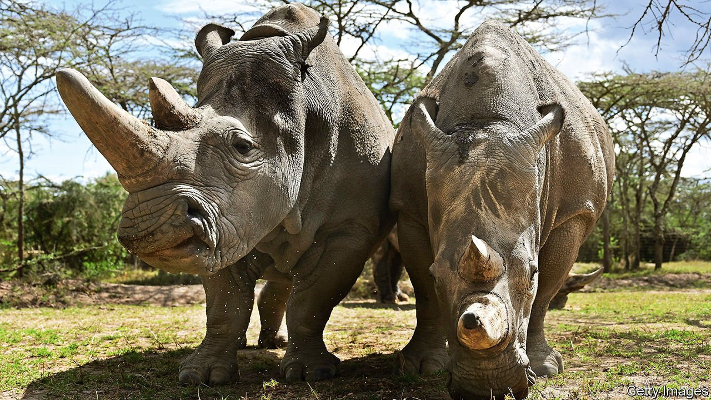
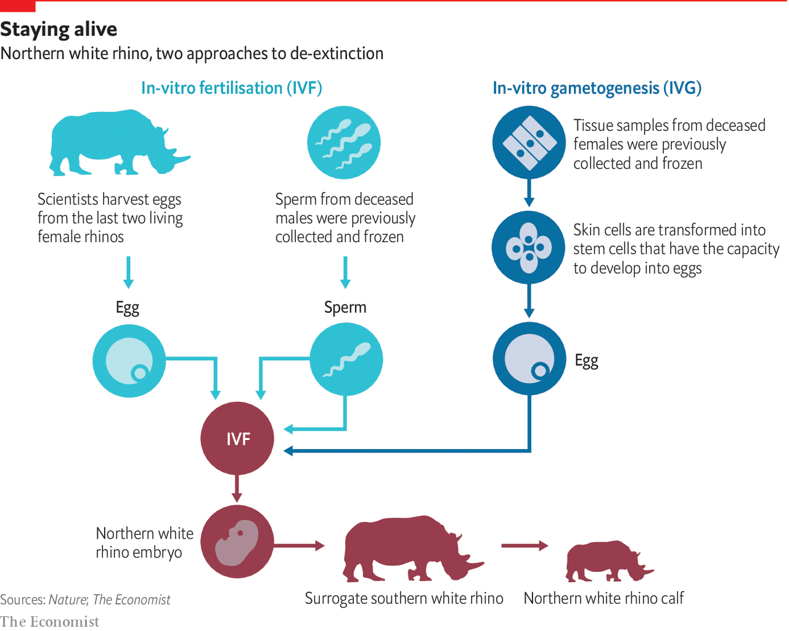

###### Back from the dead

# Reviving extinct species may soon be possible 

##### Banking cells from endangered species can help in other ways, too 

 

> Jun 15th 2021 

LATE ONE day in April 2002, a delicate blue-beige bird with a white collar and black eye mask was released into the dense forest on the Hawaiian island of Maui. The bird, a female, was one of just three remaining po’ouli (pronounced poh-oh-oolee), a species of honeycreeper that had been discovered in 1973. Believing there to be one male among the three, researchers were desperate to arrange a match. The birds, however, did not appear in the least bit concerned about the fate of their species. To help things along, earlier that day a team had caught the female, fitted her with a small radio transmitter and set her free where the male had last been seen. The next morning they set off with aerials to track the female’s progress. They soon found her, resolutely making her way back across the island to her own territory.

Conservation is full of such failed romances. When a species is reduced to a few individuals, researchers will go to great lengths to set up arranged marriages. If wild matings cannot be facilitated, they may try to breed animals in captivity and then release them back into the wild. Thus, the California condor was brought back from 22 individuals; the Arabian oryx from just nine. With the po’ouli, the decision was made to bring the reluctant trio in for captive breeding. The male was caught in September 2004. He was old, had only one eye and died a few weeks later. The other two birds were spotted around the same time, then never seen again.


And that, you might think, was the end of the po’ouli’s tragic tale. But reproductive and genetic technologies developed in the past decade mean other outcomes are now conceivable, as it were. A cluster of cells from the one-eyed male is held at the San Diego Wildlife Biodiversity Bank, also known as the Frozen Zoo. Banking tissue samples from wild species is not unusual: seed banks have done this since the early 20th century. In the San Diego facility, however, tissue samples are not just stored, but are grown in living cell cultures. Oliver Ryder, director of conservation genetics, remembers peering through a microscope to look at the po’ouli’s chromosomes, aware that he was looking at the genetic material of a species that had already expired. “Extinction is, for a lot of people, kind of an abstract concept, but for some of us it has a really visceral feeling,” he says.

 


Dr Ryder and others are developing techniques that might, theoretically, make it possible to create a live newborn long after the last members of its species have died. They are not the first to attempt this. In 2009, a team of researchers announced they had delivered the kid of a bucardo, a species of wild goat that had gone extinct nine years earlier. A skin biopsy taken from the last female had produced live cells. The team removed the bundle of DNA from inside those cells and injected it into the emptied eggs of a domestic goat. Using a zap of electricity, they fused the DNA with the egg’s cellular “shell” and produced more than 400 embryos, all carrying the goat’s genes. Over 200 embryos were transferred to the wombs of surrogate domestic goats, leading to just one live birth. It was delivered by caesarean section in 2003, but lived for only “some minutes”, according to an account in the journal Theriogenology.

Not looking swell, Dolly

The technique that produced the short-lived bucardo kid was similar to that used to create Dolly, a cloned sheep, in 1996. Its DNA was primarily inherited from a single individual. Even if it had lived, it could only ever have given rise to a population of clones, the opposite of biological diversity, for which genetic diversity is essential. Efforts to rescue a species from the brink of extinction must begin long before it is reduced to just one individual, or even three.

The po’ouli’s frozen cells, therefore, are unlikely ever to give rise to a new population of birds. But alongside them in San Diego are tubes that hold a different promise. They contain the remains of not one but 12 northern white rhinoceroses, five males and seven females. The northern white rhino is what is known as “functionally extinct”: the last male, Sudan, died in 2018, leaving behind just two females, a mother-and-daughter pair in Kenya, dubbed Najin and Fatu. Nevertheless, at a meeting in Vienna in 2015, researchers agreed on a twin-track approach to de-extinction.

The first approach, led by a group called BioRescue, uses a version of in-vitro fertilisation involving rather more international travel than most human procedures. Five times since 2019, a team of researchers, conservationists, park rangers and veterinarians have gathered in the park to harvest oocytes (immature egg cells) from the ovaries of one or both females, who are placed under general anaesthetic for the procedure. The oocytes are immediately flown to Italy, where they are fertilised with thawed sperm from a dead male whose cells are banked in Germany. Sperm are injected through a needle directly into the eggs. They are then placed in a specially designed incubator equipped with a camera that allows the team to monitor the cells as they develop. Any embryos that successfully develop in the dish are placed in liquid nitrogen for safe-keeping until such a time as the team is ready to implant them into a womb.

The most recent egg collection was performed on March 28th. A total of 19 oocytes were obtained from Fatu; 14 were fertilised with sperm from Suni, a male who died in 2014. Four developed into viable embryos, bringing the total number of frozen embryos to nine. The next step will be to transfer embryos to a surrogate. Neither Najin nor Fatu is thought to be capable of a safe pregnancy, so the embryos will instead be entrusted to female southern white rhinos, a related species with a healthy wild population. Before implanting them, BioRescue has been testing the IVF procedure using southern white rhino cells. This has resulted in seemingly healthy embryos, but none has yet led to a live birth. The team hopes that doing the embryo transfers in the wild, rather than at a zoo in Europe, will improve the chances of success.

Thomas Hildebrandt of the Leibniz Institute for Zoo and Wildlife Research, who is leading much of the work, says there is a short window for the transfers to happenbecause Najin and Fatu are both quite old. “We can try to preserve biological material very nicely,” he says, “but we can’t preserve social knowledge. And we have only two rhinos which can teach the calf how to behave as a northern white rhino.” Moreover, this IVF approach still faces the fundamental limits of genetic diversity. Fatu’s embryos carry only her and Suni’s genes. But the cells stored at -196°C in San Diego and other frozen stores carry much more, and they hold the key to the second strategy for saving the northern white rhino.

To determine whether they could theoretically build a healthy population, Dr Ryder sequenced the San Diego collection. “We found that there was more genetic variation in those 12 than in the [roughly 20,000-strong] standing population of southern white rhinos,” he says. “If we could turn those cells into animals, there is no reason the northern white rhino shouldn’t be able to recover.”

What is needed now is the means of turning frozen skin cells from long-dead rhinos into viable eggs. A way to do that has been demonstrated by Katsuhiko Hayashi, a reproductive biologist at Japan’s Kyushu University, and colleagues. In 2016, the team created baby mice from skin cells and sperm. They did this by taking cells from the tail tips of adult mice, growing them in culture, then flooding them with chemical signals that reprogrammed some of them to become “induced pluripotent stem cells”—special cells that can develop into any other cell found in the body, including oocytes. The oocytes were then fertilised and implanted into the wombs of surrogates, resulting in live mice, which went on to produce their own offspring.

A mouse, of course, is very different to a rhinoceros. Nevertheless, earlier this year, Marisa Korody of the San Diego Zoo Wildlife Alliance and colleagues at the Scripps Research Institute in La Jolla wrote that they had successfully reprogrammed skin cells belonging to nine of the 12 dead northern white rhinos to become induced pluripotent stem cells. BioRescue has had similar success. Not all such cells are truly pluripotent, so it is not a given that the team will be able to make oocytes. Initial tests, though, are promising.

Today, the frozen collection at the San Diego Wildlife Biodiversity Bank contains more than 10,000 cell lines belonging to 1,100 species and subspecies of vertebrates, plus tissue and blood samples that have not yet been cultured. Other biobanks are held by members of the Frozen Ark project, run by Britain’s University of Nottingham. Whether or not reviving extinct species becomes possible in the next few years, such biobanks can already be used to improve genetic diversity in endangered species. The American black-footed ferret, for example, was all but wiped out in the 20th century before being rescued through captive breeding of 18 surviving animals. In 2015 researchers showed that inseminating females with frozen sperm from the Smithsonian Conservation Biology Institute could increase the ferrets’ genetic diversity.

Similar work could one day restore commercially valuable populations, such as threatened fisheries—but only if cells are banked now for an unknown future. That said, not all tissues lend themselves to being preserved in liquid nitrogen. Cryopreservation is also expensive and energy-intensive. So far, according to a paper published in July 2020 by Joseph Saragusty at the University of Teramo in Italy and colleagues, sperm from just 116 species, or approximately 2% of all mammals, have been preserved, as well as eggs from “just a handful” and embryos from 51 species. Live births produced from frozen mammalian sperm have been reported in only around 45 species. But cryopreservation can hold species in suspended animation while new technologies are invented or existing ones improved. As Kurt Benirschke, who founded the San Diego collection, had the foresight to declare: “You must collect things for reasons you don’t yet understand”. ■

Full contents of this Technology Quarterly


* Back from the dead: Reviving extinct species may soon be possible

