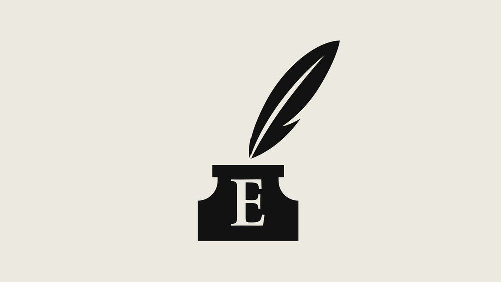

###### 

# Sources and acknowledgments 

#####  

 

> Jun 15th 2021 

Many people contributed to this technology quarterly and not all of them are quoted. The author would particularly like to thank Elena Bennett, Tanya Berger-Wolf, Paolo Bombelli, Alasdair Davies, Eric Dinerstein, Eric Fegraus, Mike Harfoot, Thomas Hildebrandt, Katsuhiko Hayashi, Jyoti Mathur-Filipp, Stephanie O’Donnell, Tim Newbold, Drew Purves, Corli Pretorius, Evan Rapoport, Alex Rogers, Oliver Ryder, M. Sajayan, Derek Tittensor, Joe Walston, Mrinalini Watsa, and Martin Wikelski.

Further reading on the biodiversity crisis


