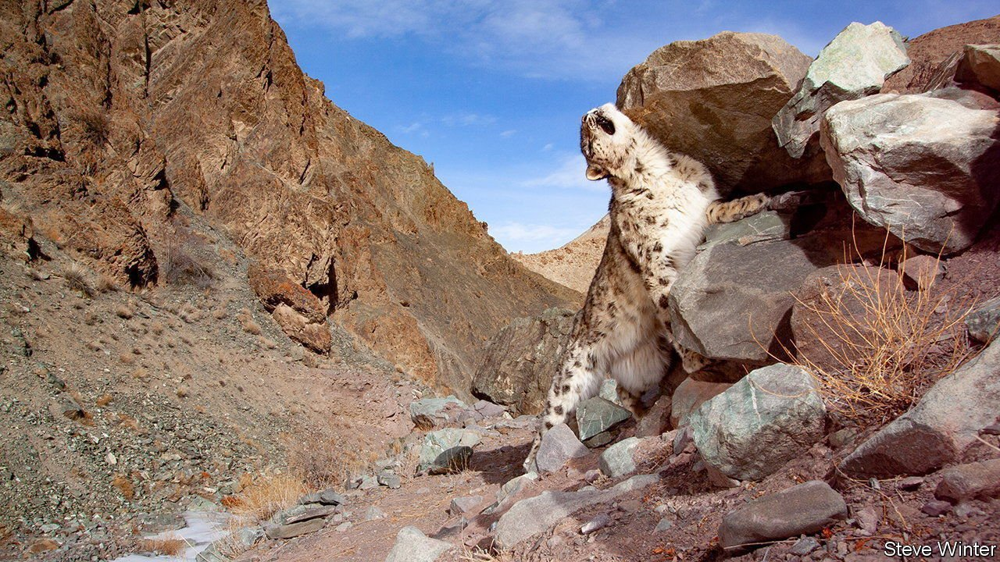
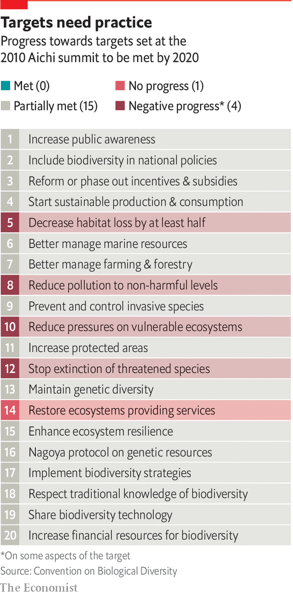

###### Bridging the gap

# Technology can help conserve biodiversity 

##### But it can only happen in conjunction with action by policymakers 

 

> Jun 15th 2021 

PROTECTING THE biological, ecological and genetic diversity that sustains life on Earth is the mission of the United Nations Convention on Biological Diversity. But progress has been slow, to put it mildly. A list of 20 conservation targets, known as the Aichi targets, was drawn up in 2010, with a 2020 due date. In the event, not a single one of the goals was met in full (see chart).

 


In 2020, IPBES (the Intergovernmental Science-Policy Platform on Biodiversity and Ecosystem Services, a body created to bridge the gap between biodiversity science and policy) published a global appraisal of the state of biodiversity. Written by 145 experts from 50 countries who reviewed 15,000 research and government sources, it offered a sobering message. “The health of ecosystems on which we and all other species depend is deteriorating more rapidly than ever,” said Sir Robert Watson, chairman of IPBES. “We are eroding the very foundations of our economies, livelihoods, food security, health and quality of life worldwide.”


According to the 2020 Living Planet Report, produced by WWF and the Zoological Society of London, two conservation and research groups, populations of mammals, birds, amphibians, reptiles and fish shrank by 68% on average between 1970 and 2016. Two years earlier, it had found the decline to be 60% for the years spanning 1970 and 2014, suggesting that losses are accelerating. Human activity is thought to be causing species to disappear around 100 times faster than the natural background rate.

As this Technology Quarterly has shown, an explosion of technology, from nanopore DNA sequencing to global computer models, is expanding human understanding of ecosystems. Yet most biodiversity indicators are still heading in an alarming direction. How can advances in technology be coupled to the policy changes needed to reverse the decline? It will require three things.

The first step is to knit together the various monitoring systems in order to provide a clear picture of what is going on and what needs to be done. The siloed nature of ecological science, in which teams focus on a particular animal, plant or ecological niche, has created a patchwork of initiatives and data rather than a comprehensive, global approach. At the moment it is not even possible to draw up an accurate summary of the number, location and type of different sensors around the world, let alone the species they are monitoring. Wildlife Insights, an online global repository for camera traps, has logged thousands of cameras, but is constantly discovering more. One country recently informed it that it had another 1,000 sensors that had not yet been logged, for example. A survey due to be published later this year by WildLabs, a network of conservation-technology users, found that financing, co-ordination and capacity-building are critical to the development and adoption of conservation technology.

Shared practices, databases and platforms, such as Wildlife Insights, are starting to close the gap. In addition, says Tanya Berger-Wolf, a computer scientist and ecologist at Ohio State University, ecosystem-wide observation networks are needed to measure everything from the structure of a landscape and its climatic conditions, to the location and identity of animal species, and how they interact with each other and with human infrastructure.

The second step is to create more powerful and detailed ecosystem models, so that they can be used to develop and analyse policy changes, for example on land use, fishing rights, farming practices and regulation of pollutants. Computer simulations have been instrumental in deepening the understanding of climate change, projecting future impacts, building public and political awareness, and designing policies. Global ecosystem models are decades behind by comparison. Better models would let policymakers set more specific and effective targets. The 2010 Aichi list was hopelessly detailed in its breakdown of what needed to be done, while remaining vague and qualitative about how targets should be met. Governments are now negotiating a new list, which is due to be signed off at an intergovernmental summit scheduled to take place in October 2021, setting goals for 2030 and 2050. Simple, quantifiable targets and clear methods for measuring success, as exist for climate change, are urgently needed.

Third, once monitoring systems, models and policies are in place, technology can help assess and enforce those policies, and make the case for adjusting or extending them as appropriate. If marine protected areas are expanded, for example, ecosystem monitoring can both measure the impact on fish stocks, and keep an eye out for unauthorised fishing boats.

All this will require funding for monitoring and enforcement. And at the moment, most technology for conservation is developed in rich countries, while most biodiversity is concentrated far away in poorer ones. Even when American or European kit makes it into the hands of researchers, park rangers or land managers, maintenance is a problem. More training, and greater use of open-source platforms that put knowledge in the hands of people on the ground, can help. But ultimately there will need to be broader mechanisms for richer countries to assist poorer ones.

Many of the necessary policies will overlap with those needed to address climate change. But not all of them. Understanding how ecosystems are changing, and measuring the impact and effectiveness of interventions, will be critical to conserving biodiversity. Technology cannot solve the problem on its own. But it is hard to imagine how the problem can be solved without it. ■

Full contents of this Technology Quarterly


* Bridging the gap: Technology can help conserve biodiversity

