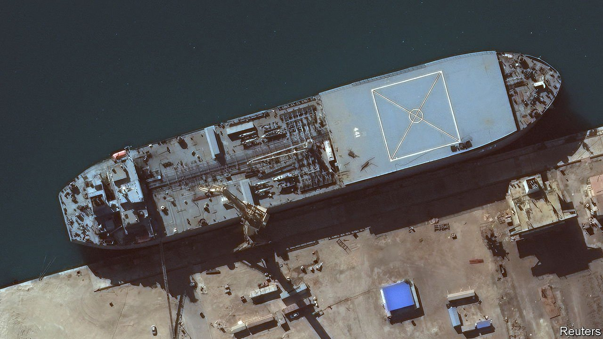

###### Gunboat diplomacy

# Iranian warships seem bound for Venezuela 

##### Will they get there? 

 

> Jun 19th 2021 

IT IS NOT exactly the Cuban missile crisis. In early June, a pair of warships rounded the Cape of Good Hope and became the first Iranian naval vessels ever to enter the Atlantic without port stops. The IRINS Makran, inching along at the speed one would expect of a former oil tanker, is thought to be carrying fast attack craft—small, agile missile-toting warships—bound for Venezuela. The United States has warned that any arms delivery would be a “provocative act and a threat to our partners in this hemisphere”, meriting “appropriate measures”.

Iran and Venezuela are united in hostility to the United States, which has imposed tough sanctions on the former for its nuclear programme and on the latter for its repression at home. Last year Iran sent equipment and experts to help Venezuela revive its ailing oil refineries, plus fuel and food to stock an Iranian supermarket, in return for Venezuelan gold.


Since the expiration of a UN arms embargo in October, Iran has also been free to sell weapons to anyone it fancies. Venezuela is a happy customer. In December the head of the US Southern Command pointed to “growing Iranian influence” and claimed that Iran had sent its Quds Force, an elite expeditionary unit, to support the regime of Nicolás Maduro, Venezuela’s dictator. American officials told Politico, a website, that the deal for weapons was signed last year. Fast attack boats would be a welcome addition to the Bolivarian Navy, which has not covered itself in glory. Last year it lost a patrol boat after ramming a cruise liner in the Caribbean.

The United States has few good options for halting the Makran and its accompanying frigate. In October Donald Trump’s administration threatened simply to “eliminate” any long-range missiles sent to Venezuela by Iran (there was no sign that Iran intended to send any). Joe Biden’s administration has stopped short of such threats. A year ago, the American State Department threatened sanctions against Greek-owned tankers to foil a delivery of Iranian fuel to Venezuela. But warships have “practically absolute sovereign immunity”, says Cornell Overfield of CNA, a think-tank, meaning that the United States cannot lawfully seize or attack them. That principle, in force from around 1812, was reaffirmed when international courts blocked America’s attempt to impound an Argentine warship at a port in Ghana in 2012.

In the middle of a heated presidential campaign, Iran is currently negotiating America’s return to the multinational nuclear deal abandoned by Mr Trump. It is therefore eager to project defiance. But Mr Maduro may have less stomach for confrontation. Eager to ease pressure on his regime, he recently let the UN’s World Food Programme resume operations in Venezuela and freed six former employees of an American oil company. There is still time for a change of heart. Some Venezuelans speculate that Iran’s shipment is timed to arrive by June 24th, the 200th anniversary of a famous battle against Spain, traditionally the national day of the armed forces.■

