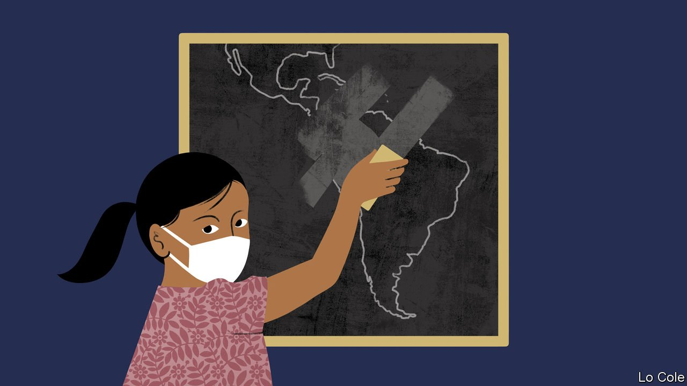

###### Bello

# Latin America’s silent tragedy of empty classrooms 

##### Prolonged school closures are inflicting lasting harm on a generation 

 

> Jun 19th 2021 

FOR THE first time in more than a year, this month small groups of children with their backpacks and chatter have trooped into some schools in Mexico City. It is a cautious re-opening. It is up to schools whether or not they open, and only a minority have chosen to do so. Only part of the class attends each day. The same goes for 18 of Mexico’s 31 other states; in the others all schools remain shut. With the pandemic far from over, caution may be understandable. But among the living, children continue to be among its principal victims, in Mexico and across Latin America.

The region has been hit especially hard by covid-19 in three ways. With 8% of the world’s population it has suffered around a third of officially recorded deaths from covid-19 (and many more unrecorded ones). Its economies contracted by an average of 7% last year, worse than the world as a whole. Much less discussed is that Latin America’s schools have stayed shut for longer than those in any other region. The effects will be felt long after the pandemic is over and economies have recovered.


Schools closed nearly everywhere in the region in March 2020 and many have remained shut ever since. They are fully open only in six smaller countries. Some countries, such as Argentina and Colombia, began opening their schools earlier this year only to close them again as they suffered a second wave of the pandemic.

The prolonged loss of learning will make dismal educational standards worse. The PISA international tests of 15-year-olds in 2018 found that in reading, maths and science, Latin American participants were on average three years behind their peers in the OECD group of mainly rich countries. With schools closed for 13 months, the World Bank reckons that some 77% of students would be below the minimum performance for their age, up from 55% in 2018. This has long-term effects. Even if only ten months of classes are missed, the bank reckons that the average student could lose the equivalent of $24,000 in earnings over his or her lifetime. The poorest, those in rural areas, and girls are most affected by the school shutdown, aggravating Latin America’s already wide inequalities.

Many Latin American countries have made big efforts to organise distance learning during the pandemic. But a sizeable minority of schools lack internet access for teaching purposes. Whereas 98% of the richest fifth of students in the region have internet at home, just 45% of the poorest do. In Brazil mobile phones offer the only internet access for over 60% of black and indigenous students. Many governments are using traditional channels, such as television, radio and printed materials. Mexico has offered distance learning by these means for 25m pupils.

This is no substitute for face-to-face teaching. “Not all students learn at the same pace,” says Marco Fernández, an educational specialist at the Technological University of Monterrey in Mexico. “They can’t ask questions or get feedback as they would in the classroom.” Beyond the loss of learning, school closures have brought emotional costs and a big increase in the number dropping out.

Schools in many countries in other regions re-opened months ago, with social distancing, testing and thorough cleaning. Apart from the severity of the pandemic, there are several reasons this hasn’t happened in Latin America. Parents have generally not been keen. In Mexico, until most people are vaccinated “we think that unfortunately the conditions don’t exist for a massive return to school,” argues Luis Solís of the National Union of Parents, a voluntary group. Teachers’ unions have been reluctant, too. In Argentina when the mayor of Buenos Aires tried to re-open schools in March he was opposed both by the union and the national government, its ally. “There’s no pressure” on governments to re-open, laments Mr Fernández.

Governments could do much more to promote safe re-opening, through information and consultation. “By now all countries should at least have made a substantial effort to open schools,” says Emanuela Di Gropello of the World Bank. “We are not where we should be.” Catching up will be a formidable challenge. Schools need quickly to assess each pupil’s level, organise remedial teaching, and make up lost time with Saturday classes and longer terms. This will take money as well as effort. Many governments have spent more on health care and emergency aid to families and firms during the pandemic. Education should be an equal priority if Latin America is not to fail a whole generation.

