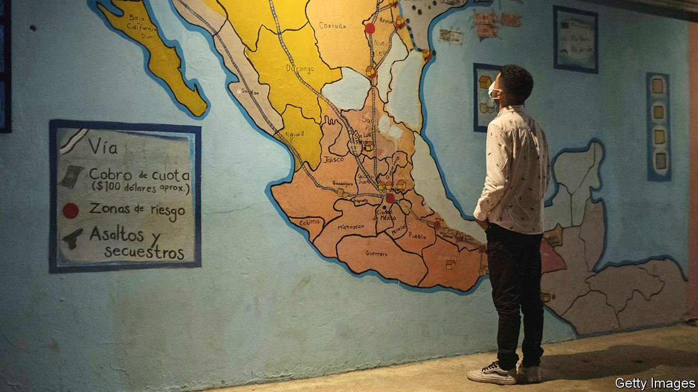
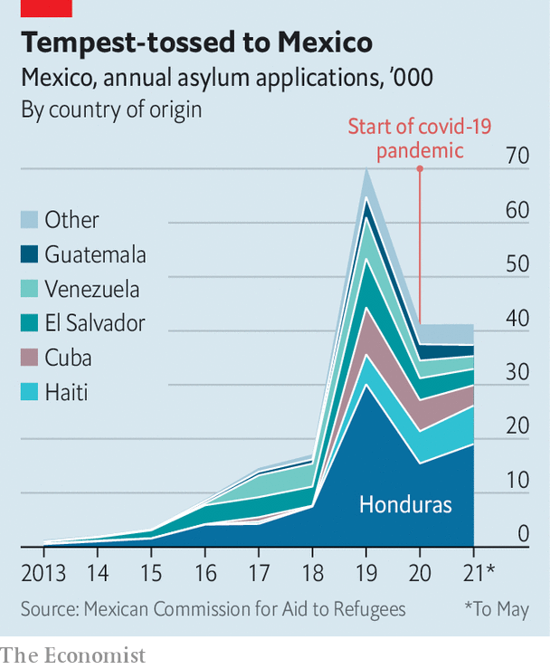

###### The other border surge

# Many Central American migrants are staying in Mexico 

##### Some join family members, others are drawn by better opportunities to work 

 

> Jun 17th 2021 

FOR YEARS Juan and Marta ran a successful transport company in El Salvador that attracted the attention of gangs. Thugs held them at gunpoint and extorted money from them. In 2019 Juan left to claim asylum in Mexico. He was given permission to stay and found work. In April Marta and their three children were allowed to join him. They are thrilled by the prospect of a quieter life in the northern Mexican city of Saltillo. Nothing is as good as at last feeling secure, says Marta. “It gives you back life.”

Latin American migrants, mostly from the “Northern Triangle” of Guatemala, Honduras and El Salvador, are attempting to cross the border from Mexico to the United States in ever higher numbers. In May 180,000 arrived there, the highest monthly total in more than 20 years. The number of arrivals in April was almost as large.


Most are escaping violence and poverty. The impression that President Joe Biden’s administration will be more friendly to migrants than Donald Trump’s was seems to have spurred many to make the journey. Kamala Harris, Mr Biden’s vice-president, visited Mexico and Guatemala in early June to issue a belated warning: “Do not come.”

 


In fact, many migrants are stopping short of the United States, and claiming asylum in Mexico instead. In 2015 there were 3,424 requests; by 2019 the number had increased to 70,302. Some of that may be thanks to Mr Trump’s policy of obliging those claiming asylum in the United States to stay south of the border while their applications were processed (Mr Biden ended this policy on coming to office).

Even so, this year looks set to break new records. Mexico had 41,195 requests for asylum, more than half from Hondurans, in the first five months of 2021. Some of these may eventually continue north. Many others, however, seem to want to stay. The country is becoming a destination in its own right, says Mark Manly of UNHCR, the UN’s refugee agency. “You can spend years trying to get into the United States, or spend those years building a life in Mexico,” says Rafael Alonso Hernández of Colef, a Mexican think-tank and college.

Mexico has a history of accepting immigrants. During the Spanish civil war in the 1930s many refugees fled across the Atlantic. Its laws are welcoming. Its definition of a refugee goes beyond the UN’s, to encompass anyone who is fleeing widespread violence. Hondurans qualify almost automatically. Moreover, refugees, once accepted as such, can do everything but vote: they can work, take advantage of state-funded health care and send their children to local schools.

This generosity is tempting, as is joining relatives who have already made the journey. “The United States has two magnets—family networks and high salaries,” says Andrés Ramírez, the head of Comar, Mexico’s refugee agency. “Now Mexico has the family networks.” Mexico may not offer high salaries—even in Honduras, the minimum wage is higher—but it does at least have work and more safe areas. For Spanish-speaking migrants there is no language barrier. Juan and Marta had worked illegally for a year in the United States before returning to El Salvador and then moving to Mexico. Marta says she would “never live there again”. It did not feel like home, and was too expensive.

Until a few years ago most migrants were young men on their own. Later families began arriving. By the end of March Mexico hosted 3,500 unaccompanied children, up from just 380 at the start of the year, according to UNICEF. The Mexican authorities are struggling to comply with a law passed last year that bars them from keeping children in detention centres for immigrants. The nationalities of refugees are shifting, too. Hondurans have sought asylum in Mexico in the largest numbers for the past three years. But last year Haitians were the second most likely to claim asylum, followed by Cubans.

All this means that Mexico is at a “moment of transition”, says Ximena Escobedo of the foreign ministry. It is likely to have to deal with a lot more migrants in the future. But without some changes it will struggle to cope. Last year Comar’s budget increased to 47m pesos ($2.4m), almost double that of previous years. But it needs yet more funds to provide more shelters, argues Mr Ramírez.

Mexican law says that asylum seekers must stay in the state where they arrive as their claims are processed. Yet the states along the southern border, where almost all asylum-seekers show up, are among Mexico’s poorest, and offer few jobs. Staying in those areas is dangerous for some migrants; Juan claims that Salvadoran gang members tracked him down there to intimidate him. The concentration of refugees in an already poor place also stokes anti-immigration sentiment.

When given the chance, migrants can integrate well. For over a decade UNHCR has run a programme to move people from the south to areas in the north, such as Saltillo, once they have been granted refugee status. Those who are selected, based on their willingness to stay in Mexico, are helped to find work, a house and schools for their children.

So far, the results are encouraging. Andrés Navarro of CINSA, a company in Saltillo that makes tableware, says firms like his struggle to find and retain Mexican workers. Refugees are both happy to move to take a job, and less likely to quit. According to UNHCR, fully 86% of those relocated, such as Juan and Marta, have stayed where they are a year later. It helps that refugees can earn more in these places. In their first year of work the average refugee earns 1,500 pesos a week in the north, but just 800 in the south.

Immigration advocates would like an even more welcoming system. This could help the country more broadly, as attracting and retaining skilled workers remains tricky, too. Legal migrants often have to jump through several regulatory hoops and the system is creaking. But despite the bureaucratic hurdles, Mexico needs more people who are happy to work. Its population is starting to age and many of its own citizens are leaving for other countries. In more ways than one, it is becoming like its richer northern neighbour.■

