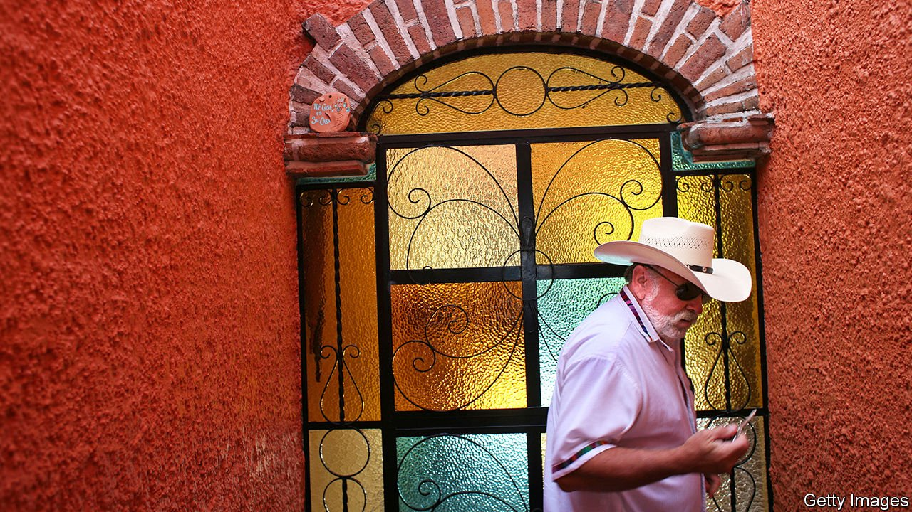

###### The Latin American dream

# Why some people are moving from the United States to Mexico 

##### It is cheaper, warmer—and safer than its reputation suggests 

 

> Jun 17th 2021 

IN THE YEAR and a half since Annette and Mike Thompson sold their house in Texas and upped sticks for Mexico, they have had few regrets. Now they live in Ajijic, a pretty town by Lake Chapala in the western state of Jalisco. Their large house has a spectacular view over the water, where birds glide in the late afternoon breeze. “The only thing we miss is Tex-Mex food,” says Mrs Thompson.

The clichéd view of Mexico is that it is poor and crime-ridden. Popular TV series, such as “Narcos: Mexico”, do little to dispel this image. The reality has long been more nuanced, as more Americans are realising. The US State Department reckons 1.5m live south of the border, making them the largest group of immigrants in Mexico and the largest group of Americans outside the United States (Mexico counts fewer: around 800,000). The largest single community of non-military American expats in the world is in Mexico’s west, close to Guadalajara


In Mexico the cost of living is cheaper and the weather nicer. The Thompsons brought Mrs Thompson’s parents down with them. Her mother has dementia but affordable care frees up her father to go fishing and play cards. And despite Mrs Thompson’s yearning for Tex-Mex, the food is better, too.

Migrants used mostly to be retirees: osteopathy clinics are abundant in Lake Chapala. But thanks to the pandemic, and Mexico’s lax rules over lockdown, younger workers are moving, too. Joyanne Sloan, who works in digital marketing for American companies, moved there with her 12-year-old daughter from Seattle last year. She is not the only one. “You can’t swing a cat around here without hitting someone from the United States,” she says. In well-heeled parts of Mexico City, such as La Condesa, English is heard as much as Spanish.

On the whole Mexicans are welcoming. But some complain that many of the newcomers come without the right visas. The largest group of illegal immigrants in Mexico—by far—is the yanquis.

