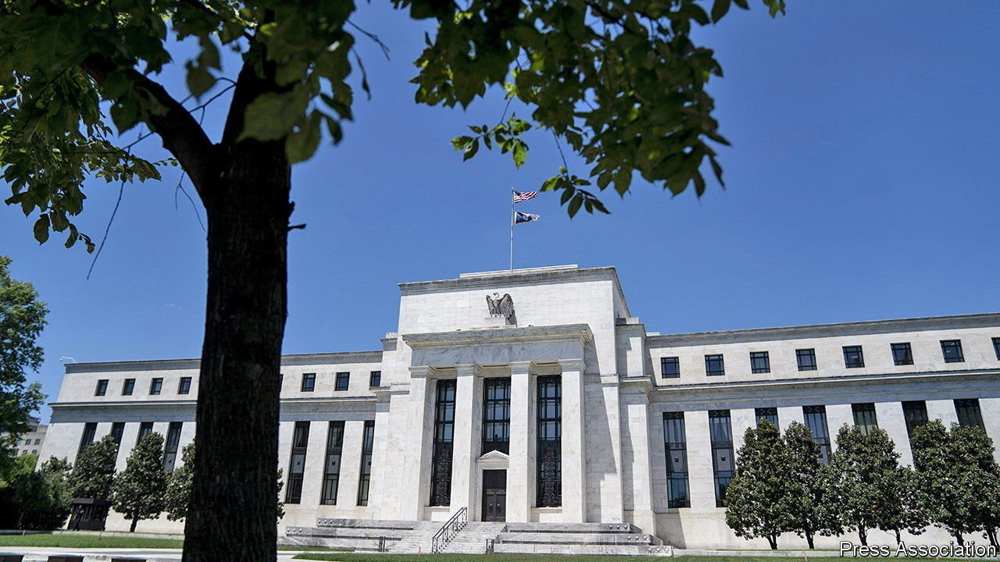
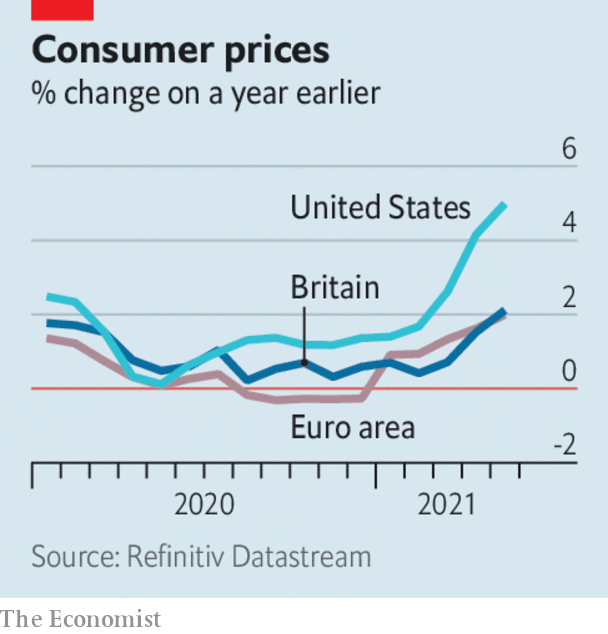

###### 

# Business this week 

#####  

 

> Jun 17th 2021 

The Federal Reserve left interest rates on hold at its latest meeting, though there was a perceptible shift in the mood music. The central bank’s projections now suggest that rates will be lifted twice in 2023, a change from previous guidance that they would remain at record-low levels until the end of 2024. The US economy is recovering from the pandemic more quickly than had been thought.

Inflation sensation

 


The annual rate of change in Britain’s consumer price index jumped to 2.1% in May, from 1.5% in April. Inflationary pressures are increasing as economies return to business. Inflation in America also rose again in May, to 5%, the highest reading since August 2008.


With inflation running at 8%, Brazil’s central bank raised interest rates for the third time this year, lifting its benchmark rate to 4.25%.

A big factor driving inflation is rising energy costs. The price of Brent crude closed in on $75 a barrel this week after OPEC and the International Energy Agency issued bullish forecasts on demand for oil. The IEA called on OPEC to “open the taps” to keep markets adequately supplied.

The European Union conducted the first funding operation for its Next Generation EU programme, raising €20bn ($24.2bn) through the sale of a ten-year bond, the largest amount the EU has raised in a single transaction. The bloc wants to tap €800bn in capital markets by the end of 2026 to finance the recovery fund.

America and the EU reached a deal to end their 17-year dispute over subsidies for Boeing and Airbus. Tit-for-tat tariffs will be suspended for five years while both sides work out an arrangement to limit subsidies and discuss other issues, such as funding to develop new aircraft.

Five bills were introduced in America’s House of Representatives that aim to curb the power of big tech companies by, among other things, prohibiting a dominant platform from promoting its products over others and barring the use of takeovers to smother competition. The most ambitious overhaul of antitrust law in decades would affect all firms, but is directed at Apple, Amazon, Facebook and Google. The bills face a long journey through Congress.

Big tech companies are to face a formidable foe at the Federal Trade Commission, where  has been appointed chairwoman. Just 32 years old, Ms Khan is a professor at Columbia University Law School and has written extensively on reforming antitrust law. She was a counsel to the congressional committee that drafted a report forming the basis of the bills in the House.

Satya Nadella took on the role of chairman at Microsoft in addition to his job as chief executive, the first time that both roles have been combined since Bill Gates was in charge.

Didi Chuxing filed papers to list shares on either the Nasdaq or New York Stock Exchange. Expected next month, the IPO of China’s biggest ride-hailing firm could raise a reported $10bn.

Emirates reported an annual loss of $5.5bn for the year ending March 31st. With international travel almost at a standstill because of the pandemic the airline carried just 6.6m passengers over the 12 months, down by 88% from the previous year. The government of Dubai will continue to support the company, which has shed almost a third of its workforce since the start of the crisis.

Britain struck a free-trade deal with Australia, the first agreement negotiated from scratch by the British government since Brexit. British farmers are worried that their market will be swamped by cheaper goods from Down Under. They will be protected by a cap on tariff-free imports for 15 years.

Nagayama Osamu said he would consider resigning as chairman of Toshiba, following the publication of a scathing independent report into collaboration between management and the Japanese government, but only after he had fixed the company’s problems. The report laid bare the extent to which officials colluded to head off a rebellion at last year’s shareholders’ meeting, which critics say proves that the government is more interested in protecting cronies than investors’ interests.

A court in France fined IKEA €1m ($1.2m) for spying on its staff through a surveillance system between 2009 and 2012. The former head of risk at IKEA France reportedly once inquired how a member of staff could afford a new BMW.

Get off the chaise longue

Bankers in America are being pressed to return to the office after a year of remote working. James Gorman, the boss of Morgan Stanley, told staff that if they felt comfortable visiting a restaurant in New York then they should also come back to the office. Goldman Sachs has taken the toughest approach, ordering all its employees back to their desks.

