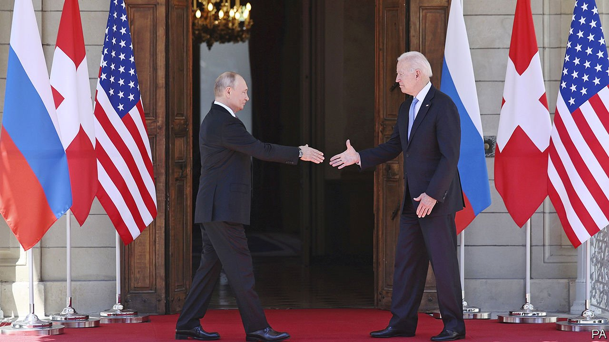
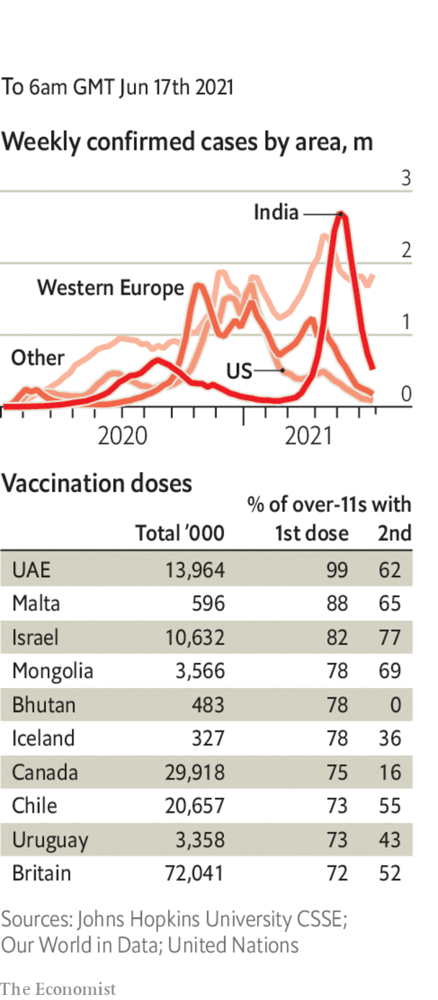

###### 

# Politics this week 

#####  

 

> Jun 19th 2021 

 for a summit. It lasted less than four hours, but both men described it as constructive. The two sides agreed to return their ambassadors, who were recalled earlier this year, and said they would work on new nuclear-arms-control measures. Mr Biden criticised Russia’s human-rights record, but said the topic should be dealt with separately from other matters, such as security and climate change. Mr Putin denied that Russia engages in cyber-attacks.

China rejected criticism made by G7 countries at their summit in Britain. The G7 had called for peace in the Taiwan Strait and asked China to respect human rights, especially in Xinjiang and Hong Kong. A Chinese official said America was sick and the G7 should give it medicine. Meanwhile, 28 Chinese military aircraft flew into Taiwan’s airspace, more than had been recorded on any previous day.


China passed a law allowing its government to retaliate against sanctions imposed on it by other countries. Individuals or entities involved in implementing such sanctions could be put on a blacklist and have their assets in China seized. In Hong Kong the editor and four other people associated with the , a pro-democracy newspaper, were arrested for publishing articles calling for sanctions against the city’s and mainland’s governments.

North Korea’s dictator, Kim Jong Un, warned that the country faced food shortages, which he blamed on flooding, covid-19 and sanctions.

Myanmar’s ruling junta put Aung San Suu Kyi on trial behind closed doors. The army, which took power in a coup in February, has charged the country’s former leader with seven crimes, including corruption and possessing walkie-talkies. If found guilty she faces decades in prison.

Tens of thousands of people rallied in Madrid against the government’s plan to pardon 12 separatists from Catalonia who were behind an illegal independence referendum in 2017. Nine of the separatists were found guilty of sedition, in what was Spain’s biggest political crisis for decades. Some 60% of Spaniards oppose their pardons.

At a referendum in Switzerland, voters narrowly rejected a plan to levy taxes on airline tickets and car fuel to tackle climate change, complicating the government’s ambitions under the Paris accord.

 in England for what had been labelled “Freedom Day”. Cases of the Delta (Indian) variant are rising. Britain’s prime minister hopes that by July 19th two-thirds of the population will be fully vaccinated and restrictions can at last end. Meanwhile, it was reported that care-home staff will have to be vaccinated if they want to keep their jobs.

A judge found that Joe Biden may have exceeded his presidential powers when he stopped issuing licences to drill for oil and gas on federal land, one of his first orders as president. Granting an injunction against the order, the judge said that only Congress could take such action.

Another six opposition politicians were arrested in Nicaragua, bringing the total to 13 in recent weeks. They have chided President Daniel Ortega, who stands for re-election in November and seems determined to do anything to win.

Pedro Castillo, a hard-leftist, claimed victory in Peru’s presidential election. He finished 44,000 votes ahead of his rival, Keiko Fujimori, the hard-right daughter of a former president. She claims that the count was inflated by fraud and has promised to challenge the result in court.

Criminal violence in Port-au-Prince, the capital of Haiti, has led 8,500 people, mostly women and children, to flee their homes, according to Unicef. Some 14,000 people have been displaced.

 was sworn in as prime minister of Israel, ending Binyamin Netanyahu’s 12 years in power. Mr Bennett faced an immediate test when Jewish nationalists marched through the Old City of Jerusalem, some chanting racist slogans. Hamas, the Palestinian militant group that runs Gaza, launched incendiary balloons at Israel, which responded with air strikes in Gaza. There were no casualties. It was their first big clash since last month.

Lebanon’s currency, which has lost more than 90% of its value since October 2019, hit a new low. The country is mired in an economic crisis that has left it short of basic goods such as fuel and medicine. Efforts to form a new government remain stalled.

America is considering a plan to send commandos back to Somalia. This would partly reverse a decision by Donald Trump, who withdrew all 700 American troops from the country. The soldiers would train Somali forces battling al-Shabab, a jihadist group.

Tedros Adhanom Ghebreyesus, the head of the World Health Organisation, warned that , and now, “not next year”. The G7 had just promised 1bn doses. At least 11bn will be required if 70% of the world’s population is to be vaccinated by the time the G7 meet again in 2022.

Coronavirus briefs

 


The number of infections continued to fall in India. Tourist attractions, including the Taj Mahal, re-opened to visitors. There are worries that easing restrictions will cause a new wave of cases.

Officials in Moscow told people to work from home, as new daily cases in the city leapt to their highest level since December.

California and New York lifted almost all their remaining restrictions. The number of new infections in both states are at their lowest levels since the start of the crisis.

Tanzania said it would release data on covid-19 infections for the first time in more than a year. This would make the IMF and World Bank more likely to disburse funds. Tanzania’s late president, John Magufuli, had halted the publication of such statistics. He also denied there was covid in his country, and said that vaccines did not work.

