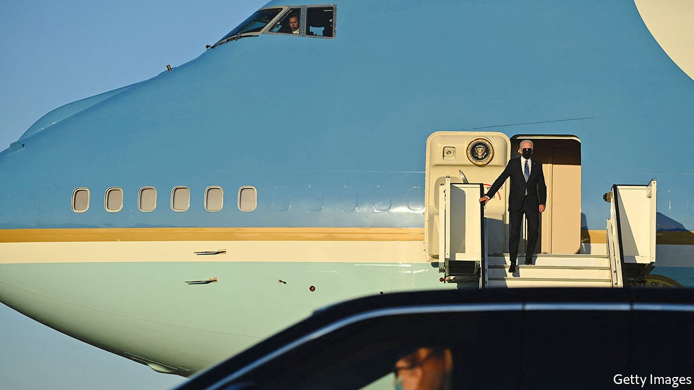

###### Look at Joe not go

# After a quick start, Joe Biden’s legislative agenda has hit a wall 

##### Factionalism and the filibuster imperil his ambitions 

 

> Jun 17th 2021 

AFTER HIS first 100 days in office, Joe Biden looked ruthless and Rooseveltian. He had just passed a  despite painfully narrow majorities. His administration was triumphantly preparing future plans to spend trillions more on climate, infrastructure and safety-net expansions. Since then, however, little has happened, and the prognosis looks murky.

When mathematicians confront a system of equations, they sometimes find that there is no possible solution: the equations are simply inconsistent and cannot be resolved. The various constraints on governance—Democratic squabbles over the importance of bipartisanship, the brutal mathematics of thin margins, unrelenting opposition from Republicans—are starting to resemble such a system.


The main constraint on Mr Biden’s ambitions has always been the filibuster, a Senate rule that mandates 60 (out of 100) votes to push through most legislation. Democrats hold 50 Senate seats; assuming unanimity among them, the administration thus needs ten Republican votes. Mr Biden will be hard-pressed to find them.

That leaves three plausible options. The first is to negotiate down his proposals, which risks losing the support of the Democrats’ left flank. The second is to squeeze the agenda into a “reconciliation” bill that is primarily budgetary, and immune to a filibuster. That would probably require excising some important regulatory provisions, such as a clean-electricity standard or a minimum-wage rise. It also risks losing the votes of moderate Democratic senators hopelessly bent on bipartisanship. The third option— through a simple majority vote—is hostage to moderates’ unshakeable belief that ending the filibuster would somehow destroy the Senate.

On infrastructure, Mr Biden seems to be pursuing the first path. Joe Manchin of West Virginia, the Senate’s most conservative Democrat, insists on a bipartisan deal. The White House pursued one, negotiating for weeks with Senator Shelley Moore Capito, the Republican senator from West Virginia. Those talks collapsed on June 8th. The White House has now pivoted to negotiating with a separate bipartisan group of senators—which may also prove a long slog with little hope of success.

If there were an obvious path to get his full, ambitious package through Congress, the president would already have taken it. Mr Biden had little compunction about pushing his rescue package through reconciliation and passing it largely unscathed on a party-line vote in the Senate. Moderates acceded during an emergency, but are much less enthusiastic about using reconciliation for ordinary legislating.

Looking at the concessions already forced upon the administration is instructive. Ms Capito’s final counter-offer was for $330bn in additional spending—not even 10% of Mr Biden’s $4trn package. The president, for his part, had offered to cut proposed spending to $1trn, and suggested taking the corporate-tax rise (from a current rate of 21% to a proposed 28%) off the table. The offer being crafted by the new group, which may yet fail to attract ten Republican votes, is said to be $579bn in extra spending, and mainly limited to “hard” infrastructure—roads, bridges and the like—without any of the welfare-state expansion that Mr Biden included in the second half of his plans.

Even if the negotiations yield a compromise, factional forces loom. Climate-conscious Democrats seem poised to bolt. (Republicans have been adamant that “core infrastructure” ought not to incorporate greenery.) “You can’t hand-wave or spin away the scientific necessity that we have to get our climate emissions down to protect public health,” says an aide to Senator Ed Markey of Massachusetts, who vows to vote against any bill that is “in denial” on climate change. Progressives in the House of Representatives, where Democrats have only a bare majority, also have sufficient numbers to torpedo any legislation they deem insufficient.

Much of the rest of Mr Biden’s agenda looks even more endangered. The For the People Act, also known as HR1, which Democrats see as their answer to state Republicans’ tightening of voting rules and to the threat to democracy posed by Trumpism, looks dead. Mr Manchin will not support it (not because of any of its manifest flaws, but because it was too partisan). He also has repeatedly rejected calls to weaken the filibuster. Among the ironies engendered by the filibuster is that a simple-majority vote is sufficient to confirm a Supreme Court justice with the power to strike down legislation, but insufficient actually to pass any.

A mausoleum of ambition

Mr Manchin promised instead to whip up support for HR4, the John Lewis Voting Rights Advancement Act, a more limited bill than HR1 (which devoted much of its space to the somewhat ancillary concern of drawing up a public-financing scheme for elections). Even this strategy is suspect. Earlier introductions of the legislation have been co-sponsored by only a single Republican senator, Lisa Murkowski of Alaska—which leaves the administration nine votes short.

Chuck Schumer, the Senate majority leader, has suggested that he will force a series of votes in the coming month. That may yield political benefits for next year’s mid-terms. Substantively, however, he may wind up with little to show for his efforts. Voting-rights legislation is imperilled, and a compromise gun-control bill is looking unlikely after talks broke down between John Cornyn of Texas and Chris Murphy of Connecticut.

That is not to say that nothing will pass. The Senate recently approved a relatively undiscussed . A $547bn surface-transport bill may soon pass with a smattering of Republican support. Bernie Sanders, who chairs the Senate budget committee, aims to start the reconciliation process soon. But that will get only some of Mr Biden’s agenda through, and nothing at all on voting rights, gun control or immigration.

And this may prove the most favourable legislative environment of Mr Biden’s term. Parties in power tend to lose seats in mid-terms, though Mr Biden is proving a slippery target for Republicans, and his signature legislative achievement showered Americans with cheques. A successful vaccination campaign and healthy reopened economy may help him when facing that headwind.

But given the Democrats’ narrow margins, even small losses would put Congress in Republican control. Herding Democrats is hard enough. The Republican congressional leadership could kill Mr Biden’s legislative priorities, leaving him reliant on executive orders, as his two predecessors were in the second halves of their terms. That is a long way from Rooseveltian. ■

A version of this article was published online on June 13th 2021

For more coverage of Joe Biden’s presidency, visit our dedicated 

