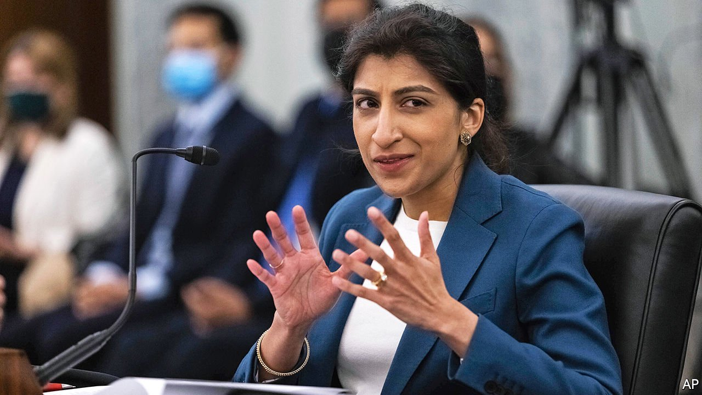

###### Yes they Khan

# Joe Biden appoints Lina Khan to head the Federal Trade Commission 

##### Big tech firms should start to worry 

 

> Jun 19th 2021 

THE EARLY motto of Mark Zuckerberg, Facebook’s boss, was “Move fast and break things”. Bruce Mehlman, a former assistant secretary of commerce for technology policy, predicts the same maxim may now guide the Federal Trade Commission (FTC), a consumer-protection agency. On June 15th news leaked that Lina Khan, a prominent critic of large tech firms, whom the Senate had just confirmed to be one of the FTC‘s five commissioners, would chair the agency. Her appointment shows that taking on tech has become a rare bipartisan concern in Washington, and that the White House supports a more activist enforcement agenda.

Ms Khan, who is 32, is best known for “Amazon’s antitrust paradox”, an article she wrote in 2016 while a student at Yale Law School. She argues that current interpretations of antitrust—which hold that if consumers benefit from free services then no harm is being done—are insufficient to deal with the power of platforms such as Amazon. The tech giants could use predatory pricing and market control to harm smaller firms.


Two more recent works show just how deeply Ms Khan’s technoscepticism runs. She contributed to a report last year by the House judiciary subcommittee on antitrust, which suggested that trustbusting needs a reboot. She has argued in the Columbia Law Review for “structural separations” at big tech companies. She also goes far beyond conventional wisdom in her interpretation of antitrust law’s toolkit.

Breaking up big tech is a popular talking point, advanced by elected officials on both sides of the aisle and by the Open Markets Institute, a once-fringe think-tank where Ms Khan used to work. Perhaps the White House chose Ms Khan in part to please progressives, who are likely to get less from the administration’s infrastructure package than they hoped. Yet many of Ms Khan’s views are also popular with conservatives, who bash big tech firms for their size and stifling of free speech. “She’s a controversial figure within antitrust circles, but a very popular one in political circles,” says Blair Levin of New Street Research, an analysis firm.

According to Mr Levin, the agenda to combat the tech giants’ power will have four fronts. Ms Khan will work with Congress on bills (which have a degree of bipartisan support) to constrain the power of big tech firms by, for example, banning them from favouring their own services. Second, Ms Khan will collaborate with European regulators, who have led the charge against the tech behemoths. Third, she will launch investigations. And fourth, she will litigate cases against businesses. Here she may be most constrained, says a former FTC commissioner: courts tend to favour business, especially since Donald Trump nominated 234 judges.

Just how aggressively the Biden administration wants to pursue big tech firms should be revealed soon, when the head of the Department of Justice’s antitrust division is named. But the selection of Ms Khan shows that Washington’s view of tech firms has changed since Mr Biden was vice-president. That was another age, back when BlackBerrys—and tech CEOs—were still popular. ■

For more coverage of Joe Biden’s presidency, visit our dedicated 

