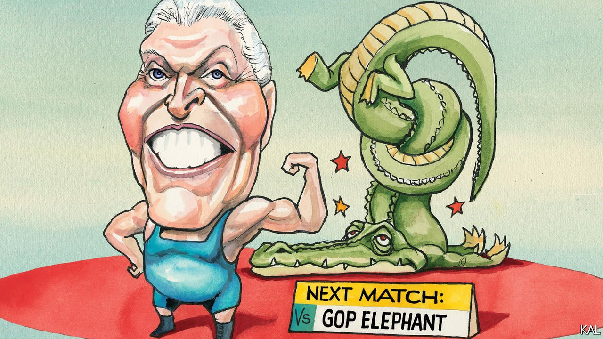

###### Lexington

# Terry McAuliffe and the battle for Virginia 

##### His victory in the state’s Democratic gubernatorial primary could be one for the history books 

 

> Jun 19th 2021 

THE ONLY man to serve two terms as governor of the Old Dominion since the civil war was a courtly “Virginia gentleman” and segregationist called Mills Godwin. Hailing from the rural south of the state, whose large black population and racism recalled the Deep South, Godwin claimed that letting black children attend Virginia’s better schools “would be a cancer eating at the very lifeblood of our public education system”. It is interesting to wonder what he would have made of Terry McAuliffe, who looks well-placed to match his achievement in November.

Flamboyant, some might even say shameless, “the Macker” is a carpet-bagging native of New York who was governor in 2014-18 and formerly known as a fast-talking Clinton crony and outlandishly good fund-raiser. He allegedly inspired (though he denied it) a scheme to Airbnb the Lincoln Bedroom to Bill Clinton’s top donors. He once wrestled a 280lb alligator for a $15,000 gift to Jimmy Carter’s re-election campaign. Godwin and the Macker, who won Virginia’s Democratic gubernatorial primary last week in a blowout, have two big things in common.


Both transformed their reputations in office. The segregationist ushered in Virginia’s first sales tax and bond issuance, leading to new roads and a community-college system. The Macker, working around a militant Republican legislature, re-enfranchised 173,000 ex-felons, nearly half of whom were African-American. He was also as effective a salesman for Virginia as he had been—as America’s youngest-ever bank chairman—in business. He rode in a fighter jet to impress the aerospace industry, played a revolutionary-war general on television to bring in the entertainment industry, and installed a kegerator in the governor’s mansion to woo the craft-beer industry. If he didn’t wrestle another gator, it was because Virginia already had three zoos. A popular governor with a decent economic record, he was probably denied a second consecutive term only because the commonwealth forbids them.

Through luck as well as judgment, Mr McAuliffe and Godwin were also beneficiaries of Virginia’s two biggest political shifts since Reconstruction. Godwin won his first term, in 1965, as a southern Democrat. But as the south lurched to the right after the passage of the Civil Rights Act he won his second, in 1973, as a Republican. Unusually in Virginia, he did so despite being of the same party as the incumbent president. Forty years later, Mr McAuliffe was the next candidate to manage that feat—thereby confirming how sharply Virginia had swung back to the Democrats. The state now has its first Democratic legislature in a quarter of a century, has not elected a Republican to statewide office since 2009, and last November chose Joe Biden over Donald Trump by a ten-point margin.

Comparing those sea-changes is instructive. The voters who left the Democrats over civil rights in the 1960s and 70s were white, mostly working-class and more radicalised than the patrician establishment of either party. By contrast, the left’s new voters, in the affluent suburbs of Richmond and northern Virginia, are diverse professionals who are chiefly recoiling from a Republican establishment captured by the wildest spirits of its base.

Mr McAuliffe’s opponent in November, Glenn Youngkin, a super-rich political newcomer, was one of the more moderate candidates in the Republican primary. Yet to win it he was forced to declare fealty to Mr Trump, perhaps the most unpopular politician in Virginia, and tacitly endorse his lie that the general election was stolen. The former private-equity baron has launched an “election integrity taskforce” and called a Trumpist conspiracy theory about voting machines “the most important issue” of the campaign. This encapsulates the handicap Republicans face in every state with extensive suburbs—including Arizona and Georgia, as well as Virginia. They are attempting to win them back while leaning into the extremism that suburbanites loathe.

This is a bigger advantage to Mr McAuliffe than his governing record (which jaundiced voters, in another contrast with Godwin’s time, are liable to set aside these days). He has therefore nicknamed his Republican opponent “Trumpkin” and is trying to goad Mr Trump into getting involved in the race—ideally by visiting the state. “Oh my goodness, I’ll pay for his gas to come!” the irrepressible Macker told your columnist. “But I’m telling you he’s scared of me, he’s not coming here, we keep beating them!”

The Democrats’ main weakness is also apparent in the race. It is that the voluble left thinks the party’s new supporters have come to it in a great awokening, not, as is the case, by default. During the primary, left-wingers suggested that Mr McAuliffe’s candidacy was an affront to his three black primary opponents. In giving him 62% of the vote in a five-horse race, Democratic voters dismissed that, and in the process underlined another Democratic advantage. The moderation of the party’s new suburban voters is reinforcing the previously underestimated centrism of its African-American base—which in Virginia represents a fifth of the electorate. Mr McAuliffe, who has said relatively little about race while vowing to boost education spending and job creation, thereby won the primary vote in every city and county of the state.

A Macker for all seasons

As a competitive state, which holds one of the first statewide votes after a general election, Virginia has long been an important political straw in the wind. Despite its recent lean towards the Democratic Party, this year will be no different. There is so much on the line. Mr Youngkin will test the Republicans’ ability to detoxify themselves now that Mr Trump is off the ballot. The party’s anti-democratic drift, perpetuated by Mr Youngkin, will be all the more threatening if they succeed. Opposing them stands the author of “What a Party! My Life Among Democrats: Presidents, Candidates, Donors, Activists, Alligators and Other Wild Animals”. Cometh the hour, cometh the Macker.■

