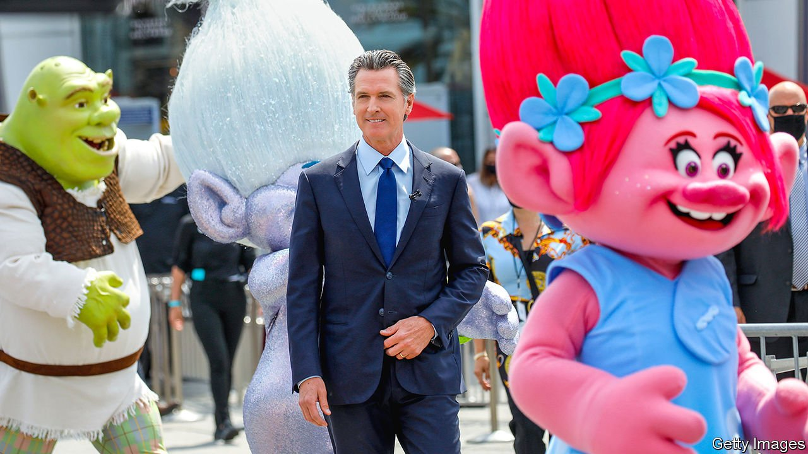

###### California teeming

# The Golden State is awash in cash 

##### How its leaders plan to use the money says a lot about its politics 

 

> Jun 19th 2021 

RECENTLY CALIFORNIA has been running a lottery to encourage vaccinations against covid-19. Those who have received their jabs can enter to win prizes, including holidays, gift cards and ten grand-prize cheques of $1.5m each. California has also recently won a windfall of its own. Instead of an expected $54bn budget deficit because of the covid-19-induced recession, a roaring stockmarket combined with a federal stimulus has produced a surplus of more than $100bn.

Politicians, including Gavin Newsom, California’s governor, are splurging. On June 14th the legislature agreed to pass a $264bn draft budget—the largest in the state’s history, nearly 30% bigger than the previous record in 2019-20.


Dubbed the “California Comeback Plan”, Mr Newsom’s proposed spending promises to help California “to make a once-in-a-lifetime investment in the future of the state”. The budget will devote billions to public education, housing, transport, health care for undocumented immigrants, fighting homelessness and climate change, and more. Though the budget is not yet final, its size highlights politicians’ belief that more government spending is the solution to the state’s problems, as well as some of their own.

California is so flush with cash that it is launching the largest-ever state tax rebate. Those earning under $75,000 will be eligible to receive cheques of up to $1,100 (in addition to federal stimulus). A law passed by voters in 1979 requires the state to refund taxpayers once appropriations reach a certain level, but California and Mr Newsom are “following the progressive orientation of the state, which is to give back more to the neediest citizens”, says Ken Miller of Claremont McKenna College.

The generosity may also be self-interested. Mr Newsom faces a Republican-led campaign to recall him from office, which gained steam during the state’s long-running shutdown in response to covid-19. California was one of the last states to lift restrictions; it reopened only on June 15th. Spending on popular progressive causes helps ensure that no Democrat will run against him in the recall, while sending cheques to voters may blunt some of their frustration with him. “It’s in Newsom’s short-term political interest to spend now, instead of save now,” says Mr Miller.

It is striking how little disagreement there is on the budget between Mr Newsom and the legislature, both chambers of which are controlled by veto-proof Democratic supermajorities. The legislature and Mr Newsom agree that the state should start paying for health-care coverage for poor undocumented immigrants. But Mr Newsom wants this to apply to undocumented immigrants who are 60 and older, whereas some legislators want to lower the age to 50. Even that reveals a lack of ideological diversity: no powerful voices are asking whether the state ought to spend as much as $1.3bn a year on the health care of low-income non-citizens.

Californians need a robust social safety-net—the state has America’s highest poverty rate when adjusted for the cost of living. But two important questions arise. One is whether expanding the footprint of government without making reforms is likely to help the people the state is trying to reach. The pandemic has laid bare how badly California runs its operations. The Employment Development Department (EDD), which handles unemployment claims, has been bedevilled by ineptitude, technical problems, fraud and lack of oversight. People can wait days to reach someone at EDD, and months to get a cheque. Meanwhile the schools, among the biggest state-run enterprises, have been closed for in-person instruction far longer than in other states because of powerful teachers’ unions. As of April 30th, only 13% of public-school pupils were in the classroom five days a week. That burden has fallen disproportionately on the poor and has only widened inequalities.

Another question is whether spending so much now instead of preparing for the next recession is wise. To make the maths of higher spending work, the governor is banking on a further climb for the stockmarket in the coming years, even though it is already near historic peaks. “We’re a state, not a SPAC,” says David Crane, a lecturer in public policy at Stanford University, referring to the investment vehicles that make often over-rosy assumptions about growth. “We should make reasonable projections about the future.”

Because California depends on personal-income taxes and stockmarket gains for revenue, busts are painful. In both 2001 and 2008, the state’s net capital-gains realisations declined by a whopping $80bn each time, leading to massive cuts to government programmes and the social safety-net. The governor’s own maths in his proposed budget showed the downside risk to another stockmarket fall, yet the state is not setting aside enough in reserves to prepare for it.

California has already withdrawn $8bn from its $16bn rainy-day fund to cope with the pandemic, but is allocating only $3.7bn back into the fund, leaving it with a fraction of the reserves required to insulate against another economic shock. Some legislators sent a letter to Mr Newsom arguing for setting aside more reserves, but their calls have gone unheeded. Politicians are too busy partying as if they have just won the lottery. ■

