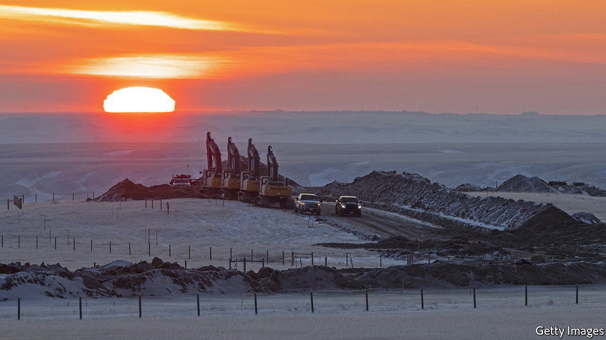
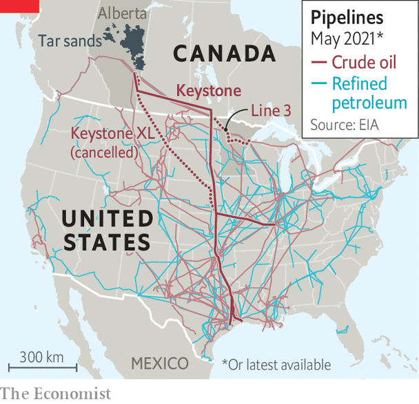

###### Keystone chimera

# The death of a totemic pipeline has been greatly exaggerated 

##### Oil from Alberta’s tar sands will still flow freely 

 

> Jun 17th 2021 

THE WEBSITE of 350.org, an environmental group, screams, “We want to end the fossil-fuel industry within the next decade.” The group’s cause célèbre has been halting the completion of Keystone XL, an $8bn pipeline that was intended to transport oil mined from mucky “tar sands” in Canada’s Alberta province over a thousand miles into the American heartland.

To that end, greens joined with native Americans and ranchers, who also opposed the pipeline out of concerns that it would disturb sacred grounds and pollute vital water supplies. They persuaded Barack Obama to revoke an essential permit, which halted construction. But TC Energy, the firm behind the project, and the Albertan government were equally determined. They persuaded Donald Trump to reverse Mr Obama’s ruling, allowing it to proceed.


Then in January this year President Joe Biden reversed Mr Trump’s ruling, halting construction again. After reviewing its legal options, TC Energy declared on June 9th that Keystone XL is “terminated”. Bill McKibben, a founder of 350.org and a noted environmentalist, exclaimed: “[W]hen enough people rise up we’re stronger even than the richest fossil-fuel companies.”

Perhaps, but greens should not pop the champagne just yet. For a start, the loss of one conduit will hardly dent America’s petro-economy, which boasts over 200,000 miles of oil pipelines (see map). Gas-guzzlers will not be affected one whit. John Coleman of Wood Mackenzie, an energy consultancy, puts it bluntly: “Keystone XL was more of a luxury than an absolute necessity for the US oil market.”

 


If slaying this pipeline sparks broader anti-oil protests, argued Mr McKibben recently in The New York Times, then “much of the rest of the elaborate architecture of fossil-fuel expansion begins to topple”. Activists in Minnesota have turned their attention to an alternative oil pipeline running from Canada to America, known as Line 3. But on June 14th an appeals court affirmed that state’s approval of the pipeline.

Even if those activists succeed, they will only inconvenience peddlers of Alberta’s carbon-intensive crude, not shut them down altogether. Canadian producers can still send their oil south through other pipelines or via rail, and ship it west to global markets via the Pacific. Chris Midgley of S&amp;P Global, a research firm, concludes that there is sufficient transport capacity “to handle growing oil sands and shale production over the next decade out of west Canada”.

Exuberance over the Keystone XL victory may prove fleeting. Alberta’s government, which has ploughed over $1bn into the pipeline, has indicated that it will try to invoke the new North American free-trade agreement to revive it. On June 15th a federal judge blocked Mr Biden’s attempt to halt new oil and gas drilling on federal lands, ruling that such a decision requires congressional approval. Environmentalists may well find Big Oil to be a hydra-headed beast.

