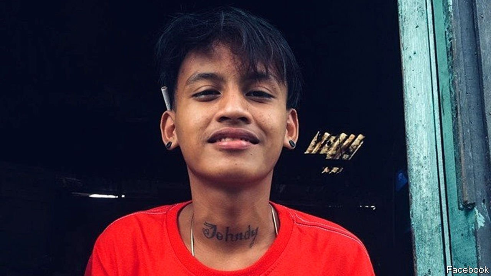

###### Silenced witness

# A rare investigation into a police killing in the Philippines 

##### Most deaths in the war on drugs are quickly forgotten. This one is different 

 

> Jun 26th 2021 

THE RASHOMON stories recounting the death of Jhondie Maglinte Helis are typical of the Philippines’ war on drugs under President Rodrigo Duterte. The police claim that officers found Jhondie (pictured), 16 years old, in the company of an adult drug suspect, Antonio Dalit, when they went to arrest Mr Dalit on June 16th in Laguna, a province on the southern edge of Manila. The officers say they shot and killed the pair after both of them drew guns in an attempt to resist arrest.

Civilian witnesses tell a different, if depressingly familiar, story: that the officers captured and summarily executed Mr Dalit. Jhondie happened to be nearby, and witnessed the killing. The officers are then alleged to have caught and handcuffed him, shoved him face-down into the mud and, as he pleaded for mercy, shot him dead, too.


What happened next, however, was far from typical. The official tally of killings in the drug war stands at 6,117 by the most recent count. Most such stories end when the authorities close the case without even attempting to uncover the truth. But in the case of Jhondie the police restricted the movements of the ten officers involved. They also started an internal investigation, which will run independently of inquiries by the Commission on Human Rights, an all-bark-and-no-bite public institution. The national chief of police, General Guillermo Eleazar, voiced his determination to rid the force of what he called “rogues who are unfit to wear the uniform”.

Even the presidential spokesman, Harry Roque, promised that police officers who broke the law would be investigated, prosecuted and punished. Mr Duterte has repeatedly urged law enforcers to kill drug suspects, usually adding as an afterthought that such killings are lawful only if the suspects try to use deadly force to resist arrest. His spokesman notes, however, that the president had also repeatedly said that police officers would be “on their own” if they broke the law.

The official protestations of determination to prosecute killer cops followed the announcement by prosecutors from the International Criminal Court (ICC) that they had asked for permission to investigate Mr Duterte and his subordinates on suspicion of committing crimes against humanity in the war on drugs. Monitors of human rights think the campaign has killed thousands more people than the official tally suggests.

During a televised address, Mr Duterte reacted to the prospect of being hauled before the ICC with the subtlety that has characterised his presidency. “Bullshit!” he said. “Why would I defend or face an accusation before white people? You must be crazy. [They used to be] colonisers, they have not atoned for their sins against the countries that they invaded, including the Philippines.”

Mr Duterte’s dismissal of the court is based on three arguments. The flimsiest is that the ICC never had any jurisdiction because the treaty by which the Philippines joined it was never published locally in print, as required by law. A stronger argument is that the court has anyway had no jurisdiction since the Philippines’ withdrawal from the treaty took effect in March 2019. The third is that the ICC can intervene in a sovereign country only if the system of justice in that country fails to function, and that the Philippine justice system is still working well enough.

If the authorities’ professed determination to establish what happened to Jhondie is meant to prove that the justice system is in fine fettle, it is unconvincing. The justice minister, Menardo Guevarra, attempting to explain why his ministry has prosecuted so few killer cops, bemoaned the lack of witnesses for the prosecution. “Unless they come forward and testify, it would be extremely difficult for our investigating agencies to build up cases against erring law enforcers,” he said. Mr Guevarra was speaking, apparently without any irony intended, just six days after Jhondie was killed. If the prosecutors of the ICC do end up investigating the blood-letting Mr Duterte has instigated, they are unlikely to be so easily discouraged. ■

