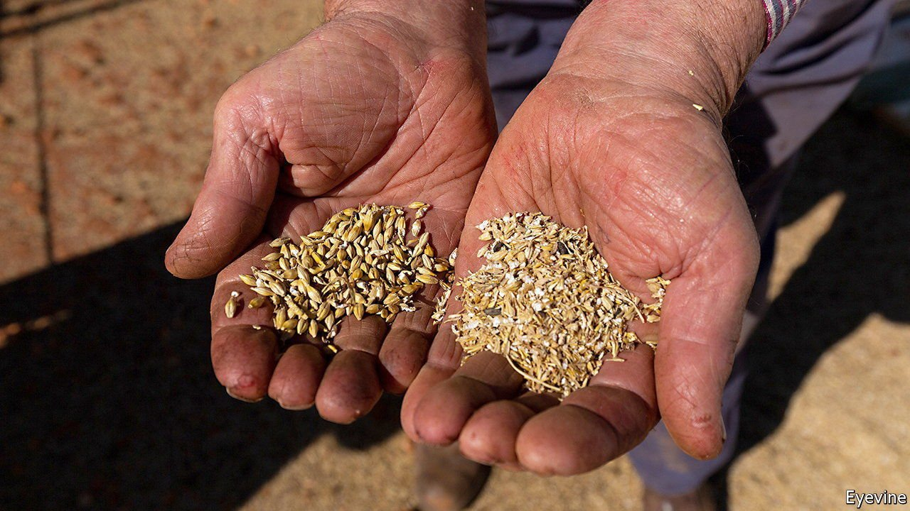

###### No more Mr Mice Guy

# Australia mulls biowarfare against unwanted critters 

##### Authorities take no prisoners in the battle against invasive species 

 

> Jun 26th 2021 

FOR SIX months a plague of rodents has infested Australia’s south-eastern farmlands. Mice are still “running around like they’re training for Tokyo”, says Xavier Martin, a grain farmer in New South Wales, the worst-hit state. The vermin devour crops, burrow into hay bales, climb into beds and pollute drinking water. That has set off a debate about how to end the scourge.

The first solution is baiting. The poisoned grain that farmers scatter over their fields is costly, and some towns have run out of the stuff. Worse, mice do not always consume a fatal dose, says Steve Henry of the Commonwealth Scientific and Industrial Research Organisation (CSIRO), though a new double-strength formula might help.


Another idea is to prevent future plagues by waging biological warfare against the creatures. Under a A$50m ($38m) “mouse-control package”, the government of New South Wales is investing in research into tweaking the rodents’ genes, to slow their breeding. One approach might be to eliminate sperm which carry the X chromosome, thereby ensuring that future pups are mostly male. Another is to pass a gene through the population that would eventually make female mice infertile.

No country has yet genetically engineered mammals in that manner, says Paul Thomas of the University of Adelaide, who is leading the research. But Australia has fought biological battles against invasive species—of which it has many—for decades.

Consider the humble bunny. A couple of dozen rabbits were first imported for sport by a bored British transplant. They bred like their proverbial selves and went on to nibble huge tracts of Australia bare. Only the introduction of two lethal viruses—myxomatosis and calicivirus, which causes them to bleed to death—has seriously dented their numbers.

Troublesome plants are kept in check by similar means. Prickly pears, a family of cacti introduced from the Americas, overwhelmed farmland in eastern Australia before a leaf-munching moth was shipped over in the 1920s. Since then, scientists have unleashed insects and fungi on weeds such as ragwort.

Next in the federal government’s sights is the carp, a bottom-feeding European fish which has overrun Australian rivers. It hopes to knock it out with a herpes virus. Such plans divide scientists, some of whom worry about the virus affecting other creatures.

They have reasons to be wary. Though Australia has some of the world’s toughest biosecurity controls, it is still paying the price for past botch-ups. Enormous, toxic cane toads, imported from Hawaii in the 1930s to consume a crop-eating beetle, poison anything that tries to bite them. Their long march across northern Australia continues. Perhaps another biological weapon could be harnessed against them? Scientists have searched high and low for a virus that would infect them without hurting other species, says Andy Sheppard, a research director at CSIRO. None has ever been found.

